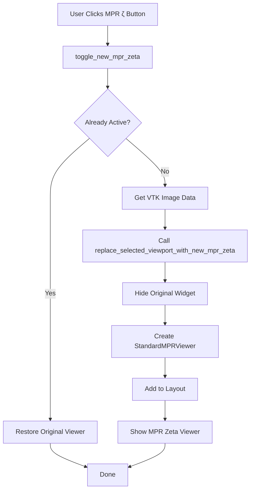

# New MPR Zeta Module

**Location:** `PacsClient/pacs/patient_tab/zeta mpr/`  
**Version:** 2.0.0  
**Purpose:** Original/alternative MPR viewer implementation for comparison with newer MPR modules

---

## 📁 Module Contents

This folder contains all files for the New MPR Zeta (ζ) module:

### Core Files
1. **`standard_mpr_viewer.py`** (formerly `standard_mpr_viewer--.py`)
   - Main MPR viewer widget with three orthogonal views (Axial, Sagittal, Coronal)
   - ~2,800 lines of code
   - Uses VTK's `vtkImageResliceMapper` for proper orthogonal views

### Dependency Modules
2. **`preset_manager.py`**
   - Window/Level preset management
   - Presets for Brain, Bone, Lung, Abdomen, etc.

3. **`advanced_rendering.py`**
   - Volume rendering features
   - Thick slab reconstruction
   - Advanced visualization techniques

4. **`segmentation_tools.py`**
   - Automatic segmentation algorithms
   - Lung, airway, vessel, and bone segmentation
   - Region growing and thresholding

5. **`surface_reconstruction.py`**
   - 3D surface extraction from volumes
   - Marching cubes algorithm
   - Surface smoothing and decimation

6. **`curved_mpr.py`**
   - Curved Multi-Planar Reconstruction
   - Interactive centerline definition
   - Vessel/airway path visualization

7. **`mpr_measurement_tools.py`**
   - Distance measurements
   - Angle measurements
   - ROI (Region of Interest) analysis

### Integration Files
8. **`toolbar_integration.py`**
   - Functions to integrate with toolbar_manager.py
   - `toggle_new_mpr_zeta()` - Toggle MPR Zeta viewer on/off
   - `replace_selected_viewport_with_new_mpr_zeta()` - Swap viewports

9. **`__init__.py`**
   - Module initialization and exports

10. **`README.md`** (this file)
    - Module documentation

---

## 🔧 Integration Instructions

### Step 1: Import in toolbar_manager.py

Add to the imports section:

```python
from PacsClient.pacs.patient_tab.zeta_mpr.toolbar_integration import (
    toggle_new_mpr_zeta,
    replace_selected_viewport_with_new_mpr_zeta
)
```

### Step 2: Add Instance Variable

In the `ToolbarManager.__init__()` method, add:

```python
self._new_mpr_zeta_active = False
```

### Step 3: Add Button to MPR Dropdown Menu

Find where the MPR dropdown menu is created (search for `mpr_dropdown_menu` or similar menu creation), and add:

```python
# MPR ζ (Zeta) action - triggers old Standard MPR viewer for comparison
mpr_zeta_action = mpr_dropdown_menu.addAction("MPR ζ (Zeta)")
mpr_zeta_action.setToolTip("Standard MPR viewer - old MPR implementation for comparison")
mpr_zeta_action.triggered.connect(lambda: toggle_new_mpr_zeta(
    self, 
    self.patient_widget.selected_widget
))
```

### Step 4: Test the Integration

1. Run the application
2. Load a DICOM series
3. Click the MPR dropdown menu
4. Verify "MPR ζ (Zeta)" option appears
5. Click it to activate the MPR Zeta viewer

---

## 🎯 Features

### Main Viewer
- **Three Orthogonal Views**: Axial, Sagittal, Coronal
- **Synchronized Navigation**: Crosshairs link all three views
- **Window/Level Control**: Interactive adjustment with presets
- **Slice Navigation**: Mouse wheel or slider control

### Advanced Features
- **3D Volume Rendering**: Ray casting visualization
- **Thick Slab MIP/MinIP/Average**: Multi-slice projections
- **Segmentation Tools**: Automatic organ/structure detection
- **Surface Reconstruction**: 3D mesh generation
- **Curved MPR**: Path-based reformatting
- **Measurement Tools**: Distance, angle, and ROI measurements

### Presets Available
- Auto (from DICOM tags)
- Brain (W:80, L:40)
- Subdural (W:200, L:75)
- Bone (W:2000, L:300)
- Lung (W:1500, L:-600)
- Abdomen (W:350, L:50)
- Liver (W:150, L:80)
- Soft Tissue (W:400, L:50)

---

## 📊 Architecture

```
MPR Zeta Viewer Architecture
┌─────────────────────────────────────────────────────────┐
│                  StandardMPRViewer                      │
├─────────────────────────────────────────────────────────┤
│  ┌────────────┐  ┌────────────┐  ┌────────────┐       │
│  │   Axial    │  │ Sagittal   │  │  Coronal   │       │
│  │   View     │  │   View     │  │   View     │       │
│  │ (QVTKRWi)  │  │ (QVTKRWi)  │  │ (QVTKRWi)  │       │
│  └────────────┘  └────────────┘  └────────────┘       │
│                                                         │
│  ┌──────────────────────────────────────────────────┐  │
│  │           Controls & Tools Panel                 │  │
│  │  • Window/Level  • Presets  • Measurements      │  │
│  │  • 3D Rendering  • Segmentation  • Curved MPR  │  │
│  └──────────────────────────────────────────────────┘  │
└─────────────────────────────────────────────────────────┘
```

---

## 🔄 Workflow



---

## 🐛 Troubleshooting

### Issue: Button Not Appearing
**Solution:** Check that the button creation code is in the correct location in toolbar_manager.py (where other MPR options are created)

### Issue: Import Error
**Solution:** Verify that the module path is correct: `PacsClient.pacs.patient_tab.zeta_mpr`
Note: Python replaces spaces with underscores in module names ("zeta mpr" → "zeta_mpr")

### Issue: Viewer Not Displaying
**Solution:** Check console output for error messages. The code includes extensive debug logging.

### Issue: Missing Dependencies
**Solution:** All dependencies are in this folder. If errors occur, verify all files are present.

---

## 📝 File Sizes & Lines of Code

| File | Size | Lines |
|------|------|-------|
| `standard_mpr_viewer.py` | ~280 KB | ~2,800 |
| `curved_mpr.py` | ~120 KB | ~2,100 |
| `segmentation_tools.py` | ~90 KB | ~1,500 |
| `preset_manager.py` | ~70 KB | ~650 |
| `advanced_rendering.py` | ~60 KB | ~1,000 |
| `surface_reconstruction.py` | ~50 KB | ~850 |
| `mpr_measurement_tools.py` | ~45 KB | ~750 |
| `toolbar_integration.py` | ~15 KB | ~320 |
| **Total** | **~730 KB** | **~9,970** |

---

## 🔗 Related Modules

- **NewMPR3**: Newer MPR implementation with different architecture
- **NewMpr**: Slicer-compatible MPR implementation
- **viewers/**: Standard 2D/3D viewers

---

## 📄 License

Same as main PACS Client project.

---

## 👥 Maintainers

PACS Development Team

---

## 📅 Version History

- **v2.0.0** (2026-01-30): Extracted into standalone module
- **v1.0.0** (Original): Integrated in viewers folder as `standard_mpr_viewer--.py`

---

## 💡 Usage Examples

### Basic Usage

```python
from PacsClient.pacs.patient_tab.zeta_mpr import StandardMPRViewer

# Create viewer with VTK image data
viewer = StandardMPRViewer(vtk_image_data=image_data, parent=parent_widget)
viewer.show()
```

### With Toolbar Integration

```python
# In toolbar_manager.py
from PacsClient.pacs.patient_tab.zeta_mpr.toolbar_integration import toggle_new_mpr_zeta

# Add button
mpr_zeta_action = menu.addAction("MPR ζ (Zeta)")
mpr_zeta_action.triggered.connect(lambda: toggle_new_mpr_zeta(self, selected_widget))
```

---

## 🎓 Technical Notes

1. **Coordinate System**: Uses VTK's right-handed coordinate system
2. **Reslicing**: Uses `vtkImageResliceMapper` for efficient orthogonal views
3. **Threading**: Uses QTimer for non-blocking operations
4. **Memory**: Handles large datasets efficiently with VTK's streaming pipeline

---

## ⚠️ Important Notes

- The module name in imports is `zeta_mpr` (underscore) even though the folder name is "zeta mpr" (space)
- This is intentional - Python automatically converts spaces to underscores in module names
- Always use the underscore version in imports

---

**End of Documentation**
