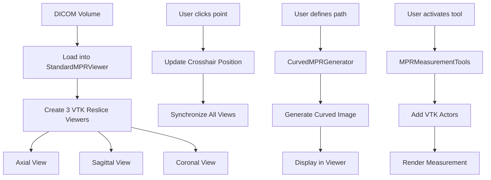

# ZMPR (Zeta MPR) Module

**Location**: `PacsClient/pacs/patient_tab/zeta mpr/`  
**Purpose**: Multi-Planar Reconstruction (MPR) with standard and curved capabilities

---

## Overview

The ZMPR module provides advanced multi-planar reconstruction (MPR) capabilities for medical imaging. It allows users to view DICOM volumes in standard orthogonal planes (axial, sagittal, coronal) and generate curved MPR views along arbitrary paths.

**Key Features**:
- ✅ Standard MPR with synchronized crosshairs
- ✅ Curved MPR with parallel transport frame algorithm
- ✅ Measurement tools (ruler, angle, captions)
- ✅ Window/level presets for different tissue types
- ✅ Surface reconstruction and segmentation
- ✅ Advanced rendering options
- ✅ Integration with main toolbar

**Code Quality Score**: 7.5/10 (B-)

---

## Module Structure

```
zeta mpr/
├── __init__.py                     # Module exports and documentation
├── standard_mpr_viewer.py          # Core MPR viewer (~3600 lines)
├── curved_mpr.py                   # Curved MPR algorithms
├── mpr_measurement_tools.py        # Measurement tools
├── advanced_rendering.py           # Advanced rendering features
├── surface_reconstruction.py       # 3D surface extraction
├── segmentation_tools.py           # Segmentation utilities
├── preset_manager.py               # Window/level presets
└── toolbar_integration.py          # Toolbar hooks (legacy/unused)
```

---

## Components

### 1. Standard MPR Viewer

**File**: `standard_mpr_viewer.py` (~3600 lines)

**Main Class**: `StandardMPRViewer`

**Purpose**: Core MPR viewer with orthogonal views and synchronized navigation

**Features**:
- Three synchronized views (axial, sagittal, coronal)
- Interactive crosshairs for navigation
- Window/level adjustments
- Zoom and pan
- Rotation controls
- Segmentation overlay support
- Batch rendering for performance

**Key Methods**:
```python
load_volume(vtk_image_data)  # Load 3D volume
set_crosshair_position(x, y, z)  # Move crosshair
set_window_level(window, level, view=None)  # Adjust contrast
toggle_crosshairs(visible)  # Show/hide crosshairs
generate_curved_mpr(points)  # Generate curved MPR
cleanup()  # Release resources
```

**Code Quality Issues**:
- ❌ Very large file (~3600 lines) - needs splitting
- ❌ Mixed concerns (UI, rendering, interaction, business logic)
- ❌ Excessive debug prints (lines 187-196, 442-529)
- ❌ Magic numbers hardcoded (e.g., `0.5`, `0.1`, `20px`)
- ⚠️ Complex methods exceed 100 lines

**Recommended Refactoring**:
```
standard_mpr_viewer.py  →  Split into:
  ├── mpr_viewer_core.py       # Core rendering and VTK setup
  ├── mpr_viewer_ui.py          # UI components and layouts
  ├── mpr_viewer_interaction.py # Mouse/keyboard handlers
  └── mpr_viewer_tools.py       # Segmentation, curved MPR, etc.
```

---

### 2. Curved MPR

**File**: `curved_mpr.py`

**Main Classes**:
- `Path3D` - Represents a 3D curve/path
- `PlaneGenerator` - Generates planes perpendicular to path
- `ResliceEngine` - Performs reslicing along path

**Purpose**: Generate curved multi-planar reconstructions along arbitrary 3D paths

**Algorithm**: Parallel Transport Frame
- Maintains consistent plane orientation along curved path
- Prevents twisting artifacts
- Reference: "Visualization of Vasculature from Volume Data" by Kanitsar et al.

**Features**:
- Interactive path definition (click points)
- Automatic path smoothing
- Adjustable slice thickness
- High-quality reslicing

**Usage Example**:
```python
from PacsClient.pacs.patient_tab.zeta_mpr.curved_mpr import CurvedMPRGenerator

# Create generator
cpr_gen = CurvedMPRGenerator(vtk_image_data)

# Define path points (in world coordinates)
points = [(x1, y1, z1), (x2, y2, z2), ..., (xn, yn, zn)]

# Generate curved MPR
curved_image = cpr_gen.generate_curved_mpr(
    points=points,
    slice_thickness=5.0,  # mm
    num_slices=100
)
```

**Code Quality**:
- ✅ Excellent documentation with references
- ✅ Well-structured class hierarchy
- ✅ Clear algorithmic explanation
- ⚠️ Some debug prints remain (lines 397-400, 431-434)
- ⚠️ Long methods (e.g., `generate_panoramic_image_slicer_method()` ~260 lines)

---

### 3. Measurement Tools

**File**: `mpr_measurement_tools.py`

**Main Class**: `MPRMeasurementTools`

**Purpose**: Provides measurement capabilities in MPR views

**Features**:
- **Ruler Tool**: Distance measurements
- **Angle Tool**: Angle measurements between lines
- **Caption Tool**: Text annotations

**Usage Example**:
```python
from PacsClient.pacs.patient_tab.zeta_mpr import MPRMeasurementTools

# Create tools (pass MPR viewer instance)
tools = MPRMeasurementTools(mpr_viewer)

# Activate ruler in axial view
tools.activate_ruler_tool(view_name='axial')

# Activate angle tool
tools.activate_angle_tool(view_name='sagittal')

# Deactivate all tools
tools.deactivate_tool()
```

**Code Quality Issues**:
- ❌ Debug prints in production (lines 65-66):
  ```python
  print('self.mpr_viewer.viewers[view_name]:', ...)
  ```
- ❌ Incomplete `deactivate_tool()` - doesn't fully disable widgets (lines 207-226)
- ❌ Missing validation before widget access

**Recommended Improvements**:
1. Remove debug prints
2. Complete `deactivate_tool()` implementation
3. Add widget existence checks
4. Add proper error handling

---

### 4. Preset Manager

**File**: `preset_manager.py`

**Purpose**: Manages window/level presets for different tissue types

**Presets Available**:
- CT: Bone, Soft Tissue, Lung, Brain, Liver
- MR: T1, T2, FLAIR, Angiography
- Custom user-defined presets

**Usage**:
```python
from PacsClient.pacs.patient_tab.zeta_mpr import PresetManager

# Get preset
preset = PresetManager.get_preset("CT-Bone")
# Returns: {"window": 2000, "level": 400}

# Apply to viewer
viewer.set_window_level(preset["window"], preset["level"])
```

**Issue**: Missing dependency `vtk_3d_presets` (line 19) may cause import error.

---

### 5. Advanced Rendering

**File**: `advanced_rendering.py`

**Purpose**: Advanced rendering techniques (MIP, MinIP, average intensity)

**Features**:
- Maximum Intensity Projection (MIP)
- Minimum Intensity Projection (MinIP)
- Average Intensity Projection (AvIP)
- Volume rendering integration

---

### 6. Surface Reconstruction

**File**: `surface_reconstruction.py`

**Purpose**: Extract and visualize 3D surfaces from segmentation

**Features**:
- Marching cubes algorithm
- Surface smoothing
- Mesh decimation
- Export to STL/OBJ

---

### 7. Segmentation Tools

**File**: `segmentation_tools.py`

**Purpose**: Segmentation utilities for MPR views

**Features**:
- Threshold segmentation
- Region growing
- Connected component analysis

---

## Integration with Main Application

### Toolbar Integration

**File**: `toolbar_integration.py` (⚠️ **Appears unused**)

**Issue**: Contains wrong import path:
```python
# Line 227 - WRONG!
from PacsClient.pacs.patient_tab.zeta_mpr import StandardMPRViewer
# Should be:
from PacsClient.pacs.patient_tab.zeta mpr import StandardMPRViewer
```

**Status**: This file is likely legacy code. The actual integration happens through:
- `PacsClient/pacs/patient_tab/ui/patient_ui/patient_toolbar/toolbar_manager.py`

**Current Integration**:
```python
# In toolbar_manager.py
from PacsClient.pacs.patient_tab.zeta mpr import StandardMPRViewer

# Create MPR viewer when button clicked
mpr_viewer = StandardMPRViewer(parent, volume_data)
```

---

## Data Flow



---

## Performance Considerations

### Rendering Optimization

1. **Batch Rendering System** (lines 277-302):
   ```python
   def _schedule_render(self):
       """Schedule a render after a delay to batch multiple updates"""
       if not self._render_scheduled:
           self._render_scheduled = True
           QTimer.singleShot(50, self._do_render)
   ```
   This prevents excessive rendering during user interaction.

2. **Crosshair Updates**:
   - Crosshairs updated in all views simultaneously
   - Can be expensive for large volumes

3. **Curved MPR Generation**:
   - Computationally intensive
   - Should be run in background thread for large volumes

### Memory Management

- **Volume data**: Shared across all views (good!)
- **Cleanup required**: Must call `cleanup()` to free VTK resources
- **Known issue**: Incomplete cleanup in some paths

---

## Common Issues & Troubleshooting

### Issue #1: Folder Name Has Space
**Problem**: Folder named `zeta mpr` (with space) complicates imports  
**Workaround**: Use correct import:
```python
from PacsClient.pacs.patient_tab.zeta mpr import StandardMPRViewer
# Note the space in the path
```
**Fix**: Rename to `zeta_mpr` (underscore)

### Issue #2: Debug Output Spam
**Problem**: Excessive print statements to console/stderr  
**Workaround**: Redirect output or filter  
**Fix**: Replace all `print()` with proper logging

### Issue #3: Incomplete Tool Deactivation
**Problem**: `deactivate_tool()` doesn't fully disable measurement tools  
**Workaround**: Manually hide tool widgets  
**Fix**: Complete the implementation:
```python
def deactivate_tool(self):
    # Remove actors from renderers
    # Disconnect event handlers
    # Hide/disable UI widgets
    # Reset tool state
```

### Issue #4: Missing vtk_3d_presets Module
**Problem**: `preset_manager.py` imports non-existent module  
**Workaround**: Comment out the import or create the module  
**Fix**: Remove the import or implement the module

---

## Testing

### Manual Test Cases

**Standard MPR**:
- [ ] Load CT volume
- [ ] Load MR volume
- [ ] Navigate with crosshairs
- [ ] Adjust window/level
- [ ] Zoom and pan
- [ ] Rotate views
- [ ] Apply presets
- [ ] Toggle crosshairs on/off

**Curved MPR**:
- [ ] Define path with 3 points
- [ ] Define path with 10+ points
- [ ] Generate curved MPR
- [ ] Verify no twisting artifacts
- [ ] Adjust slice thickness
- [ ] Clear path and start over

**Measurement Tools**:
- [ ] Ruler: Measure distance
- [ ] Angle: Measure angle
- [ ] Caption: Add text annotation
- [ ] Verify measurements persist
- [ ] Verify measurements in all views

---

## API Reference

### StandardMPRViewer

```python
class StandardMPRViewer(QWidget):
    """Main MPR viewer with synchronized orthogonal views"""
    
    def __init__(self, parent=None, volume_data=None):
        """Initialize MPR viewer"""
        
    def load_volume(self, vtk_image_data):
        """Load 3D volume for MPR viewing"""
        
    def set_crosshair_position(self, x: int, y: int, z: int):
        """Set crosshair position in voxel coordinates"""
        
    def set_window_level(self, window: float, level: float, view: str = None):
        """
        Set window/level for contrast adjustment
        
        Args:
            window: Window width
            level: Window center
            view: View name ('axial', 'sagittal', 'coronal') or None for all
        """
        
    def generate_curved_mpr(self, points: List[Tuple[float, float, float]]):
        """
        Generate curved MPR along path
        
        Args:
            points: List of (x, y, z) world coordinates
        """
        
    def cleanup(self):
        """Release VTK resources"""
```

### MPRMeasurementTools

```python
class MPRMeasurementTools:
    """Measurement tools for MPR views"""
    
    def __init__(self, mpr_viewer: StandardMPRViewer):
        """Initialize with MPR viewer instance"""
        
    def activate_ruler_tool(self, view_name: str):
        """
        Activate ruler (distance) tool
        
        Args:
            view_name: 'axial', 'sagittal', or 'coronal'
        """
        
    def activate_angle_tool(self, view_name: str):
        """Activate angle measurement tool"""
        
    def activate_caption_tool(self, view_name: str):
        """Activate text caption tool"""
        
    def deactivate_tool(self):
        """Deactivate current tool"""
```

---

## Future Enhancements

### Short-term
- [ ] Fix debug output (replace print with logging)
- [ ] Complete `deactivate_tool()` implementation
- [ ] Fix missing import (vtk_3d_presets)
- [ ] Rename folder to `zeta_mpr` (underscore)

### Medium-term
- [ ] Split `standard_mpr_viewer.py` into smaller modules
- [ ] Add unit tests for curved MPR algorithm
- [ ] Implement background thread for curved MPR generation
- [ ] Add progress indicator for long operations
- [ ] Extract magic numbers to constants

### Long-term
- [ ] Add oblique MPR (arbitrary plane orientation)
- [ ] Add thick-slab MPR (MIP/MinIP/AvIP)
- [ ] Add 4D support (time-series volumes)
- [ ] Add automatic vessel centerline detection
- [ ] Add export capabilities (screenshots, videos)

---

## References

### Academic Papers
- Kanitsar et al. (2002): "Visualization of Vasculature from Volume Data"
- Wang & Kaufman (1999): "Curved Planar Reformation"

### Technical Documentation
- [VTK Image Reslicing](https://vtk.org/doc/nightly/html/classvtkImageReslice.html)
- [Parallel Transport Frames](https://en.wikipedia.org/wiki/Parallel_transport)
- [MPR Techniques](https://radiopaedia.org/articles/multiplanar-reformation)

---

## Code Quality Summary

**Overall Score**: 7.5/10 (B-)

**Strengths**:
- ✅ Well-organized module structure
- ✅ Excellent algorithmic documentation (curved MPR)
- ✅ Good feature coverage
- ✅ Performance optimizations present

**Weaknesses**:
- ❌ `standard_mpr_viewer.py` too large (~3600 lines)
- ❌ Excessive debug output
- ❌ Incomplete tool deactivation
- ❌ Missing imports
- ❌ Folder name with space

**Priority Fixes**:
1. Remove debug prints
2. Fix incomplete features
3. Split large files
4. Add proper logging
5. Add type hints

---

**Last Updated**: January 31, 2026
