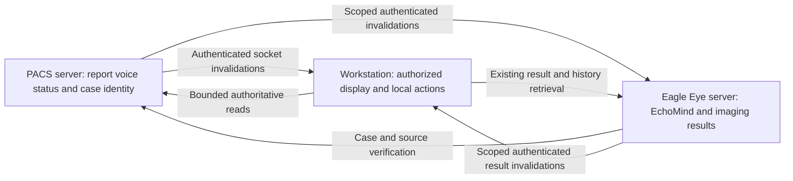

# PACS Client and Eagle Eye realtime implementation and initial review

The initial review below records the pre-change baseline. Source implementation
now connects PACS workflow sockets to authenticated Eagle Eye case notifications
and Patient clients. See the implementation receipt at the end.

At the initial review, the existing PACS socket channel supported bounded workflow invalidations and
authoritative state reconciliation. It does not yet provide the requested
three-node synchronization, server history discovery in Patient, or red EchoMind
and Eagle Eye sidebar availability indicators. This review records the source
evidence, the owner's shared-center decision, and the implementation contract.

Initial review date: 2026-10-06. Runtime code was inspected and existing synthetic tests
were executed. No runtime behavior, server configuration, deployment, credentials,
or clinical records were changed. All design sections below describe required
work, not implemented capabilities.

## Owner requirements

- Connect the PACS server, workstation clients, and authenticated Eagle Eye server
  through immediate change notifications and authoritative retrieval.
- Synchronize voice availability, report content changes, report/workflow status,
  EchoMind saved responses, and Eagle Eye analysis states/results.
- Share previous EchoMind and Eagle Eye results among all authorized users of the
  same center. This is an explicit owner decision in this session, not permission
  to share between centers or to bypass current authentication.
- Mark the vertical Patient EchoMind/Eagle Eye buttons red when a matching saved
  server result is available. Opening it retrieves the existing result; it must
  not silently initiate another inference request.

## Verified source boundaries

| Boundary | Current implementation | Gap for the requested behavior |
| --- | --- | --- |
| PACS mutation to socket | `D:/pacs server INO/servers/socket_server.py` publishes report status, audio availability and assignment/list changes through `utils/workflow_realtime.py`. | Version 1 does not advertise a report-content revision event, EchoMind result events, or Eagle Eye result events. |
| Socket to workstation | `modules/network/workflow_realtime.py` negotiates `SubscribeToEvents`, reads `GetWorkflowStates` on another socket, coalesces bursts, reconnects, and reconciles every 30 seconds. | Snapshot fields are report status, assignment, and audio count. They cannot prove the current report body or AI result availability. |
| Workstation GUI consumer | `PacsClient/pacs/workstation_ui/home_ui/workflow_realtime.py` refreshes up to 100 visible Home rows for the active server/search generation. | This consumer does not subscribe the open Patient tabs or update their AI buttons and loaded report/voice contents. |
| Eagle Eye job service | `modules/ai_imaging/eagle_eye_remote/server.py::Jobs` persists job states and artifacts. Authenticated HTTP exposes recent owner jobs, job state, cancellation and ZIP artifacts. | No event subscription route exists in this handler. `recent(owner)` returns at most 50 owner jobs, not a study-specific center history. |
| Eagle Eye workstation client | `modules/ai_imaging/eagle_eye_remote/client.py` observes jobs and resumes credential/server-bound saved local handles. ZIP extraction validates identity, inventory and checksums. | Local-handle resume does not discover results created on another workstation. There is no case history client API. |
| EchoMind server | `eagle_eye_remote/echomind/hosting.py` saves request and response through `text_history.py::History` before returning. | `History` exposes write methods only. The HTTP handler has no history list/get endpoints or saved-result broadcasts. |
| EchoMind association | `modules/EchoMind/remote_backend.py::bind_history` captures optional study/session context for a worker. `History.validate_context` permits study UID and session ID. | Context is client-origin and explicitly not a PACS identity claim. It lacks a server-verified PACS namespace/center/reception association. Unbound historical entries must not be assigned by guessed identity. |
| Patient navigation | The active five-button UI is `_pw_panels.py::sidebar_layout_ui`, not the separate three-button `sidebar_widget.py`. `_safe_set_sidebar_button_style` uses selection alone. | Neither saved-result discovery nor red availability state is connected to these buttons. Eagle Eye currently opens its workspace. |
| Upstream reception changes | PACS `servers/reception_sync_service.py` also emits reception/workflow events after synchronization; its documented external polling default is two minutes. | Local socket speed cannot eliminate upstream polling latency. Existing v1 workstation events do not include those reception-specific names. |

Audio invalidation is not an increment: the PACS also uses `audio_uploaded` after
removal, and consumers must reread `audio_count`. A saved voice, a transcript, an
AI draft, and a finalized PACS report are separate resources. Do not interpret
one as evidence of another.

## Authoritative three-node flow

Keep each source authoritative for its own durable state. PACS owns report,
voice and workflow resources; Eagle Eye owns its job/artifact store and EchoMind
history. A single universal broadcast store is unnecessary. Clients combine
their verified projections, rather than write AI history into the PACS database
or send raw reports/voice bytes to every subscriber.

The PACS-to-Eagle Eye connection needs an explicitly scoped service identity and
a verified mapping to the configured PACS source. Do not reuse a GUI session as
a permanent service credential, select a source by display name, or enable the
production Agent Gateway as a substitute. New company inference remains on the
authenticated Eagle Eye server, with server-owned prompts and provider keys.

Events announce durable changes only after persistence succeeds. They contain a
resource kind, opaque result/resource ID, verified case reference, epoch and
revision. Report bodies, prompts, filenames, audio bytes and artifact payloads
are retrieved separately under authorization. Events never replace clinical truth.

## Required event and retrieval contracts

Suggested names are a proposed versioned contract, not currently callable APIs.

| Resource | Invalidation | Authoritative retrieval |
| --- | --- | --- |
| Voice | Existing audio availability event, with resource revision when introduced | Voice inventory/count and authorized file retrieval; cover upload and delete |
| Report | Existing status event plus new report-content change invalidation | Current report metadata/content with independent content revision |
| Workflow | Assignment, report status and relevant reception/workflow invalidations | Verified current status and reception/study association |
| EchoMind | Request state and durable response create/update/delete invalidation | Case-scoped response list, metadata and exact saved response |
| Eagle Eye | Job state and durable artifact availability/revision invalidation | Case-scoped analysis list and exact existing artifacts |

Negotiate capabilities before requesting new events or endpoints. Preserve the
four-byte framing and current PACS request/download protocols. Use a dedicated
bounded event connection for each source, separate from responses/artifacts.
The Eagle Eye transport must preserve its current TLS/token/client-certificate
checks; adding a bare unauthenticated socket port is not acceptable.

Subscribe before the first case snapshot. Reconcile after reconnect, server epoch
change, overflow/EOF, and periodically. Coalesce bursts and bound watched cases,
queue sizes, payload sizes and concurrent readers. Support explicit missing,
deleted, unavailable and permission-revoked states. A network error is unknown
availability, not proof that no result exists. Source publication revision is not
a contiguous per-subscriber clinical version.

Avoid automatically rerunning AI when a PACS source changes: mark the relevant
result/source relationship and let the user deliberately create a new analysis.
Read an existing result without POSTing a new job. Existing `Client.resume`
resubmits the same idempotent request for recovery; that mechanism is not a
cross-user shared-result retrieval contract.

## Shared-center access and case identity

Current Eagle Eye `Jobs.get` requires the creating owner. Do not loosen it to
all configured owners. Add a server-owned center membership model, verified case
access, and a separate shared read permission; retain creator ownership for
cancellation, edits and correction proposals. Client-supplied owner/center fields
cannot grant access. A center-level shared token is not proof of an individual
user's PACS authorization.

Bind discovery and retrieval to the verified center/PACS source namespace,
StudyInstanceUID and authoritative patient/reception link. Patient names and
patient IDs alone are not sufficient, particularly across sources, repeated
studies or multiple-study admissions. Read the exact request/result's series,
SOP and revision where applicable. Reject a delayed result after tab navigation,
server switch, credential change or destruction.

Index case-scoped history and paginate it. Do not list every historical job or
scan private SQLite history during every repaint. Existing history entries
without sufficient verified context remain unassociated until an explicit safe
migration proves their binding. Empty context must never match every patient.

## Patient button and retrieval behavior

Maintain selection and availability as separate states. A saved, accessible
result takes the red availability treatment, including when the button is
selected; preserve selection through a border/indicator and a descriptive
tooltip. Red indicates available saved content, not a pathological finding or
clinical urgency. Queued/running/failed jobs alone do not make a button red.

On Patient open, asynchronously retrieve current case availability from the
configured Eagle Eye server. Subscribe the open case independently of whether
its Home row is visible. Reset and rebind when the case/source changes; remove
availability when the final saved result is deleted or access is revoked.
Unknown/disconnected state needs a clear connection indication and retry.

EchoMind opens a case-scoped history picker and displays the chosen original
saved response. Eagle Eye opens a module/result picker and retrieves the chosen
artifact using the existing secure archive/identity validation and the module's
existing presentation adapter. Where there are multiple previous results,
display timestamps, module and source/revision rather than silently overwrite
the current view. Preserve unsaved local edits; notification arrival must not
replace the user's draft or interrupt voice recording.

Network, SQLite and file work belongs on workers. GUI updates use bounded
queued delivery with generation/identity checks; no blocking joins or requests
in the sidebar paint/click path. Keep viewer decoding and private caches in
their existing execution domains.

## Verification receipt

Existing suites on the inspected dirty source trees:

- Workstation direct pytest: `tests/code/network/test_workflow_realtime.py`,
  `tests/code/ui_services/test_workflow_realtime_ui.py`, and
  `tests/code/ai_imaging/test_eagle_eye_remote.py`: **43 passed**, exit **0**.
  Three existing SWIG deprecation warnings occurred.
- PACS direct pytest: `tests/test_workflow_realtime.py`,
  `tests/test_socket_transfer.py`, `tests/test_attachment_upload.py`:
  **72 passed**, exit **0**.
- Actual PACS socket AST harness with two real workstation receivers through
  `tools/testing/workflow_wire_acceptance.py --server-root`: **passed**, exit
  **0**. Assignment, report status, voice availability, burst, reconnect and
  missed-event reconciliation were covered with synthetic data.
- Documented Test Control fallback `client.py ping`: exit **1**, named source
  test listener unavailable. No GUI acceptance is claimed. No application was
  launched/restarted and no installed executable or production gateway was used.

These tests certify existing tested boundaries only. They do not verify the new
history, shared-center authorization, button coloring, three-node event path,
deployment, or clinical acceptance.

## Implementation sequence and acceptance gates

1. Establish verified center membership and PACS case binding. Specify shared
   read versus creator mutation permissions and legacy history migration.
2. Add paginated case history and direct saved-result retrieval endpoints to
   Eagle Eye/EchoMind. Prove cross-center denial, same-center authorized reads,
   patient/study isolation and original result identity with synthetic guards.
3. Publish bounded durable result invalidations on the authenticated Eagle Eye
   listener, and connect the scoped PACS service subscription. Extend PACS
   report-content/reception contracts without changing download behavior.
4. Add a worker-owned Patient case coordinator and connect the active five-button
   mixin to availability. Integrate exact prior-result display through existing
   EchoMind and Eagle Eye adapters; retain unsaved edits and recording state.
5. Run fail-before/pass-after guards for stale callbacks, disconnect/reconcile,
   deletion, burst/slow consumers, auth revocation, history pagination, source
   switching and selected-red presentation. Update the regression catalog and
   owning contracts with actual implementation receipts.
6. Verify scoped plugin mirrors/build inputs and then the fresh-source GUI:
   two authorized clients observe a result created on either, both buttons update
   for the exact case, selecting retrieves that result without inference, and
   unrelated cases/centers remain unchanged. Human source launch/sign-in and
   documented control preflight are required. Build/deploy acceptance is separate.

Follow the existing optimization master plan for any reliability implementation
slice; this review is a subsystem contract and does not establish a competing
optimization backlog. Runtime implementation and live acceptance remain open.

## Source implementation receipt, 2026-10-06

The owner authorized implementation after the initial review. The initial gap
and design sections above remain historical evidence, not current capability claims.

### Implemented contract

- PACS publishes metadata-only attachment changes in its existing authenticated
  socket protocol. Workflow snapshots include document count, a content-inventory
  revision and legacy audio availability. Optional exact attachment names select
  original files before file reading or encoding.
- Eagle Eye `case_realtime.py` authorizes exact StudyInstanceUID/PatientID against
  authenticated PACS metadata and server-owned center membership. `pacs_case_bridge.py`
  consumes PACS sockets and publishes bounded invalidations to all authorized
  same-center case readers. Different-center and wrong-patient access are rejected.
- Authenticated `/v1/cases/snapshot`, `/events`, `/text`, `/job` and `/artifacts`
  provide paginated history, held notifications and original saved results.
  Notifications use held HTTP connections (authenticated long polling), while
  the upstream PACS connection uses its existing framed socket protocol.
  Epoch/revision cursors, overflow reconciliation, reconnect and periodic snapshots
  recover missed events. Clinical text and file bytes are retrieved explicitly;
  they are absent from broadcast messages.
- EchoMind publishes only after its private history transaction completes. Eagle
  Eye publishes after durable job state changes. Shared reads do not grant another
  user's cancel/update rights. Existing owner job routes stay owner-scoped.
- `case_receiver.py` runs network work outside Qt. `case_ui.py` updates the actual
  vertical Patient buttons: saved results are red and the selected button retains
  a blue border. Exact selected-study binding, active PACS profile checks and
  dialog/worker retirement reject stale results across study and source changes.
- Previous EchoMind responses, saved Eagle Eye results, original report documents
  and voice recordings are explicitly retrieved without another inference call.
  Original media is validated and atomically cached in an isolated `.server-media`
  directory. Active brain edits are preserved when opening saved history.
- Server startup pins history/job roots to the configured center and PACS source.
  Existing paired clients default to the configured center; `center_id` and
  server-owned `client_centers` can define membership. No client selects its center.
  `pacs.socket_port` defaults to 50052. Optional `pacs.client_host` advertises a
  client-reachable hostname; clients retain their selected profile's public port.
  Co-located loopback source mapping requires the authenticated Eagle endpoint and
  active PACS profile to agree. No credential or deployment configuration was edited.

### Evidence and remaining acceptance gates

The synthetic three-node acceptance script uses actual PACS socket handler logic,
the Eagle Eye bridge/HTTP service and two real case receiver workers. It passed
PACS-to-Eagle-to-clients delivery, report status, voice/document arrivals, original
voice/report retrieval, shared EchoMind and Eagle Eye history, no repeat inference
and forced PACS reconnect. It never starts a clinical server or reads a live database.

Guards: `test_case_realtime.py`, `test_case_realtime_http.py`,
`test_pacs_case_resources.py`, `test_patient_case_realtime.py`, and PACS
`test_case_report_realtime.py` / `test_case_attachment_selection.py`.
PACS revision and exact-name guards failed before the corresponding fixes.
The initial missing case-service guard failed collection before implementation;
GUI and later boundary guards were added during implementation and are not claimed
as fail-before evidence. The staged standard-library Eagle Eye client also passed
shared history/artifact retrieval without importing server implementation modules.

Fresh-source GUI acceptance is pending: Test Control `ping` reported an unavailable
local listener. AGENTS.md requires the human to launch one source app with
`run_app.ps1 -TestServer` outside clinical work and sign in manually. No source or
installed clinical app was launched, restarted or signed into by this work.

Global mirror verification matched 511/512 files. The existing unrelated
`modules/EchoMind/viewer_chat/ai_chat_pages.py` mirror drift causes three edition
renderer parity failures. Current changed runtime files have no packaged mirrors;
that unrelated in-progress payload was preserved. An adjacent pre-existing
long-prompt literal guard also fails with its involved source files unchanged from
HEAD; the remaining selected EchoMind guards pass. No lint pass is claimed.

Standard and ARM clients must consume the Patient helpers in both PyInstaller and
Nuitka builds; Eagle Eye servers own the case service/bridge/private history.
Source and staged-client tests do not qualify these six release artifacts.
No packaging, push, deployment, release or installed acceptance was performed.

Final verification: workstation case/network/Patient/remote suite 71 passed;
PACS case/workflow/socket suite 62 passed; adjacent EchoMind selected suite
48 passed, one pre-existing prompt guard deselected. All three commands exited 0.
The final three-node wire acceptance exited 0. Scoped diff whitespace and Python
AST checks passed. These automated gates are separate from pending live GUI.

## Alignment availability correction, 2026-10-06

Reported: a study with a retained Alignment result had a gray Eagle Eye button.
Confirmed source gap: the local sidebar inventory called only brain discovery,
while Alignment PDF generation writes exact-study `report.json` / `report.pdf`
companions under hashed study directories. Existing remote downloads can retain
these companions even when the server case-history capability is unavailable.
The supplied screenshot establishes the gray button; it does not establish the
running process version or whether its Eagle Eye server has this source change.

Fixed: worker-only Alignment discovery checks embedded study identity, report
format, measurements, owned paths, bounded file sizes and the PDF checksum.
The Patient inventory now combines brain and Alignment results. Red availability
opens a local result chooser; opening Alignment rereads and verifies the original
report on the worker, without inference. Brain reopening is preserved. Changed
studies and delayed reads cannot apply the previous result. Local reports remain
local; no upload or cross-center sharing is inferred from their presence.

Fail-before: `test_local_alignment_report_is_in_sidebar_inventory` failed because
no Alignment row was found (exit 1). Pass-after: 30 focused Patient, Alignment
PDF/review and payload tests passed (exit 0), including red styling, original PDF
reopening, another-study rejection and changed-file rejection. Fresh-source GUI
is pending: Test Control ping is unavailable. A running process predating this
fix cannot verify it. No clinical app was started/restarted and no build/deployment
was performed. Standard/ARM clients and Eagle Eye profiles in both build backends
need this source in the next candidate; current installers are not qualified.
Rollback is removal of the additional local Alignment inventory and picker branch;
the existing authenticated server history remains unchanged.

## Complete module and workflow coverage, 2026-10-06

Owner scope: Bone Age, Total Spine, lower-limb Alignment, Brain/lesions, Breast,
EchoMind reports, status, voice, images and reporting physician.

The shared-center server case inventory already reads all succeeded job modules;
new parameterized guards cover all six module identifiers. Completed EchoMind
report history is shared by exact study and authorized center. Client retained
result discovery now covers authenticated remote downloads for every module,
exact-study legacy Bone Age/Breast engine receipts, Alignment companions and Total
Spine companions. The original result's study identity is required; patient names
and filenames are never sufficient. New downloads and server artifact packets
persist the module identity. Local EchoMind history is discovered and reopened by
exact study, separately from the server's shared history. Local files are not
silently uploaded or represented as center-wide server results.

Red availability covers both server and retained results. The history picker
includes local results alongside server results on its first page, and retrieves
existing artifacts/responses without inference. Brain's specialized recovery is
preserved. Local reads stay on workers and retired study/dialog bindings reject
late results. Synthetic tests isolate EchoMind history and attachment roots.

PACS workflow snapshots now carry bounded image/series counts in addition to
report status, attachment revision, voice availability and reporting/typing doctor
identity. Study-created/updated and audio-deleted events normalize to existing v1
invalidation types; legacy subscribers retain their original event contract.
The Patient consumer displays current physician/image metadata in Reception,
updates status/voice, and requests the existing asynchronous thumbnail loader when
image/series counts change. This uses the existing shared catalog entry point;
no viewer decoding or rendering implementation is changed. Image attachments use
the same explicit exact-case original-file retrieval as voice and reports.

Fail-before evidence: six retained-module inventory cases failed before the
additional discovery; the PACS image-count guard failed with missing snapshot
fields before the change. Pass-after includes shared-center module coverage,
local report reopening, original EchoMind text, mixed histories, exact-study
rejection, changed PDFs and doctor/image GUI state using synthetic Qt inputs.
The actual socket/HTTP bridge acceptance passed with two clients: reporting doctor,
image inventory, image attachment/original image, report status, voice/document,
original voice/report, shared AI history, no repeated inference and reconnect.
Fresh-source GUI remains unverified because Test Control ping failed. A human
fresh source launch and sign-in is required by AGENTS.md; no app restart, release,
credentials change or server deployment was performed.

Next-build source handoff: `case_ui.py`, `local_results.py`, `client.py`,
`artifacts.py`, `modules/network/workflow_realtime.py` and PACS workflow/socket
sources. Standard/ARM client UI/discovery and Eagle Eye server artifact/workflow
contracts apply to both PyInstaller and Nuitka; Slicer staged stdlib client reads
remain separately tested. There are no mirrors for changed files. The unrelated
EchoMind ai_chat_pages mirror drift is preserved. Produced artifacts and clinical
GUI acceptance remain pending, not implied by code tests.

Final complete-coverage verification: 105 workstation/Patient/network/remote/
selected builder tests and 63 PACS workflow/socket tests passed (exit 0).
The expanded three-node acceptance passed, including original image retrieval.
Python AST, scoped whitespace and PACS documentation catalog checks passed.
Mirror verification retains the existing unrelated 511/512 parity result.
