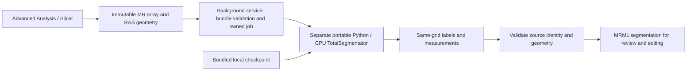

# Advanced Analysis: offline lumbar MR segmentation

Implementation record: 2026-08-31. Status: development integration, not a clinical release.

**Viewer acceptance update:** the user confirmed on 2026-08-31 that Advanced
Analysis opens and responds after the launch and hidden-modal repairs. That
confirmation concerns the viewer only. The current-case segmentation demonstration
subsequently completed through the same offline backend: nonempty output,
566.803 s service time and exact saved-mask voxel/geometry roundtrip. A local
source/overlay preview and `.seg.nrrd` export were produced. The operator route,
preparation delay and unverified clinical/UI claims are recorded in the
[verification follow-up](../reports/OFFLINE_LUMBAR_IMPLEMENTATION_VERIFICATION_2026-08-31.md#local-mr-operator-follow-up).

The [resident runtime guide](ADVANCED_ANALYSIS_RESIDENT_RUNTIME.md) adds concurrent
hidden viewer warmup and a separate no-window Slicer service for this model. That
headless route has also executed the real portable model on synthetic input; it
does not require opening the interactive segmentation module below.

## Decision and scope

The first supported model is **TotalSegmentator 2.14.0, task `vertebrae_mr`**, with
the Dataset756 checkpoint and a separate Windows x64 CPU Python runtime. The
Advanced Analysis component packages the custom Slicer runtime, our scripted
extension, the inference environment, and model weights together. Customer
inference does not install packages, fetch weights, require CUDA, or contact a
model server.

This is a vertebral anatomy stage. It does not diagnose disc herniation, stenosis,
nerve compression, marrow lesions, or tumors. The existing Eagle Eye LLM pipeline
has not been changed; its external providers are not made offline by this work.
There is no implemented MCP transport or automatic LLM dispatch in this feature.

| Candidate | Role for our lumbar workflow | Decision |
|---|---|---|
| TotalSegmentator `vertebrae_mr` | Automatic MR vertebral/sacral masks and candidate level labels; no interactive box required | Implement first, then validate numbering and coverage |
| MONAI Auto3DSeg | Framework/catalog with individually trained models; suitability depends on anatomy, sequences, weights and license | Add only after selecting and qualifying a specific lumbar checkpoint |
| MedSAM Lite | Prompt/ROI-driven segmentation assistance; can help refine a selected region | Later interactive adapter; not an automatic vertebral numbering or lesion-diagnosis substitute |
| MONAI Label | Local client/server annotation and inference workflow | Possible training/annotation infrastructure; unnecessary server complexity for this first portable model |

Primary sources: [TotalSegmentator](https://github.com/wasserth/TotalSegmentator),
[SlicerMONAIAuto3DSeg](https://github.com/lassoan/SlicerMONAIAuto3DSeg),
[MedSAM](https://github.com/bowang-lab/MedSAM),
[MONAI Label](https://github.com/Project-MONAI/MONAILabel).
The upstream TotalSegmentator task list places `vertebrae_mr` in its Apache-2.0
open-use group. This does not extend the same rights to every task in that
repository or replace a distribution-license review of all dependencies.

The 25 non-background classes are sacrum and L5-L1, T12-T1, C7-C1. A lumbar field
of view will normally contain only a subset. Model-assigned levels are proposals:
partial coverage, transitional anatomy, postoperative change, scoliosis, and
nonstandard acquisition can invalidate numbering. Empty masks do not establish
absence of disease. MRI intensity thresholds are not standardized CT HU values.

## Execution architecture



Slicer retains its existing Python/VTK/NumPy environment. Torch, nnU-Net,
SimpleITK and the model run in the separate bundled Python process. No model
site-packages directory is injected into Slicer. Only our small adapter package
is imported by its background worker.

The GUI thread snapshots the selected MR array and its IJK-to-RAS matrix. Bundle
hashing, filesystem operations and inference run in the background; independent
VTK segmentation data is constructed there, then attached to MRML on the GUI
thread. The source must remain in the scene with unchanged image modification
time, geometry and parent-transform state. A changed source rejects the result.
The active result timer briefly yields the Python GIL for 1 ms every 100 ms,
following the [Slicer maintainer's threading guidance](https://discourse.slicer.org/t/using-python-multithreading-in-3d-slicer/32299/5).
Without this, worker filesystem calls stalled between PythonQt events in the
isolated runtime. The parent validates only interpreter/adapter bootstrap bytes
and all manifest metadata; full dependency/weight hashing runs in the standalone
worker before model import. Build staging still performs full validation.
Main-thread memory copying and final scene attachment still have a cost; large
clinical-volume responsiveness has not been benchmarked.

The worker exchanges KJI NumPy arrays with an explicit RAS affine, transposes to
IJK for NIfTI inference, and verifies same-grid output before returning labels.
Volume measurements use the absolute affine determinant in mm3. This avoids
inferring anatomy from display screenshots or assuming that voxel spacing alone
encodes orientation.

## Source ownership

| Source | Responsibility |
|---|---|
| `modules/mpr/advanced_3d_slicer/slicer_modules/AIPacsOfflineLumbar.py` | Slicer UI, asynchronous logic, source checks, MRML result |
| `modules/ai_imaging/offline_lumbar/bundle.py` | Version, path, file-size and SHA-256 validation |
| `modules/ai_imaging/offline_lumbar/service.py` | Owned local job/process, timeout/cancellation, input cleanup |
| `modules/ai_imaging/offline_lumbar/worker.py` | Offline engine configuration, model execution and typed artifacts |
| `tools/slicer/prepare_offline_lumbar.py` | Developer-machine downloads and portable environment assembly |
| `tools/slicer/offline_lumbar_sources.json` | Reviewed Python/model archive SHA-256 pins |
| `tools/slicer/offline_lumbar_requirements.lock` | Exact resolved dependency versions |
| `builder/offline_lumbar_payload.py` | Lossless bundle staging and canonical adapter refresh |

The launcher adds the scripted-module directory through
`--additional-module-path`. In an installed package it sets
`AIPACS_OFFLINE_LUMBAR_ROOT` to the directory next to the Slicer executable.
Only a source checkout with a `.git` ancestor can fall back to the development
bundle. The existing `advanced_mpr` module catalog, installer component and
installation-profile writers remain the ownership boundary. No new selectable
module or configuration family was introduced.

Our extension builds its widgets programmatically. It does not depend on the
missing Designer plugins observed in the earlier SlicerSandbox GUI experiment.
We integrate the TotalSegmentator engine, not the entire upstream Slicer plugin
and its first-use package-install workflow.

## Prepare once on the development/build machine

The following command requires internet access on the build machine only:

```powershell
.\.venv\Scripts\python.exe tools/slicer/prepare_offline_lumbar.py
if ($LASTEXITCODE -ne 0) { throw "Offline model preparation failed" }
```

The default output is `generated-files/offline-lumbar/bundle/`, ignored by Git.
An existing completed output is refused. Use `--output <new-directory>` for a
new bundle, or `--resume` only for this tool's incomplete `.preparing` directory.
Keep the sibling download/pip cache and archive/manifest records with release
engineering artifacts. Source downloads and runtime inference are separate paths.

The prepared environment contains Python 3.12.10 AMD64, Torch 2.6.0+cpu,
TotalSegmentator 2.14.0, nnunetv2 2.6.2 and NumPy 2.2.6. Preparation uses the host
pip to target the portable interpreter; it does not install into the workstation
venv or Slicer's embedded interpreter. `pip check` is mandatory. The Python and
model archives are hash-pinned; dependency versions are locked and all final
payload files are inventoried. The process is not a claim of bit-for-bit
reproducible wheel compilation or cryptographic publisher authentication.

The initial prepared bundle inventoried **26,304 files / 2,260,714,423 bytes**
(about 2.26 GB), before installer compression and excluding Slicer, caches and
temporary inference space. Canonical adapter updates change the final inventory
size slightly. The model archive is 230,791,939 bytes. License/notice files are
retained, including Python and dependency distribution metadata. Disk sizing of
the existing Advanced MPR package is raised to 6 GB; actual release staging and
working-space requirements must still be measured.

## Install all components together

Both runtime materialization and release package construction call
`stage_offline_lumbar`. A selected Advanced MPR package fails staging when its
offline bundle is absent, incomplete, unsupported or hash-invalid. A developer
can select an alternate prepared source with
`AIPACS_OFFLINE_LUMBAR_BUNDLE_SOURCE`; the customer does not need this variable.

Installed layout:

```text
%ProgramData%/AIPacs/module_packages/advanced_mpr/
  payload/
    AIPacsAdvancedViewer.exe
    ... existing Slicer runtime ...
    python/modules/mpr/advanced_3d_slicer/
      slicer_custom_app/launch_slicer.py
      slicer_modules/AIPacsOfflineLumbar.py
    offline_lumbar/
      manifest.json
      requirements-resolved.txt
      python/python.exe
      python/Lib/site-packages/...
      app/offline_lumbar/...
      weights/Dataset756_mri_vertebrae_1076subj/...
      licenses/...
```

The existing optional Advanced MPR installer component now describes the included
CPU model. It is offered only when the Slicer executable, bundle manifest and
portable Python are staged. A dedicated installer file rule copies the complete
model environment without the broad `tests/docs/examples` pruning used for other
payloads: dependency resources with those names must not be silently removed.
The release gate validates the staged offline manifest and hashes.

Selecting Advanced MPR therefore installs Slicer, the adapter and the model as
one component. Core-only installations remain possible. No download is scheduled
by the new installer rules or inference path. This implementation targets Windows
x64; native ARM64 and CUDA packages have not been qualified.

## User controls and Python API

In Advanced Analysis, choose **Segmentation > AI-PACS Offline Lumbar**, select
the scalar MR volume, confirm its modality, and click **Segment vertebrae offline
(CPU)**. Review the resulting segmentation, edit it in Segment Editor, and save
it through the normal Slicer save workflow. The Cancel button requests termination
of the owned inference process. CPU runs may take minutes; no diagnostic result
is inferred from how many labels were returned.

For a controlled Slicer Python session, retain the logic object until completion:

```python
from AIPacsOfflineLumbar import AIPacsOfflineLumbarLogic

offline_logic = AIPacsOfflineLumbarLogic()

def completed(result):
    # Keep returned paths/results local; do not print patient-derived artifacts.
    if result["status"] == "succeeded":
        segmentation = slicer.mrmlScene.GetNodeByID(result["segmentation_node_id"])
        # An approved local export can use slicer.util.saveNode(segmentation, path).

offline_logic.start(selected_mr_volume_node, completed)
# offline_logic.cancel()
# offline_logic.cleanup()  # after use / on module teardown
```

`start` immediately returns a running status; the callback receives succeeded,
failed or cancelled. A successful result includes local artifact paths, an opaque
source token, geometry, segment labels/volumes and `clinical_validation:
not_established`. It explicitly has `diagnosis: null`. The generated NIfTI and
label arrays are local outputs; editable `.seg.nrrd` export uses Slicer's normal
segmentation save API.

This model adapter intentionally exposes a fixed task/device/quality configuration.
There is no invented universal "sensitivity" slider. Segment Editor threshold
parameters remain available as separate postprocessing operations in the
[control runbook](ADVANCED_ANALYSIS_SLICER_CONTROL_RUNBOOK.md). LLM tuning of a
validated task would require separately bounded parameters, provenance and a
comparative evaluation.

A future MCP tool should dispatch this API through the established authenticated
loopback/main-thread bridge with named operations, job IDs, timeout/cancel,
source identity and an allowed export root. Do not expose arbitrary Python,
arbitrary model downloads or user-controlled filesystem paths to an LLM.

### Assistant-directed local demonstration

The existing backend can also be called outside Slicer by a trusted local
operator. `run_snapshot(bundle, work_root, array_kji, affine_ras)` is the same
owned-process service used by the extension. This is useful for demonstrating
model output when desktop automation cannot reliably reach the extension's
controls. It does not establish that the live Slicer UI, its MRML callback, or an
Eagle Eye MCP tool dispatched the job.

For this route, bind the input to the exact series handed to Advanced Analysis,
not a guessed patient folder or the first available volume. Reconstruct only that
series and validate modality, orientation, spacing and slice consistency before
inference. Convert an image reader's LPS affine to RAS explicitly; preserve the
KJI array convention expected by the service. Unsupported geometry must stop the
trial rather than be silently corrected. Keep the source unchanged while running.

Save the source and labelmap under an opaque, ignored local review directory.
Reload the saved mask and compare its voxels, origin, spacing and direction with
the in-memory result. A static comparison should show preselected source slices
beside their overlays, without choosing slices because the masks look favorable.
Such a preview is an inspection aid; it is not a Slicer import test, an expert
mask comparison, or a diagnostic report. Before later attaching a mask to a live
scene, revalidate the source identity and geometry in that scene.

Record only operational evidence in repository documentation: completion,
elapsed time, nonempty/empty output, geometry checks, cleanup and execution route.
Keep images, DICOM identifiers, label measurements and per-case provenance local.
Git ignore prevents accidental tracking but does not anonymize or encrypt data.

## Offline and privacy limits

**Separate disc experiment (2026-08-31):** a requested local L5-S1 trial used the
`total_mr` Dataset850 disc class through the installed engine, with a separately
downloaded checkpoint and the prior verified MR source. The worker completed in
182.016 s and produced a nonempty disc mask plus one provisional level candidate;
geometry/export checks passed. Individual level identity is proposed from the
earlier vertebral/sacral masks, not supplied by the disc model or confirmed by a
clinician. See the [disc experiment record](../reports/OFFLINE_LUMBAR_IMPLEMENTATION_VERIFICATION_2026-08-31.md#l5-s1-disc-operator-experiment)
for the selection heuristics and exact execution boundary. This is not a new
option in the production `vertebrae_mr` adapter, an MCP tool, or an installer
payload update. The prepared checkpoint remains cached separately for development.
Subsequent user review rejected its target coverage. Successful inference and
export did not establish a complete disc boundary; the original mask is retained
as an incomplete proposal pending localized, supervised refinement.

The worker disables TotalSegmentator usage reporting, Hugging Face telemetry and
online hub behavior. It installs a Python audit hook before importing the engine
that denies socket connection, DNS and bind events. Preflight completed with the
guard active and recorded one blocked network attempt during dependency imports.
This is evidence that a dependency tried an operation and was blocked, not that
dependencies never attempt network activity.

The audit hook is not an OS firewall or sandbox for arbitrary native code. A
clean offline Windows VM / denied-egress acceptance run is still required before
customer release. Never interpret this control as authorization to transfer
patient images to any external service.

Inputs are unnamed arrays with geometry, not DICOM identity records. Each job has
an owned temporary directory under Slicer's temporary location. The service
removes `input.npy` after success, failure and normal cancellation, including
process-start failure. Returned masks/provenance remain local and are still
sensitive patient-derived artifacts. They need an approved retention policy;
this prototype does not add an encrypted archive or automatic output retention
policy. Forced application/OS termination is not a guaranteed cleanup path.

Cancellation/timeout stops only the Popen-owned process tree, never a process
selected by name. There is currently no Windows Job Object guaranteeing child
cleanup after an abrupt parent crash. The JSON manifest checks file integrity;
it is not a digital signature and does not defend against a malicious actor
able to rewrite both payload and manifest.

## Verification and release boundary

The bundle has been assembled and real engine imports pass preflight. Synthetic
geometry, GUI initialization, changed-source rejection, model execution and
packaging checks are recorded in the [verification report](../reports/OFFLINE_LUMBAR_IMPLEMENTATION_VERIFICATION_2026-08-31.md).
Synthetic inference can establish plumbing only: a Gaussian
fixture is not a clinical accuracy dataset.
The subsequent selected-series MR trial produced a nonempty mask and local review
artifacts; it has no expert-reference accuracy score or confirmed vertebral
numbering. Direct backend execution and SimpleITK export roundtrip do not establish
successful import into the user's live Slicer scene.

```powershell
$env:QT_QPA_PLATFORM = "offscreen"
$env:PYTHONPATH = "."
.\.venv\Scripts\python.exe -m pytest -p no:debugging tests/code/ai_imaging/test_offline_lumbar.py tests/code/builder/test_offline_lumbar_payload.py tests/code/builder/test_plugin_package_registry.py tests/code/builder/test_release_parity_guards.py -q -k "not stage_config_parity_against_current_stage"
.\.venv\Scripts\python.exe tools/dev/verify_plugin_mirrors.py
# Only with no Advanced Viewer already running; synthetic isolated source runtime:
.\.venv\Scripts\python.exe tools/dev/run_slicer_offline_lumbar_probe.py --inference
```

The excluded stage-config guard compares the existing release stage with current
user configuration; it already differs in `patient_table_sort.json`. Do not
reset that configuration or claim the repository-wide release lane is green.
No installer has been compiled, signed, distributed or tested on a clean
customer machine in this work. Existing release/security gates still apply.

Before clinical promotion: qualify representative hardware and clean offline
installation; measure memory/runtime/cancellation; validate MR sequence and
field-of-view coverage; quantify per-level masks and numbering against expert
references including transitional anatomy; then compare Eagle Eye baseline
against fixed model-derived evidence before testing adaptive LLM tool calls.
Keep lesion-level sensitivity/specificity and false-positive burden separate
from vertebral segmentation Dice/geometry measures.
