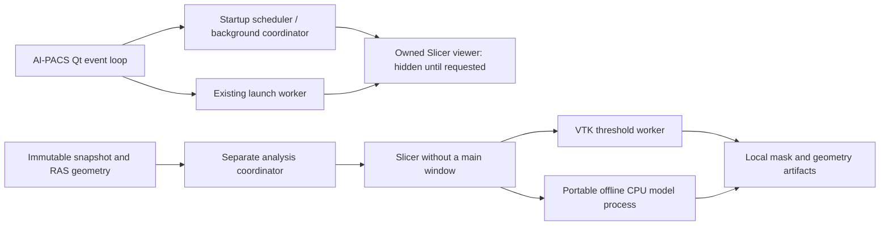

# Advanced Analysis: resident startup and headless computation

Implementation and synthetic verification: 2026-08-31. Canonical tracking: OPT-56 in
`docs/OPTIMIZATION_STABILITY_RELIABILITY_MASTER_PLAN.md`. Development integration;
not a packaged release or clinical validation.

**Live acceptance update, 2026-08-31:** after the deleted-button and invisible-modal
repairs below, the user confirmed that Advanced Analysis opens and responds in the
VS Code source run. This closes the reported launch and input-freeze defects for
that session. It does not establish model accuracy, exhaustive extension behavior,
customer hardware compatibility or release readiness.

## What changed

AI-PACS starts its optional custom Slicer viewer in a separate, below-normal-priority
Windows process during workstation startup. Its window is constructed but hidden.
The Image Analysis launcher joins that startup and reuses the same process. It no
longer treats importing a launcher module, an alive process, or a startup timeout
as proof that Slicer is ready.

AI computation has a **different Slicer process**, started on demand with
`--no-main-window`. It receives an immutable numeric snapshot and RAS geometry,
runs a named operation, and returns local mask/measurement artifacts. It never
loads, clears, or segments the interactive viewer's MRML scene. The initial
operations are VTK threshold segmentation and offline TotalSegmentator
`vertebrae_mr`. This is a private application bridge, not an implemented MCP server
or automatic dispatch from the Eagle Eye LLMs.



## Startup and resource policy

`main.py` installs `PacsClient/utils/advanced_analysis_startup.py` before constructing
`AppHandler`. The first Qt event turn schedules a daemon preparation thread. Module
profile reads, executable discovery, process creation, readiness polling and warmup
waits occur outside the workstation GUI thread. No patient image is preloaded.

| Control | Default | Behavior |
|---|---|---|
| Existing `advanced_mpr` profile | Existing source/installed profile policy | Disabled/omitted installed components are not prewarmed |
| `AIPACS_SLICER_PREWARM` | `1` | `0`, `off`, or `false` disables automatic warmup; the managed viewer can still start on demand |
| `AIPACS_SLICER_RESIDENT` | `1` | `0`, `off`, or `false` returns the UI launcher to its legacy cold-launch path |
| Available memory | At least 2 GiB | Below this threshold, skip speculative viewer warmup; on-demand requests remain possible |
| Analysis runtime | Lazy | Start only when requested, avoiding a second idle Slicer at every login |

These are environment switches inside an existing module, not a new selectable
module or JSON configuration family. The analysis controller can explicitly call
`get_service("analysis").warmup()` when its workflow is about to need Slicer. This
warms Slicer, **not** the portable model process or weights; model computation still
has its own latency. No persistent GPU reservation is introduced.

Each role has one serial background executor and at most four outstanding host
requests. Startup has a 120-second deadline; ordinary commands default to 120
seconds and model jobs to 1800 seconds. Requests arriving during startup join the
same runtime rather than launching a competing instance. Automatic warmup failure
does not abort workstation startup. A later user request can retry startup.

Closing the interactive window ends that Slicer session normally. A subsequent
launch starts a new process; there is no automatic endless replacement loop and
no interception of Slicer's normal close/save workflow. The launch worker emits
`slicer_finished` when the reused process actually ends, not when image loading
merely completes.

## Why hiding works in this runtime

The verified Slicer revision is `ae061ac`, using the existing custom executable.
Its application helper instantiates scripted modules before creating the main
window. `AIPacsBackgroundRuntime` installs a Qt event filter in its module
constructor; top-level windows get `WA_DontShowOnScreen` before being shown. Native
Windows startup also requests `SW_HIDE`; both splash screens are disabled.
Promotion clears the attribute on every live top-level widget suppressed by this
guard, including dialogs polished during startup but opened later. It maps any
already-logically-visible window without hiding or accepting/rejecting its dialog,
then shows the same main window and raises any active modal. Intentionally hidden
dialogs stay hidden; offscreen attributes set by other components are preserved.
No C++ rebuild and no `--testing` mode are required.

The analysis role instead uses `--no-main-window`; a headless instance is not
promoted into the interactive viewer because the custom main window was never
constructed. This is why the roles have separate process ownership.

This mechanism was checked on the current source-linked executable. It is not an
OS-level proof that every graphics-driver, third-party-extension, or pre-module
error dialog can never flash on every customer machine. Verify startup visibility
again if the Slicer build, extension set, or graphics environment changes.
Primary implementation reference:
[Slicer application helper at the pinned revision](https://github.com/Slicer/Slicer/blob/ae061ac/Base/QTApp/qSlicerApplicationHelper.hxx).

## Private command contract

`modules/mpr/advanced_3d_slicer/resident_service.py` owns the host service;
`slicer_modules/AIPacsBackgroundRuntime.py` owns the in-Slicer receiver. The runtime
creates a loopback-only ephemeral TCP listener and atomically publishes
`ready.json` inside its random session directory. Readiness requires a protocol-1
descriptor, the expected role, and a successful authenticated ping. The descriptor
has no authentication secret. A random 256-bit per-launch token is passed through
the child environment, never in command-line arguments or application logs.

Messages use newline-delimited JSON, limited to 64 KiB, with `ping`, `submit`, and
`result` envelopes. Submitted IDs are unique 32-character lowercase hexadecimal
identifiers; up to 32 completion records are retained. One runtime operation runs
at a time. Repeated submission of a known ID does not execute it again.

| Role | Named operations | Effect |
|---|---|---|
| Viewer | `status`, `show`, `hide`, `load_dicom` | Inspect/promote/hide the owned window, or load the selected source |
| Analysis | `status`, `analyze` | Inspect the headless role or process a staged immutable snapshot |

There is no arbitrary Python execution, shell command, package install, network
download, or unrestricted path-based analysis tool. Wrong tokens and unlisted
commands are rejected. This protects against accidental cross-instance control;
it does not sandbox malicious code already running as the same Windows user.
The old unauthenticated fixed-port receiver is not started by the resident path.
The resident kill switch restores legacy behavior and its older limitations.

`load_dicom` accepts the existing launch payload: `dicom_dir`, `series_uid`,
`layout`, patient/study display metadata, window width/level, and optional viewport
geometry. It uses a temporary Slicer DICOM database and `loadSeriesByUID`. An
omitted UID is accepted only for a folder containing exactly one series. An
unavailable UID or ambiguous folder is rejected; it never loads an arbitrary first
patient. A scene already containing a volume is preserved and cannot be replaced
by another load request. Layout, contrast, display metadata, and viewport sizing
remain available.

Interactive DICOM import and MRML construction still use Slicer's own GUI-thread
APIs. They can delay Slicer's window while loading a large series; they do not run
on the workstation GUI thread. Headless array loading, validation, VTK computation,
model execution and artifact writes all run in a Slicer background thread without
creating scene nodes. Its Qt timer only dispatches commands and publishes results.

## Calling from an AI worker

```python
from modules.mpr.advanced_3d_slicer.resident_service import get_service

# Acquire this private snapshot from the identity-keyed read-only data trunk.
# Copying/decoding the source belongs in the caller's worker, not the Qt event loop.
snapshot_kji.setflags(write=False)
future = get_service("analysis").analyze_snapshot(
    snapshot_kji, affine_ras, algorithm="threshold", lower=30, upper=100
)
# Blocking result retrieval and artifact reads belong in a worker:
result = future.result(timeout=1900)
# result["labels_file"] is a local .npy mask; affine_ras and shape_kji accompany it.
```

Use `algorithm="vertebrae_mr"` for the bundled model. Supply a numeric 3-D NumPy
snapshot marked read-only and a valid 4x4 RAS affine. The volume must be nonempty,
at most 256 Mi voxels and 1 GiB. Do not mutate aliases after submission. The adapter
rejects mutable/oversize inputs before copying or starting Slicer and stages files
in its worker. Threshold bounds must be finite and ordered; they are intensity
parameters, not a clinically validated sensitivity control.

`Future` completion callbacks run outside the caller's Qt thread. Marshal UI updates
through queued signals. Keep the original case/series identity and source revision
with the future; reject stale results at the consumer before applying them to any
clinical workflow. Geometry and job IDs do not replace patient identity checks.
The current Eagle Eye pipeline is unchanged and does not consume these masks yet.

Threshold results contain voxel count and physical volume from the affine
determinant. Both algorithms return the mask path, shape, affine, job ID, role and
`clinical_validation="not_established"`. The model also retains its engine
provenance and NIfTI output; see the
[offline lumbar guide](ADVANCED_ANALYSIS_OFFLINE_LUMBAR.md). No inference accuracy
or lesion-detection benefit follows from successful execution alone.

## Failure, shutdown and sensitive artifacts

Definitive operation rejection leaves an existing viewer intact. An uncertain
viewer transport error or command timeout preserves its process and marks the
service uncertain; further automatic commands are refused while it remains alive.
Recover/save through the preserved window, close it, and retry. Commands are not
silently replayed. Analysis timeouts close only the analysis runtime.

`owned_process.py` uses a non-inherited Windows Job Object with kill-on-close.
Normal application shutdown stops scheduling work and asynchronously closes the
owned jobs. OS handle closure also covers abrupt parent exit after job assignment.
Slicer and its model descendants belong to these jobs; unrelated viewers are never
terminated by an image-name sweep. Process creation is followed immediately by job
assignment; the small creation-to-assignment interval is not a suspended-start
crash-proof boundary. Assignment failure aborts the attempted runtime.

Normal child output is discarded rather than copied into workstation logs. The
probe alone opts into diagnostic logs and must only use generated synthetic data.
Raw staged `.npy` input is removed on ordinary success/failure. Returned masks,
geometry, model artifacts and metadata remain under the session's OS temporary
directory so the consumer can read them. They are sensitive even without direct
identifiers. Abrupt termination can leave partial input. This is not an encrypted
artifact store or a secure-erasure/retention service; deploy only with an approved
local retention and cleanup policy. Never attach these directories to analytics
or model-provider requests.

The prepared model is local and needs no runtime package/weight download. Its
Python audit hook denies network operations; this is not an OS firewall for
Slicer/native libraries. Complete disconnected-machine acceptance remains a
separate release check.

## Verification and packaging

The isolated probe refuses to start if an Advanced Viewer already exists, uses
the source-linked executable, creates synthetic data only, and closes only its
owned processes. It does not launch/login to the workstation or installed build.

```powershell
.\.venv\Scripts\python.exe tools/dev/run_slicer_resident_probe.py --inference
```

Successful full probe:
`generated-files/offline-lumbar/resident-probes/6dcda7641a514551815cd450ad7308c0/result.json`.

| Check | Observed result |
|---|---|
| Hidden viewer cold initialization | 4.385 s, real authenticated readiness, no loaded volume |
| Show already-ready viewer | 0.471 s, same process ID |
| Source selection | Correct six-slice second series from a two-series synthetic folder; ambiguous request rejected |
| Scene protection and authentication | Existing volume retained; wrong token and arbitrary-code command rejected |
| Headless threshold | Exact expected 384-voxel mask, 691.2 mm3, no main window or MRML volume nodes |
| Offline model in the headless role | 55.600 s, shape/dtype/geometry preserved, same analysis process, no main window |
| Model mask on the nonanatomical fixture | Empty; an execution check, not clinical evidence |
| Parent Qt heartbeat | 4644 ticks, maximum observed gap 0.697 s throughout this run |

An earlier successful show-only run measured 5.832 s cold and 1.220 s warm. These
are individual observations on this workstation, not distributions or latency
guarantees. The test uses a Qt harness, not the full login/workstation startup;
remaining acceptance includes human-launched source startup, real-study loading
latency, lower-memory PCs, simultaneous local AI load, and customer graphics.

`tests/code/mpr/test_slicer_resident.py` covers readiness, background dispatch,
coalesced startup, shutdown races, ownership, input budgets, uncertain/rejected
requests, launch lifetime, profile switches and low-memory deferral. Three original
guards failed before the repair: launcher imports falsely counted as ready, an
alive process timed out as success, and cleanup targeted unowned image names.

The focused resident/offline-model/builder/default-inclusion/shutdown gate passed
**58 tests, 4 deselected**, with direct pytest exit code 0. Mirror verification
matched **462 Python pairs**. The repository-wide fast lane was not used as proof
of success; its previously documented baseline blockers remain outside this task.
A final synthetic rerun after lifecycle refinements also passed (without repeating
model inference): `generated-files/offline-lumbar/resident-probes/505a8fd7184f49b7b36b78982c0c2dc6/result.json`.

The existing `advanced_mpr` source-tree package rule includes the new service and
scripted module. Canonical Python mirrors are synchronized with the repository
tools. The startup helper belongs to the existing core `PacsClient` tree. No native
runtime, generated installer, installed executable, module catalog or profile schema
was rebuilt/changed for resident startup. The earlier combined Slicer/model installer
staging remains in place; a fresh distributable still requires the documented
release/security and clean-machine acceptance gates.

## Live launch follow-up: deleted sidebar buttons (2026-08-31)

The human-launched source session reported viewer readiness after 26.608 seconds,
but the Advanced MPR button failed before reaching the Slicer launcher. The local
trace identified `ButtonSafeguard.start_operation`: `button.isHidden()` touched a
deleted `QPushButton` outside its exception boundary. Qt had destroyed the control
while its Python wrapper remained registered. Because the operation flag was set
first, the exception also left subsequent clicks blocked. No patient data is
needed to reproduce this failure.

The shared safeguard now rejects deleted controls during registration, prunes
stale wrappers and saved states, and checks Qt validity before accessing controls
when disabling/restoring them. Existing disabled states, duplicate-launch
protection and completion signals remain intact. This is a core UI lifecycle fix;
it does not change Slicer visibility policy, scene identity or model execution.
An explicit Advanced MPR launch still opens the interactive window; AI analysis
uses its separate headless role.

`tests/code/mpr/test_advanced_launch_safeguard.py` reproduced **5 failures** before
the fix (exit 1) and now passes all five: immediate/deferred Qt deletion, invalid
registration batches, deletion during an operation followed by retry, and the
real Advanced MPR handler reaching deferred launch with synthetic series identity.
The combined safeguard/resident/overlay/tab-lifecycle/route/builder suite passed
**52 tests** (exit 0, reruns disabled). Mirror verification matched **462 pairs**;
the core safeguard has no plugin payload mirror and the sync dry-run found no drift.

The human subsequently restarted the source application and confirmed that the
window opened. The separate invisible-modal repair below restored interaction.
No hot patch, installed application launch, process recovery or patient/model
request was performed for this button repair. Rollback is limited to the
safeguard lifecycle change; disabling Slicer warmup cannot repair that exception.

## Live visible-window follow-up: invisible modal (2026-08-31)

After the source restart, the user confirmed that the Advanced Analysis UI opened
but did not accept input. Launch completion was recorded. Read-only native window
inspection found a responding process, a visible disabled main window, and a
hidden enabled owned window. No window titles, patient content or memory dump
were retained. This is consistent with an invisible modal blocking input rather
than a process-level computation hang.

The reproducible defect was in `WindowGuard`: it set `WA_DontShowOnScreen` on
all startup windows, but viewer promotion cleared it only on the main window.
A dialog polished during warmup therefore remained invisible when subsequently
opened. Qt still registers suppressed modal windows as input blockers. Clearing
the attribute also does not remap an already-logically-visible widget; see the
primary [Qt 5.15 QWidget implementation](https://raw.githubusercontent.com/qt/qtbase/5.15/src/widgets/kernel/qwidget.cpp),
`QWidgetPrivate::show_sys` and `QWidget::setAttribute`.

The guard now marks only widgets whose offscreen attribute it changed, removes
its event filter at viewer promotion, and restores live marked top-level widgets.
Already-visible dialogs are mapped through their window handle, preserving their
modal state and pending user decision. No `hide()`, dialog acceptance/rejection,
forced main-window enabling or nested event pumping is used. A fresh top-level
widget query avoids stale Qt wrappers; unrelated offscreen widgets are untouched.
The separate analysis process never enters viewer promotion and remains hidden.

`tests/code/mpr/test_slicer_window_promotion.py` reproduced **3 failures** before
the implementation change (exit 1): a warm-polished dialog shown later, an active
invisible modal, and stale/unused/foreign widget handling. All pass afterward with
real Qt widgets in the offscreen test process, including native-window visibility
state and preservation of the modal's unfinished result. Combined launch,
resident, overlay, lifecycle and builder verification: **70 passed**, exit 0,
reruns disabled. The canonical Slicer module was synchronized to its Advanced MPR
plugin payload; **462 mirror pairs match**.

This test uses the development PySide6 Qt binding; the shipped Slicer uses
PythonQt/Qt 5.15. The full Slicer synthetic probe was not run alongside the active
clinical viewer. After the human's source retest, the user explicitly confirmed
that the window works. Record this as user-confirmed launch/responsiveness, not
an instrumented sweep of all menus, slice interactions and extension dialogs.
No native binary rebuild, model change, runtime process recovery or release was
performed. A rollback would restore the defective promotion path; the existing
`AIPACS_SLICER_RESIDENT=0` switch remains the documented legacy fallback.
