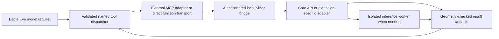

# Advanced Analysis: Slicer control runbook

Verified: 2026-08-31. Scope: the existing source-linked AI-PACS Advanced Viewer runtime.

**The current runtime can be controlled through Python and a bounded local command bridge. Core image loading, threshold segmentation, parameter readback, output saving/reloading, and measurements have been executed successfully. An LLM-facing MCP adapter has not been implemented or tested.**

Use this document for repeatable control recipes. Use the [extension guide](SLICER_EXTENSIONS_INSTALL_AND_CONTROL_GUIDE.md) for downloads, dependencies, third-party APIs, and the separately observed extension GUI failure. Historical evidence is in the [runtime audit](../reports/SLICER_RUNTIME_CONTROL_AUDIT_2026-08-31.md) and [Eagle Eye feasibility assessment](../reports/EAGLE_EYE_SLICER_TOOL_AUGMENTATION_FEASIBILITY_2026-08-31.md).

## 1. Runtime identity and boundaries

The repository-relative launcher is:

`modules/mpr/advanced_3d_slicer/slicer_custom_app/NewMPR2Slicer/build/AIPacsAdvancedViewer.exe`

| Property | Observed value |
|---|---|
| Application name/version | AIPacsAdvancedViewer / 0.1.0- |
| Slicer repository revision | ae061ac |
| Runtime package directory | AIPacsAdvancedViewer-5.11 |
| Embedded interpreter | Python 3.12.10 |
| VTK / NumPy | 9.5.2 / 2.3.4 |
| Workstation development interpreter | Separate Python 3.13.5 in .venv |
| Extension Manager / SimpleITK build defaults | OFF / OFF in the custom application configuration |
| Relevant packages present | numpy, pydicom |
| Relevant packages absent | SimpleITK, torch, monai, mcp, totalsegmentator |

Do not infer compatibility from the folder name alone. Record application version, repository revision, Python/Qt/VTK versions, and the exact extension/model versions when updating this inventory. Presence of a Python package does not prove successful import or GPU compatibility.

This executable is the custom Slicer component, not the installed AI-PACS workstation executable. The source and installed Advanced Viewer payload had matching hashes for four inspected files; that was not a complete payload parity audit.

The existing AI-PACS launcher/startup socket on loopback port 47891 only accepts image-loading operations (`load_dicom`, `load_series`). Its acknowledgement means scheduled, not necessarily loaded. It is not the segmentation bridge described here and does not provide the probe's token protection.

## 2. What each control mechanism does

| Mechanism | Appropriate use | Current evidence |
|---|---|---|
| Slicer Python console | Inspect nodes and call local APIs during an authorized development session | Python APIs exercised by script |
| `--python-script` | Initialize a controlled Slicer process or run an audit | Executed |
| `--additional-module-path` | Load a reviewed scripted extension for one process | Executed; no persistent installation |
| Bundled WebServer with a custom handler | Deliver restricted commands to an existing Slicer event loop | Executed on loopback, random port, session token |
| Native LLM function calling or external MCP server | Expose named, validated operations to the models | Proposed; provider transport not verified |
| Community MCP with arbitrary Python execution | Broad experimental automation | Exists externally; not installed or approved as a clinical interface |

The bridge reuses `WebServer.SlicerHTTPServer` directly with `server_address=("127.0.0.1", 0)`. Do not substitute `WebServerLogic.start()`: the inspected implementation binds all interfaces. Do not add the default arbitrary-execution, filesystem, or DICOMweb handlers to the clinical control surface.

An external MCP process can use its own Python environment. Installing the `mcp` package inside Slicer's embedded Python is not a prerequisite for that architecture. The community [mcp-slicer project](https://github.com/zhaoyouj/mcp-slicer) demonstrates a bridge approach, but does not establish compatibility, security, or clinical suitability for this custom runtime.

## 3. Reproduce the core control audit

From the repository root, with no Advanced Viewer instance running:

```powershell
.\.venv\Scripts\python.exe tools/dev/run_slicer_control_probe.py
if ($LASTEXITCODE -ne 0) { throw "Slicer control probe failed" }
```

The [client](../../tools/dev/run_slicer_control_probe.py) starts the source-linked runtime with no main window, disabled persistent settings, no user slicerrc, and no inherited additional launcher settings. It refuses to launch if an Advanced Viewer process already exists. It never starts the workstation, logs in, attaches to a patient session, or installs a package.

The [Slicer-side script](../../tools/dev/slicer_control_probe.py) creates only synthetic images. A new UUID directory under `generated-files/slicer-control-probe/` contains fixtures, output files, logs, and `result.json`. The temporary connection file contains a credential: do not display or copy it into documentation. It is removed on shutdown.

The client calls these fixed operations:

| Operation | Action | Verified result |
|---|---|---|
| capabilities | Inspect runtime/modules/effects/packages | Inventory returned |
| open_fixture | Generate, save, and load a small NRRD volume | Exact pixel roundtrip |
| open_dicom_fixture | Generate 12 MR instances; import/load by series UID in a temporary DICOM database | Exact pixels and spacing |
| threshold(30, 100) | Set and apply Segment Editor Threshold | 1,536 voxels; 2,764.8 mm3 |
| threshold(60, 100) | Change the same effect parameters and reapply | 128 voxels; 230.4 mm3 |
| save_reload | Save/reload segmentation and NIfTI labelmap; compute statistics | Matching masks, NIfTI geometry, and volume |
| shutdown | Stop the bridge and exit its owned runtime | Normal process exit code 0 |

It also rejects an invalid token, an unsupported `execute_python` operation, and reversed threshold bounds. Success requires both successful checks and a normal process exit. Timeout cleanup targets only the process tree owned by this probe.

The array has KJI shape (12, 24, 32), IJK spacing (0.8, 0.9, 2.5) mm, and known cuboids of intensity 40 and 80. These values are synthetic intensities, not a lumbar MRI threshold recommendation.

## 4. Practical Python API recipes

The following are **API fragments**, not a clinical command endpoint. Variables such as `volume`, `segmentation`, `segment_id`, and output paths must already refer to validated, job-owned objects. The complete executable synthetic example is the probe script linked above.

### Discover capabilities before calling them

```python
module_names = slicer.app.moduleManager().factoryManager().loadedModuleNames()
editor = slicer.qMRMLSegmentEditorWidget()
effect_names = editor.availableEffectNames()
editor.deleteLater()
```

An available module or effect name does not establish operational readiness. Fourteen editor effects were listed, but only Threshold was executed in the core audit. Mask Volume emitted a CTK `DecimalsOptions` type error during editor setup; do not classify it as working.

### Load data

```python
volume = slicer.util.loadVolume(input_path, {"show": False})
assert volume is not None
pixels_kji = slicer.util.arrayFromVolume(volume)
spacing_ijk_mm = volume.GetSpacing()
matrix = vtk.vtkMatrix4x4()
volume.GetIJKToRASMatrix(matrix)
```

For DICOM, the executed recipe uses `DICOMUtils.TemporaryDICOMDatabase`, `DICOMUtils.importDicom`, and `DICOMUtils.loadSeriesByUID([series_uid])`; see `open_dicom_fixture()` in the probe. Do not point tests at the workstation's live `dicom.db` or import an entire patient directory when a specific series was requested.

Array equality and spacing were checked for the synthetic DICOM input. A clinical implementation additionally needs orientation, origin, frame of reference, multiframe interpretation, per-instance identity, intensity conversion, and source-series validation.

### Change segmentation parameters and execute

```python
segmentation.SetReferenceImageGeometryParameterFromVolumeNode(volume)
editor_node = slicer.mrmlScene.AddNewNodeByClass("vtkMRMLSegmentEditorNode")
editor = slicer.qMRMLSegmentEditorWidget()
editor.setMRMLScene(slicer.mrmlScene)
editor.setMRMLSegmentEditorNode(editor_node)
editor.setSegmentationNode(segmentation)
editor.setSourceVolumeNode(volume)
editor.setCurrentSegmentID(segment_id)
editor.setActiveEffectByName("Threshold")
effect = editor.activeEffect()
assert effect is not None
effect.setParameter("MinimumThreshold", lower)
effect.setParameter("MaximumThreshold", upper)
actual_lower = effect.doubleParameter("MinimumThreshold")
actual_upper = effect.doubleParameter("MaximumThreshold")
effect.self().onApply()
mask_kji = slicer.util.arrayFromSegmentBinaryLabelmap(
    segmentation, segment_id, volume
)
```

Validate finite numeric bounds and allowed ranges before this code. Keep the editor and parameter node alive while needed; detach/delete the editor and remove job-owned nodes at cleanup. Only this effect's exact parameter names have been executed here. Other effects need their own validated parameter definitions.

### Read measurements and save results

```python
assert slicer.util.saveNode(segmentation, segmentation_path)
reloaded = slicer.util.loadSegmentation(segmentation_path)
labelmap = slicer.mrmlScene.AddNewNodeByClass("vtkMRMLLabelMapVolumeNode")
assert slicer.modules.segmentations.logic().ExportVisibleSegmentsToLabelmapNode(
    segmentation, labelmap, volume
)
assert slicer.util.saveNode(labelmap, labelmap_path)
statistics = SegmentStatistics.SegmentStatisticsLogic()
statistics.getParameterNode().SetParameter("Segmentation", segmentation.GetID())
statistics.getParameterNode().SetParameter(
    "ScalarVolumeSegmentStatisticsPlugin.enabled", "False"
)
statistics.getParameterNode().SetParameter(
    "ClosedSurfaceSegmentStatisticsPlugin.enabled", "False"
)
statistics.computeStatistics()
volume_mm3 = statistics.getStatistics()[
    segment_id, "LabelmapSegmentStatisticsPlugin.volume_mm3"
]
```

Import `SegmentStatistics` before this fragment. The audit used `.seg.nrrd` for Slicer segmentation and `.nii.gz` for a labelmap, then independently reloaded and compared them. Visibility-based export was safe with the single synthetic segment; production export must explicitly select intended segment IDs and preserve label-to-anatomy mapping.

Saving a complete `.mrb` scene through `slicer.util.saveScene` is documented upstream but was **not tested** here. A scene can contain sensitive images and metadata. Neither NIfTI nor `.seg.nrrd` is DICOM SEG; DICOM export needs a separate validated workflow.

Official API reference: [Slicer script repository](https://slicer.readthedocs.io/en/latest/developer_guide/script_repository.html). Installed source and executed probes take precedence over examples for a different Slicer version.

## 5. Turn these operations into tools for two LLMs



This is the proposed production design. Only the local bridge, core APIs, and the lightweight extension computation have been exercised.

Prefer named tools such as `get_capabilities`, `load_authorized_series`, `segment_threshold`, `run_anatomy_model`, `measure_segments`, `export_job_result`, `get_job_status`, and `cancel_job`. Each tool has its own schema and implementation. Do not give an LLM `exec`, `eval`, arbitrary module imports, shell commands, package installation, arbitrary URLs, or unrestricted file paths.

Required contract:

1. Resolve opaque input handles to authorized immutable series/volume data. Preserve source identity and provenance locally; do not send patient identifiers to the model.
2. Validate model/task, supported modality, dimensions, coordinates, parameter ranges, output ownership, and compute/time budgets. Reject extra arguments.
3. Serialize mutations per Slicer scene. Two LLMs must not concurrently modify the same segmentation or editor parameter node. Use separate job-owned nodes or isolated sessions.
4. Return a job ID for long work; distinguish queued/running/succeeded/failed/cancelled. A scheduling acknowledgement is not a completed segmentation.
5. Keep bounded MRML/Qt mutations on Slicer's owning thread. Run blocking I/O, decoding, inference, and substantial computation in appropriate workers. Do not pass mutable MRML objects into arbitrary background threads.
6. Validate the output geometry and identity before returning measurements, overlays, or authorized image crops. Include units, source/model hashes, actual parameter readback, warnings, and completion state.
7. Store outputs in a validated per-job directory, prevent overwrites/path traversal, write a provenance manifest, and clean up only resources owned by that job.

The current HTTP probe is **not hardened for production**. Its size check occurs after the bundled parser receives the body; it has no full request-rate/resource control, explicit per-user file ACL policy, or async job manager. Those are engineering requirements, not completed features.

## 6. Sensitivity, thresholds, and interpretation

An intensity threshold, a model probability cutoff, a smoothing parameter, and diagnostic sensitivity are different things. A model may not expose a probability cutoff at all. MRI intensities are not a universal calibrated disease scale.

The model-facing tool catalog must enumerate only parameters the selected algorithm actually supports. Any adaptive parameter search needs bounded candidates and an independent quality check, rather than letting the LLM repeatedly optimize a mask to agree with its first diagnosis.

An anatomy mask or cross-sectional area can supply evidence. It does not itself establish disc herniation, root compression, tumor type, or improved diagnosis. Compare baseline Eagle Eye, fixed tool augmentation, and adaptive tool augmentation on an independently annotated held-out dataset before claiming clinical benefit.

## 7. Troubleshooting and completion checklist

| Symptom | Interpretation / next check |
|---|---|
| Probe refuses to launch | Existing Advanced Viewer process; do not terminate or reuse a patient's session |
| Node/module missing | Inspect this process's inventory and additional module path |
| Mask Volume setup traceback | Known CTK enum compatibility issue; not repaired by this documentation |
| Extension form lacks setMRMLScene | Observed MRML custom-widget loading failure; computational logic may still work |
| Missing SimpleITK/PyTorch/nnUNet | Dependency gap; do not blindly pip-upgrade the shipped runtime |
| Socket says accepted but no image | Existing loading socket schedules work; validate completion separately |
| Saved output looks displaced | Check IJK/KJI ordering, RAS/LPS, origin, direction, transforms, and reference geometry |

Before promoting an operation to the LLM tool catalog, require an exact version pin, dependency preflight, synthetic operation/negative tests, geometry/output checks, cancellation/timeout behavior, and appropriate clinical evaluation. Shipping it later also requires project packaging parity and release gates.

For extension downloading and the successful third-party calculation, continue with the [extension installation and control guide](SLICER_EXTENSIONS_INSTALL_AND_CONTROL_GUIDE.md).
