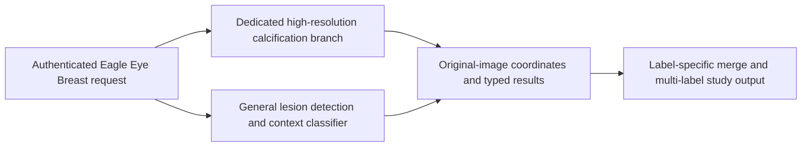

# Breast calcification-region training workflow

> Current state and continuation: [Breast AI development](BREAST_AI_DEVELOPMENT.md)
> and [experiment ledger](BREAST_AI_EXPERIMENT_LEDGER.md), reconciled 2026-10-05.
> The preparation and execution sections below are historical receipts. Read the
> current entry point before repeating a pilot or selecting a next experiment.

Owner-authorized structure preparation, 2026-10-01. Status: protected research data
candidates, experiment specification and synthetic optimizer/checkpoint proof.
The following preparation snapshot predates the later authorized real-data pilot.
See the execution receipt below: research weights now exist, but production
registration and clinical acceptance remain pending.
The incident and dataset evidence belongs to
[the Breast engineering record](EAGLE_EYE_BREAST_BONE_LOCAL_2026-09-21.md).

## Task and branch contract



This diagram specifies a proposed integration; current runtime does not yet invoke
the new branch. The calcification branch scans images independently of legacy
detector boxes. Mass and calcification can coexist. The classifier for Mass/Focal
Asymmetry/Asymmetry remains a separate training experiment. Missing branch output
is explicit unavailability, not No Finding. All company inference stays on the
authenticated Eagle Eye Server.

The first supported research target is an annotated calcification **region**.
Individual-punctum segmentation and a universal microcalcification label are not
supported by these converted ROI masks. Preserve original morphology, distribution
and pathology labels; review which subtypes support the clinical microcalcification
target before narrowing training. Benign is not No Finding. VinDr suspicious-region
labels and CBIS all annotated calcification-region labels are distinct supervision.
Do not pool them indiscriminately.

## Implemented components

- `tools/eagle_eye/prepare_cbis_calcification.py`: source annotation/series linkage,
  grayscale and geometry checks, near-binary region-mask checks, exclusive xyxy
  bounding envelopes, complete per-image targets, quarantine and patient partitions.
  All original Mass and Calcification test people are reserved together. Missing
  role strings can be recovered through geometry/pixel checks, but those checks do
  not establish clinical mask alignment. JPEG threshold 128 is an explicit research
  derivation, not restored native binary truth.
- `tools/eagle_eye/breast_training_targets.py`: complete VinDr per-image targets,
  coannotated Mass preservation, recorded reference clipping and study stratification.
- `tools/eagle_eye/configs/calcification-region-v1.json`: explicit task/data/model,
  experiment, evaluation and proposed runtime contract. Training hyperparameters
  are pilot hypotheses, not optimized settings.
- `tools/eagle_eye/smoke_calcification_training.py`: strict owned FCOS load,
  multi-box/empty-target synthetic training, finite gradients, a real optimizer
  update, checkpoint save/restore and reloaded inference. It is not a clinical
  training executor. The later `run_calcification_pilot.py` implements a bounded
  real-data positive-patch loop and label-blind complete-image evaluation; a full
  training workflow with reviewed negatives and checkpoint selection remains pending.

## Protected data outputs and audit result

Data and private manifests remain on Windows A100 under
`D:/Enhanced Mammography/candidates/20261001-calcification/protected-data`.
Do not copy patient records, paths to individual images or quarantine rows into
the repository or externally hosted reports. Aggregate JSON only may be copied to
the local candidate evidence directory.

| CBIS partition | Images | Accepted region annotations | People |
|---|---:|---:|---:|
| Training | 955 | 1220 | 468 |
| Validation | 118 | 134 | 58 |
| Calibration | 114 | 134 | 58 |
| Cross-category test-reserved | 39 | 56 | 18 |
| Publisher test | 284 | 324 | 151 |

Of 1872 annotations, 1868 were resolved and four quarantined. The resolver recovered
323 rows with missing image/mask role strings through shape and pixel checks.
The union of original Mass and Calcification splits revealed 31 shared train/test
people across categories. Eighteen calcification-training people (56 accepted
annotations) were therefore reserved outside training/development; the other shared
people concern Mass training. These reserved train annotations are not a new
independent test cohort. The dataset audit took 541.91 seconds on CPU.

The initial manifest is `cbis-calcification-v1.jsonl`; its sibling aggregate JSON
records source hashes and cohort counts. Before an actual training run, bind input
image hashes, preparation code, dependency lock, manifest/config and initialization
checkpoint hashes. A moved manifest needs an explicit path mapping on Linux, not
silent Windows-path substitution. All copies/crops/views of a person remain in
that person's partition.

## Reproducible preparation commands

Run on Windows A100 using the existing dataset environment. Outputs must be new:
the tools reject replacing an existing protected manifest or smoke directory.

```powershell
$candidateRoot = 'D:/Enhanced Mammography/candidates/20261001-calcification'
& 'D:/Enhanced Mammography/venv/Scripts/python.exe' "$candidateRoot/prepare_cbis_calcification.py" `
  --root 'D:/AisanRahimi/mamography/mamographic data set/CBIS-DDSM/archive' `
  --output "$candidateRoot/protected-data/cbis-calcification-v1.jsonl"

& 'D:/Enhanced Mammography/venv/Scripts/python.exe' "$candidateRoot/smoke_calcification_training.py" `
  --weights "$candidateRoot/best_fcos_csv_delivery.pth" `
  --output "$candidateRoot/synthetic-training-smoke-v1"
```

These commands were executed. Synthetic losses were classification 0.96122, box
regression 0.77644 and centerness 0.76112 with Torch 2.5.1+cpu; one optimizer step
changed the classifier head and checkpoint tensors restored exactly. Synthetic
128-pixel inputs do not prove GPU capacity or accuracy at native 1024 pixels.

## Training and promotion stages

1. Review representative converted source images and masks for alignment, clipping,
   compression and native-source preservation. Classify unresolved annotations and
   confirm microcalcification subtype semantics. Review completeness of negatives:
   VinDr No Finding does not exclude unannotated benign calcification.
2. Implement native 1024-pixel overlapping patches with exact invertible coordinates.
   Track every visible target; reject uncertain partial annotations rather than
   drop them into negative supervision. Add reviewed normal/hard-negative samples
   and retain large-cluster context. Training crops may use labels; evaluation
   windows must not use reference locations.
3. Compare a dedicated FCOS candidate initialized from owned generic weights with
   a clean-lineage ImageNet-backbone/new-head baseline. Unknown history of the owned
   checkpoint prevents claiming its public-dataset results are independent.
4. Use the Linux A100 isolated worker for an actual native-1024 GPU pilot, first
   checking current free VRAM, jobs, data mapping and packages. Measure one-image
   peak VRAM and finite mixed-precision updates; no service eviction, shared driver
   upgrade or H200 rental is implied by this structure preparation.
5. Train a CBIS research baseline, then perform a separately labeled VinDr adaptation
   experiment for suspicious regions. Monitor classification/box/centerness losses,
   optimizer updates, rare-subtype recall, validation FROC and false-positive burden.
   Stop on numerical failure and investigate persistent validation degradation.
6. Select thresholds/checkpoints using validation/calibration complete images.
   Measure sensitivity at 0.5/1/2 false-positive boxes per image, typed end-to-end
   matches, source/morphology/size/density strata, latency and uncertainty by person.
   The false-positive budgets are evaluation operating points, not approved clinical
   acceptance targets. Digital-mammography external validation remains required.
7. Only after localization improves, retrain/compare the morphology and context
   classifier on actual detected ROIs. Preserve multi-label cooccurrence and evaluate
   the complete two-branch study workflow. A successful loss curve or reference-ROI
   classifier alone cannot qualify the system.
8. Bind the evaluated candidate's code, weights, transforms, labels and dependencies.
   Production integration, server parity and source GUI acceptance are separate
   gates; no production changes were made by this work.

Use the existing `D:/monai` MON-AI platform for orchestration once its executor is
verified to perform real training; do not interpret a dashboard job marked success
as evidence of an optimizer update. MONAI is a framework, distinct from that
platform. No MON-AI job was submitted by this preparation work.

Primary implementation references:
[Torchvision FCOS](https://docs.pytorch.org/vision/stable/models/generated/torchvision.models.detection.fcos_resnet50_fpn.html),
[VinDr official task/annotation description](https://physionet.org/content/vindr-mammo/1.0.0/),
and [CBIS-DDSM official collection](https://www.cancerimagingarchive.net/collection/cbis-ddsm/).

## Authorized real-data A100 pilot execution receipt (2026-10-01)

The owner authorized the bounded pilot. `stage_calcification_pilot.py` selected
32 training and eight validation images from different CBIS people, enriched for
pleomorphic/amorphous/punctate/fine-linear-branching morphology while retaining all
source region targets. Forty full images decoded and 42 source ROI envelopes
matched the prepared references. Thresholding those JPEG masks at 96/128/160
changed no bounding coordinates; median/max intermediate-intensity pixel fractions
were 0.0001764/0.0010733. This supports region-envelope stability, not native-detail
preservation, exact punctum truth or clinical alignment approval.

The protected archive was transferred directly between authorized Windows and
Linux hosts using SCP relay, without depositing image data in the repository.
Archive and every staged image hash were verified after extraction. The existing
Linux interpreter had Torch 2.11.0+cu130 but no Torchvision or Pillow; compatible
Torchvision 0.26.0+cu130 and Pillow 11.3.0 were installed only in a named candidate
overlay. No existing environment, service or driver was modified or evicted.
Reference compatibility: [Torchvision official version matrix](https://github.com/pytorch/vision#installation).

`run_calcification_pilot.py` completed 100 real optimizer steps on 32 distinct
training images with native 1024-pixel crops, batch one, AdamW LR 1e-5, gradient
clip 5 and frozen BatchNorm running statistics. Every visible region target is
translated/clipped; ambiguous slivers reject the crop, and unknown background is
never made an empty negative. This is a positive-only pilot; reviewed negative
sampling and a full training executor still need work. The initial FP16 attempt
stopped on nonfinite gradients and its private log was retained. BF16 completed
with finite gradients and a verified changed classifier head. No invalid update
was accepted. Mean total loss over first/last ten updates was 2.2130/1.3777.

Peak allocated VRAM was 1.7654 GiB within an eight-GiB process cap; execution took
22.50 seconds including paired CBIS evaluation. Post-run free VRAM returned to
11865 MiB, matching the pre-run snapshot. The checkpoint was saved and strictly
reloaded before candidate evaluation; SHA-256:
`99dc214eb5ca90a68273ba34857589e25209e96e7741ccb4e086bdf5009bf095`.

### Paired complete-image CBIS evaluation

Both initial generic weights and candidate weights were evaluated with identical
label-blind native-1024 overlapping windows and NMS 0.5. One-to-one matching used
IoU >= 0.5 on ten region references in eight validation images. No final test
images were used. The candidate foreground channel denotes CalcificationRegion,
not Suspicious Calcification, malignancy or individual-punctum segmentation.

| Threshold | Initial matched / 10 | Candidate matched / 10 | Initial boxes | Candidate boxes |
|---|---:|---:|---:|---:|
| 0.30 | 1 | 5 | 3904 | 858 |
| 0.40 | 0 | 4 | 779 | 250 |
| 0.45 | 0 | 2 | 304 | 134 |

At 0.40, 246 candidate boxes remain unmatched. Region annotations and incomplete
outside-ROI review do not establish that all unmatched boxes are clinical false
positives. The count nevertheless demonstrates excessive output burden. Reduced
loss and this small exploratory gain are not qualification evidence.

### Digital-mammography transfer check

`stage_vindr_calcification_transfer.py` selected 12 calcification-positive and 12
No Finding control images from disjoint development study groups, with 18 suspicious
reference regions. Images were checked, hash-bound and privately staged on Linux.
`evaluate_calcification_transfer.py` compared both checkpoints with the same
native-1024 label-blind scan. This is a development transfer check, not patient-level
independent testing; initialization lineage and VinDr patient linkage remain unknown.

| Threshold | Initial matched / 18 | Candidate matched / 18 | Initial No Finding control boxes / 12 images | Candidate control boxes / 12 images |
|---|---:|---:|---:|---:|
| 0.30 | 3 | 8 | 2009 | 606 |
| 0.40 | 2 | 4 | 305 | 149 |
| 0.45 | 0 | 1 | 107 | 98 |

At 0.40 the candidate produces 167 boxes on positive images, 163 unmatched. VinDr
No Finding does not exclude benign calcification, whereas this candidate's target
includes annotated calcification regions; control boxes are therefore output burden,
not verified clinical false-positive truth. This semantic mismatch requires separate
review before adaptation. These counts must not be compared numerically with the
earlier 512-pixel 115-region cascade as if the cohorts/outputs were identical.

### Saved state and next discriminating experiment

Research checkpoint and private data remain under
`/home/gadmin/Mammography/candidates/calcification-pilot-20261001` on Linux.
Only aggregate `pilot-result.json`, `transfer-result.json`, pilot staging and mask-QA
receipts were copied to the local candidate evidence directory. Twenty-three focused
guards pass; new crop guards verify native translation, multi-target preservation,
partial-target rejection and refusal to invent negative labels.

This candidate is **trained research pilot, not deployment-qualified**. The next
experiment needs reviewed normal/hard-negative tissue windows, annotation completeness,
label harmonization and deterministic complete-image validation/checkpoint monitoring.
Compare clean-lineage initialization with owned weights, then add the global context
branch if large-cluster failures justify it. Do not merely lower confidence to inflate
recall: the measured output burden is still excessive. The normal Eagle Eye runtime,
clinical weights and server configuration were not changed, and no MON-AI dashboard
success was used as proof of training.

### Controlled continuation: 500 additional updates (2026-10-01)

A separate protected run continued the 100-update research checkpoint for 500
additional updates on the same 32 training images, with unchanged crop, optimizer,
BF16 and complete-image evaluation settings. Its initial evaluation exactly
reproduced the previous CBIS result. No validation image was used for optimization.
Peak allocated VRAM remained 1.7654 GiB; training and CBIS evaluation took 64.33 s.
The previous checkpoint and all receipts remain intact.

| Development measurement at threshold 0.40 | 100 updates | 600 total updates |
|---|---:|---:|
| CBIS matched reference regions / 10 | 4 | 1 |
| CBIS output boxes / 8 images | 250 | 55 |
| VinDr matched reference regions / 18 | 4 | 3 |
| VinDr positive-image output boxes / 12 images | 167 | 64 |
| VinDr No Finding control output boxes / 12 images | 149 | 42 |

At threshold 0.30, CBIS matches also fell from 5 to 2 and VinDr from 8 to 4.
At 0.45 VinDr matches increased from 1 to 2, illustrating why a single threshold
does not establish superiority. These are repeatedly inspected development
cohorts, not independent accuracy estimates or clinically verified FP rates.

Decision: **reject this continuation as a replacement for the earlier research
candidate at the current 0.40 operating point**. Fewer output boxes came with
lost reference detections. Training loss reduction is insufficient; these results
do not prove overfitting or identify its cause. Positive-only sampling, limited
source diversity, confidence shift and incomplete labels are competing explanations.

Next training preparation must expand patient/source diversity, harmonize the
calcification target and establish reviewed normal/hard-negative tissue windows.
Never turn unmatched proposals or VinDr No Finding images into automatic negative
labels. Add interval development evaluation and preserve checkpoints before
continuing; compare recall at matched output burden, with a prespecified selection
rule and an untouched qualification cohort. Do not simply repeat longer training
on these 32 images. The rejected checkpoint remains research evidence, SHA-256
`be41af5afcbb3b2681b58e19ed4aa734344fe5eb97331dee8cc2f35d5cbac51e`.
Aggregate receipts are `continuation-500-result.json` and
`continuation-500-transfer-result.json` in the local candidate evidence directory;
private artifacts stay under the Linux candidate's separate continuation folders.
Eagle Eye clinical weights, services and runtime were not changed.

## Expanded development and negative-label review (2026-10-02)

The CBIS archive was expanded deterministically to 128 distinct training people
and 32 validation people, with 146/34 region references and zero person overlap.
All 160 image hashes and full-image/mask geometry were verified. The earlier
100-update checkpoint initialized 384 additional BF16 updates at LR 1e-5, with
saved/reloaded complete-image evaluations every 128 updates. Training used 127
distinct sources; four ambiguous crop attempts were rejected. Peak allocated
VRAM was 1.7657 GiB; run time including evaluations was 153.32 s. These cohorts
extend and include the previously inspected pilot; they are development data.

### Identical expanded CBIS cohort, threshold 0.40

| Checkpoint | Matched / 34 regions | Output boxes / 32 images |
|---|---:|---:|
| Earlier 100-update candidate | 18 | 904 |
| Expanded, additional 128 updates | 18 | 553 |
| Expanded, additional 256 updates | 18 | 983 |
| Expanded, additional 384 updates | 19 | 600 |

The interval results demonstrate why the final training loss cannot select a
checkpoint. Additional 128/384 steps provide promising burden reductions at this
operating point; neither universally dominates the other across thresholds.

### Same digital development transfer cohort, threshold 0.40

| Checkpoint | Matched / 18 regions | Positive-image boxes / 12 images | Control boxes / 12 images |
|---|---:|---:|---:|
| Earlier 100-update candidate | 4 | 167 | 149 |
| Expanded, additional 128 updates | 5 | 127 | 123 |
| Expanded, additional 384 updates | 5 | 120 | 112 |

These are small exploratory changes, not statistically established accuracy gains.
At 0.30 the earlier candidate matches 8/18 digital references and each expanded
candidate matches 6/18, so the fixed-0.40 improvement is not improved sensitivity
at every operating point. At 0.45, expanded-128 matches 4/18 with 35 control boxes;
expanded-384 matches 3/18 with 25. Threshold selection remains development work.
The output burden is still excessive; controls are not confirmed negative for all
calcification. VinDr explicitly omits benign BI-RADS 2 finding annotations:
https://physionet.org/content/vindr-mammo/1.0.0/ .

Aggregate receipts: `expanded-20261002-result.json`,
`expanded-transfer-128-20261002-result.json`, and
`expanded-transfer-384-20261002-result.json` in the local candidate directory.
Expanded step-128 SHA-256 is
`a205f834d9c50043aa1bc1070c39531d411b5b7a0ca5a8c07c0495bad5138d06`;
step-384 SHA-256 is
`d7977862035b1ae9f50416a3dbd76ba22ac033ab73afc066c0642c5d3b68056b`.

### Private proposal review packet

`prepare_calcification_review.py` prepared two high-confidence unmatched proposals
per development image (48 proposals from 24 images), using expanded step-384.
Unmatched status does not assert false positivity. Each proposal fits completely
inside its native, unpadded 1024-pixel crop. Image and crop hashes were verified;
private images, identifiers and manifests were not copied into this repository.

On **Windows A100**, the protected packet is:
`D:/Enhanced Mammography/candidates/20261001-calcification/protected-data/review-20261002/review.html`.
Open that file locally on that host. Inspect native resolution, assess the marked
proposal separately from the entire crop, enter a reviewer identifier and export
the reviewed JSON onto protected storage. There are zero automatic negative labels.
Uncertain/incomplete reviews stay unknown; rejection of the marked proposal alone
cannot authorize an empty crop target. A complete-crop negative also requires
explicit absence of any calcification, including benign calcification.

The HTML is a review aid, not diagnostic software or a training importer. Review
exports still require artifact/schema verification, annotation reconciliation and
partition reassignment before training. Reviewed cases must be excluded from any
future independent qualification cohort. The negative-eligibility gate has eight
synthetic guards. This packet is not a random prevalence sample or clinical FP audit.

### Mixed digital adaptation and source-specific decisions

`stage_vindr_calcification_training.py` selected 64 distinct positive **training**
studies with 81 reference regions, zero protected-study overlap and zero negative
training images. All source PNG hashes and geometries were verified. Original
validation/calibration/test data were excluded from adaptation. Study-level
grouping is still a proxy for unverified person linkage.

The mixed worker initialized expanded CBIS step-384 and alternated CBIS/VinDr
positive samples (128 CBIS + 64 digital images; each digital record repeated twice
per 256-entry sampler cycle). It performed 512 BF16 updates at LR 3e-6, batch one,
with interval save/reload/evaluation every 256 steps. Eight ambiguous crop attempts
were rejected; 190 unique training sources actually contributed. Training plus
combined development evaluations took 184.69 s; peak allocated VRAM was 1.7659 GiB.
The optimizer was newly initialized, not a full optimizer-state resume. No controls
were assigned empty training labels. The two sources' target semantics remain
different; this exploratory run does not resolve that mismatch.

| Same development cohorts, threshold 0.40 | Expanded CBIS step-384 | Mixed step-256 | Mixed step-512 |
|---|---:|---:|---:|
| CBIS matched / 34 regions | 19 | 14 | 11 |
| CBIS output boxes / 32 images | 600 | 344 | 284 |
| VinDr matched / 18 regions | 5 | 6 | 5 |
| VinDr positive-image boxes / 12 images | 120 | 62 | 52 |
| VinDr control boxes / 12 images | 112 | 43 | 31 |

At 0.30, mixed step-256 matches 24/34 CBIS and 10/18 VinDr references, versus
expanded step-384's 24/34 and 6/18. It produces 1934 CBIS positive-image boxes,
351 VinDr positive-image boxes and 274 control boxes at this threshold. These
burdens remain unsuitable for a clinical accuracy claim. Mixed step-512 loses
recall relative to step-256 and is not selected merely for its lower box count.

Decision: retain **mixed step-256 as a digital research candidate** and retain
expanded CBIS step-384 separately. Neither is a universal or deployment-qualified
replacement. Relative to the earlier 100-update candidate on the same digital
cohort at 0.40, matches rise from 4/18 to 6/18, positive-image boxes fall from 167
to 62 and control boxes from 149 to 43. This is development evidence, with no
independent or statistically established clinical performance claim.

Mixed step-256 SHA-256:
`21abbfda6830891a379f4115e7f3d97977bf2609a2e64b0610e93af63b1392e6`.
Receipts are `mixed-20261002-result.json` and
`mixed-source-evaluation-20261002.json`. The actual worker evaluates CBIS,
VinDr positives and VinDr controls separately, rather than hiding domain regression
in a combined metric. Configuration is
`tools/eagle_eye/configs/calcification-domain-adaptation-20261002.json`.

The preferred **digital-candidate** review packet uses mixed step-256 and retains
the earlier queue separately. Its Windows A100 entry point is:
`D:/Enhanced Mammography/candidates/20261001-calcification/protected-data/review-digital-20261002/review.html`.
Reviewing/reconciling these uncertain tissue proposals is the required data step
before targeted hard-negative training or a learned proposal-verification stage.
Do not invent negatives to bypass it. Thirty-four focused synthetic guards passed;
research tooling checks are separate from model evaluation and clinical GUI gates.

## Microcalcification architecture ladder (2026-10-02)

The existing detector is **FCOS**, with a ResNet50 backbone and P3-P7 FPN; it is
not an FCAS model. Torchvision's builder uses returned ResNet layers [2,3,4].
The installed worker implementation was inspected, not inferred from a model name.
Source: https://github.com/pytorch/vision/blob/main/torchvision/models/detection/fcos.py .

| Priority | Candidate change | Intended contribution | Required evidence / risk |
|---|---|---|---|
| 1 | Native DICOM floating-point input with audited modality/VOI/polarity/padding | Preserve intensity detail before it reaches the backbone | Audit exact current conversion first; do not claim quantization caused misses without a lesion-specific comparison |
| 2 | C2/P2 high-resolution FPN branch | Learn fine spatial features at stride 4 alongside existing stride-8+ features | Paired architecture ablation, complete-image recall and output burden; more fine-grid proposals may increase spurious detections |
| 3 | Local fine-detail branch plus global region context, optionally weighted multiscale fusion | Combine tiny bright structures with the surrounding cluster/anatomy | Preserve native detail; measure extra compute and source regression; attention alone is not qualification |
| 4 | Proposal verification / hard-negative learning | Distinguish calcification from vessels, tissue texture, text and other artifacts | Reviewed full-crop negatives and reconciled positive boxes; reject unknown labels rather than auto-mining negatives |
| 5 | Residual LoG/wavelet/top-hat feature channel or branch | Provide a fine bright-structure cue while retaining the original intensity channel | May also amplify noise, vessels, compression artifacts and text; compare a single change, with physical scale where spacing is verified |
| 6 | Individual-punctum segmentation auxiliary head | Provide precise speck supervision rather than only region boxes | Current CBIS converted region masks/VinDr boxes do not establish punctum truth; new dense reviewed annotations are required |
| 7 | CC/MLO/bilateral context or a different detector backbone | Reduce ambiguity using anatomy and independent views | Verified pairing/correspondence, missing-view behavior and independent evaluation; never pair using reference lesion labels at inference |

Focal loss is already present in FCOS; proposing to add focal loss as if absent
would not address the observed defect. A larger transformer or attention block is
a hypothesis, not a ready microcalcification detector. Do not combine every
candidate into one run and attribute any result to a particular layer.

Relevant primary studies supporting multiscale/region-versus-punctum experiments:
"A shortcut weighted fusion pyramid network for microcalcification detection in
breast mammograms" (2022), https://pubmed.ncbi.nlm.nih.gov/36442221/ ;
"Improving the Quantitative Analysis of Breast Microcalcifications: A Multiscale
Approach" (2023), https://pmc.ncbi.nlm.nih.gov/articles/PMC10287598/ .
Their published performance does not transfer to this checkpoint or these labels.

### DICOM/PNG intensity audit

Twenty deterministic positive **training** images were checked on Windows A100.
All DICOM/PNG dimensions matched. DICOM BitsAllocated was 16 in all 20; BitsStored
was 12 in 12 and 16 in eight. All PNG inputs were 8-bit mode L. Fifteen images
were MONOCHROME2 and five MONOCHROME1. PixelSpacing was present in five; this audit
does not establish absence of other spacing tags.

`audit_calcification_pixel_fidelity.py` decoded all 20 pairs successfully, excluded
declared pixel padding, and sampled up to 50000 pixels per pair. MONOCHROME2 had
the same raw-to-PNG intensity ordering in all 15; MONOCHROME1 had inverted ordering
in all five. Median absolute rank correlation was 0.999883. Median distinct sampled
levels were 1679.5 raw versus 180.5 PNG. This is evidence of quantization with
largely preserved global ordering, **not** evidence of wrong polarity, correct VOI
rendering, or individual microcalcification detail loss. Do not fabricate detail by
super-resolution. A native-input comparison must bind training and inference to
the same reviewed transform and evaluate actual lesions.

Receipts: `digital-bitdepth-20261002.aggregate.json` and
`digital-pixel-fidelity-20261002.aggregate.json` in the local aggregate directory.

### Strict P2 implementation and numerical guard

`calcification_p2_model.py` adds returned ResNet layer 1 and a stride-four P2 map,
giving six levels P2-P7. Existing C3-C5 FPN state indices shift by one; backbone,
shared head and P6/P7 are preserved strictly. Only the new C2 lateral/output are
initialized: lateral weights/bias zero, output copied from the prior P3 output.
Schema or tensor-shape mismatch aborts migration. Four synthetic migration guards
pass; an actual A100 256-pixel check verified identical higher-level features and
finite, nonzero new-lateral gradients. This was architecture execution, not accuracy.

The first native-1024 BF16 P2 training attempt stopped on nonfinite loss before
accepting an optimizer update. Its private failure log remains intact. The
torchvision AnchorGenerator casts anchors to feature-map precision, and the box
coder casts anchors to regression precision: BF16 can collapse stride-four anchor
corners near large image coordinates. An actual numerical reproducer produced
28287 degenerate legacy anchors and zero with FP32 anchors/decoded regression.
The corrected 1024-pixel BF16 convolution run had finite loss/gradient and peak
allocated VRAM 2.8994 GiB. Reproducer:
`tools/eagle_eye/guard_calcification_p2_geometry.py`.

Both paired research architectures therefore use **FP32 geometry with BF16
convolution**. The comparator is explicitly FCOS P3 with the same geometry fix,
not the older BF16-geometry checkpoint protocol. The original clinical worker and
weights remain untouched. The shared run budget is 128 additional updates at LR
3e-6 from mixed step-256, identical protected mixed manifest and seed, native1024,
batch one, frozen BatchNorm, and complete-image interval evaluation. Old P3 and
failed P2 experiment folders are retained separately from the corrected pair.

### Completed paired P3/P2 results

Both corrected workers completed 128 real updates with finite loss/gradients,
128 contributing unique sources, strict checkpoint reload and source-separated
complete-image evaluation. Peak allocated training VRAM/time including repeated
evaluations: P3 1.7672 GiB / 111.77 s; P2 3.1402 GiB / 175.00 s. This is a short,
single-seed architecture screen; it does not show that P2 is optimally trained.

| Same digital development cohort | P3 with FP32 geometry | P2 with FP32 geometry |
|---|---:|---:|
| Matched / 18 reference regions at 0.30 | 10 | 11 |
| Positive-image boxes / 12 images at 0.30 | 313 | 290 |
| Control boxes / 12 images at 0.30 | 250 | 227 |
| Matched / 18 reference regions at 0.40 | 7 | 6 |
| Positive-image boxes / 12 images at 0.40 | 83 | 79 |
| Control boxes / 12 images at 0.40 | 50 | 46 |

On CBIS at 0.30 both match 25/34 references (P3 1830 boxes, P2 1735). At 0.40,
P3 matches 19/34 with 462 boxes; P2 matches 18/34 with 434 boxes. P2 therefore
does not establish superiority at the existing 0.40 operating point. Its small
0.30 gain is a hypothesis for additional development/calibration, not independent
evidence, and comes with substantially greater compute. Do not promote it or
claim individual-punctum sensitivity from region-box matches.

Step-128 checkpoint SHA-256:
P3 `48873320f4fb6f937c73aca247bbb503f6eb7c1d8dc2194f48bf72b6ceb8a868`;
P2 `dbe761083ace5b62dac283d48dcbe8e3e08b4f50c1c240637768cdfad2b11b23`.
Receipts: `architecture-p3-fp32-20261002-result.json`,
`architecture-p2-fp32-20261002-result.json`,
`architecture-source-evaluation-20261002.json`, and
`p2-geometry-guard-20261002.json`. The source-specific evaluator is
`tools/eagle_eye/evaluate_calcification_architectures.py`. All private data and
weights stay on protected hosts. Thirty-eight focused guards passed; these are
separate from actual GPU numerical proof and clinical model qualification.

### Build versus adapt shortlist refreshed on 2026-10-02

| Project | Verified useful direction | Decision for this product |
|---|---|---|
| DeepMiCa | Official microcalcification preprocessing/segmentation/classification pipeline; PyTorch one-channel UNet and public checkpoint link; repository code MIT | Best task-matched alternative to inspect next. Reproduce preprocessing, checkpoint provenance, mask semantics and label-blind complete-image inference before comparing; public weights are not yet downloaded or evaluated |
| Mammo-CLIP | Official mammography encoder with detection fine-tuning for VinDr suspicious calcification; offers variants trained with VinDr | Useful comparator in principle, but inspect training overlap and CC BY-NC-SA 4.0 restrictions before any product adoption. No code/weights incorporated |
| GLAM | Official MICCAI 2025 multiview geometry-alignment/pretraining method | Source of multiview design ideas, not a ready available checkpoint: authors explicitly state pretrained weights cannot be shared under their EMBED policy |

Primary sources:
https://github.com/ales-git/DeepMiCa ;
https://github.com/ales-git/DeepMiCa/blob/master/Step2_Segmentation/_03_Train/UNet.py ;
https://github.com/ales-git/DeepMiCa/blob/master/LICENSE ;
https://github.com/batmanlab/Mammo-CLIP ;
https://github.com/XYPB/GLAM .

Next discriminating work: audit/reproduce native floating-point DICOM transforms;
inspect a task-matched segmentation comparator and its inference/data assumptions;
then use the existing protected review queue to establish normal/hard-negative
truth for proposal verification. Region masks do not authorize speck-level targets.
Adding generic attention, an unavailable foundation checkpoint or more positive-only
epochs cannot replace these checks. Research requests have not changed Eagle Eye
clinical runtime, model weights or the authenticated server routing contract.

### Cost-aware selection decision, 2026-10-02

The incumbent is a comparator, not the default winner. No tested candidate has
established adequate calcification detection with verified normal-tissue specificity.
The model-development skill now requires competing routes, annotation effort,
time to validated evidence, and complete-image serving costs before substantial
additional training or adding branches.

| Route | Evidence and readiness | Next decision |
|---|---|---|
| FCOS P3 with FP32 geometry | Executed reference; small development cohort and incomplete negative truth | Retain the reproducible baseline |
| FCOS P2 branch | Executed short paired screen; higher training memory/time without consistent recall improvement | Do not select by architectural complexity alone |
| Native floating-point DICOM preprocessing | Existing PNGs quantize signal; audited ordering is retained, but diagnostic signal loss is unproven | Run a bounded preprocessing comparison before assuming extra layers solve the issue |
| YOLOX-Tiny | Compact box detector fits current region labels; official code is Apache-2.0 and pretrained links exist | Preferred next compact detector readiness screen; verify weight terms, dependency compatibility and small-object resolution before a bounded trial |
| Ultralytics YOLO26 small variants | Current official model catalog offers released alternatives | Evaluate exact variant, available weights and product-compatible licensing; no accuracy claim from general-purpose benchmarks |
| MONAI RetinaNet / UNet | MONAI is a framework; these are distinct detector and segmentation routes | Compare RetinaNet as a named detector; UNet requires suitable mask semantics, not invented punctum masks from region boxes |
| DeepMiCa component reuse | Task-matched public pipeline and checkpoint link; not executed here | Audit preprocessing, label-blind inference, checkpoint lineage, label compatibility and weight rights; use as the reuse comparator when ready |

The next proposed detector screen is YOLOX-Tiny against the preserved FCOS
baseline on the same locked development partitions. Keep native small-object
signal, complete-image tile coverage and matching rules comparable; document
model-specific preprocessing and use equally bounded tuning effort. Different
families' confidence values are not calibrated: compare sensitivity at matched
reviewed false-positive budgets, rather than calling a shared 0.40 threshold fair.
Until reviewed negative truth exists, report unmatched/control output burden as
a proxy and do not call it specificity or a clinical false-positive rate.

For the first readiness/training screen, preserve the existing shared-host cap:
at most 8 GiB worker memory, require at least 9 GiB free before launch, and stop
on nonfinite optimization or resource contention. A proposed two-GPU-hour cap
limits the initial comparison, not an assertion that either model will converge.
Record actual training cost, full-image GPU/CPU latency, peak memory, tile count,
annotation preparation effort and integration effort. If the quality constraints
remain unmet, report that outcome; otherwise choose among non-dominated quality,
time and cost options. An H200 upgrade is not a prerequisite without measured need.

This is a selection receipt and proposed next experiment, not a completed YOLO
trial. No new checkpoint was downloaded, trained or promoted by this skill update.
Official selection sources: https://github.com/Megvii-BaseDetection/YOLOX ;
https://docs.ultralytics.com/models/ ; https://www.ultralytics.com/license ;
https://docs.monai.io/en/1.4.0/applications.html ;
https://github.com/ales-git/DeepMiCa .

### Completed compact-detector and preprocessing screens, 2026-10-02

Owner authorized actual comparisons and literature review. The Linux A100 had
11865 MiB free before launch. Existing services remained active. YOLOX source
commit `6ddff4824372906469a7fae2dc3206c7aa4bbaee` and official COCO Tiny weights
were staged in candidate-only storage. Additional pinned packages were installed
with `--target --no-deps`; the shared training environment was not modified.
Weight rights for product distribution remain unverified; these are research runs.

YOLOX-Tiny uses 5032866 parameters after replacing the three 80-class output
projections with one-class projections. Pretrained backbone/regression/objectness
weights load with strict key/shape checks; output biases are initialized at 0.01.
Native 1024-pixel inputs use the official non-legacy BGR 0..255 convention.
Targets are class zero followed by pixel center x/y and width/height. No image
resizing, mosaic, mixup or invented empty negative labels are introduced.

Two finite-gradient FP32 AdamW runs used the protected mixed training manifest:

- Frozen BatchNorm, LR 1e-4, 512 updates: 190 unique contributing sources,
  47.10 training seconds, peak 0.7682 GiB. No proposals above 0.01 on validation.
- Adapting BatchNorm, LR 3e-4, 1024 updates: 191 unique contributing sources,
  94.29 training seconds, peak 0.7683 GiB. Predictions emerged, but recall remained
  weak. Multiple training choices changed together; this is not a causal BN ablation.

Complete-image comparisons cover 32 CBIS images (34 reference regions), 12
VinDr positive images (18 reference regions), and 12 VinDr controls. All use
native1024 tiles, 25% overlap, FP32 evaluation, per-tile cap100, global NMS0.5
and one-to-one reference IoU>=0.5. The FCOS P3 FP32-geometry step128 checkpoint
is unchanged, with the proposal floor lowered from0.2 to0.01 for the sweep.
Consequently its new FP32 counts need not exactly equal earlier BF16 evaluations.

| Candidate and exploratory threshold | CBIS matched /34 | VinDr matched /18 | VinDr positive outputs | Outputs on 12 controls |
|---|---:|---:|---:|---:|
| FCOS P3, 0.40 | 19 | 7 | 81 | 46 |
| YOLOX-Tiny adaptive BN, 0.05 | 1 | 4 | 50 | 43 |
| Same FCOS with full-image CLAHE, 0.40 | 12 | 4 | 71 | 46 |

This uses approximately matched control output burden, not calibrated confidence
equivalence or verified false-positive truth. At YOLO0.01 the digital match count
is6/18 with115 control outputs; lowering confidence is not a demonstrated quality
solution. At FCOS0.35 it is9/18 with113 control outputs. The small screened cohort
and different initialization/tuning histories do not prove architecture superiority.

The CLAHE-only experiment applies grayscale clipLimit2, grid8x8 once to the whole
image before tiling, without annotations or extra training. It regressed on both
sources. This rejects this inference-only configuration, not every contrast method
or native floating-point DICOM training approach.

All56 images require1390 tiles. Measured complete evaluation time, including image
loading, tiling, postprocessing and metric computation: adaptive YOLO16.26s,
FCOS40.24s, CLAHE FCOS42.47s. These single-pass research timings are not warmed,
repeated production latency benchmarks; output volume and precision affect costs.
YOLO offers a computational direction, but did not improve quality in these runs.

A synthetic guard reproduced silent removal of nonfinite YOLO predictions before
the fix (one failure, four passes). The adapter now fails explicitly on any
nonfinite raw detector output; five isolated Torch guards pass. A complete-image
finite-output recheck reproduces adaptive YOLO metrics exactly. Nineteen existing
crop/migration/training-selection/review guards pass locally, and both new research
scripts compile. These are research tools; no clinical GUI acceptance is claimed.

Receipts under the aggregate-only candidate folder:
`yolox-screen-20261002.json`, `yolox-adaptbn-screen-20261002.json`,
`contrast-screen-20261002.json`, `yolox-provenance-20261002.json`.
The provenance receipt hashes executed script versions, checkpoints and manifests
and records dependency versions. Private logs, images and checkpoints remain on
authorized hosts. The currently measured choice is to retain FCOS as comparator,
not replace it with either screened YOLO or CLAHE. None is clinically qualified.

### Task-matched literature implications refreshed on 2026-10-02

| Primary source | Relevant evidence | Implication and limit |
|---|---|---|
| [DeepMiCa, 2023](https://iris.unipv.it/retrieve/784885f2-7bff-48a2-b621-ce1e571b5d99/DeepMica.pdf) | Patch UNet segmentation trained on precise INbreast annotations; CBIS used for classification. Authors report segmentation ROC AUC0.95 and classification AUC0.89 | Audit/reproduce the accessible segmentation checkpoint; these AUCs are not full-image lesion sensitivity. CBIS region masks cannot replace precise punctum targets |
| [Context-sensitive detection, 2018](https://pubmed.ncbi.nlm.nih.gov/30467443/) | Evaluates local calcification features plus surrounding tissue context on292 mammograms using FROC; reports reduced false-positive detections | Supports a context-aware verifier trained on reviewed hard negatives; no numeric performance transfer to our cohort |
| [HDoGReg, 2021 preprint](https://arxiv.org/abs/2102.00754) and [official code](https://github.com/cmarasinou/HDoGReg) | Hessian/DoG candidates followed by regression network;435 mammograms, reported TPR0.744 at0.4 false detections/cm2 | A plausible small-signal candidate branch; square-centimeter metric differs from image-level burden. Inspect dependencies, checkpoint provenance and license before reuse |
| [MC-GenRef, 2026 preprint](https://arxiv.org/abs/2604.04470) and [official repository](https://github.com/hwcho-research/MC-GenRef) | Synthetic microcalcifications on real negative patches plus iterative test-time refinement; repository currently only promises code upon publication | Research lead, not a ready implementation. Requires reliable negative backgrounds and compute measurement; synthetic evidence cannot qualify a clinical detector |

Next discriminating work is task-matched segmentation checkpoint readiness and
reviewed normal/hard-negative truth, while preserving FCOS and the failed screens.
No result above demonstrates speck-level detection, clinical specificity, an optimal
training schedule or successful mass/asymmetry classification.

### Executed DeepMiCa checkpoint screen and next-stage decision, 2026-10-02

The owner authorized prioritizing DeepMiCa and using the full A100 memory for
Breast research. This authorization includes a controlled GPU maintenance window
when a larger worker needs it; preserve the documented EchoMind launch/recovery
path and active-session guards. No service interruption was needed for this screen:
the measured worker fit the existing free memory. Full-GPU authorization is not a
requirement to allocate all memory or interrupt services without a compute need.

Official upstream commit: `c2ce72cdf3265897827b8ab38fc9e1c7965ff812`.
The public archive contains a UNet segmentation checkpoint plus ResNet18 and
VGG16 classification checkpoints. Only the segmentation checkpoint was extracted
and executed. Its saved epoch is161, parameter count31042369, SHA-256
`df50a71d269596dc88ebc09b3b063338c13b61749ab433d1a543eb8280d55fef`.
These are pretrained weights, not new medical optimizer updates in this run.
Checkpoint membership and product redistribution rights are not independently
established; no classification result or clinical promotion is claimed.

The upstream testing code requires special handling for autonomous detection:

- `Step1_Preprocessing/preprocessing.py` derives artifact cleanup from the
  reference lesion mask's ROI center.
- `Step2_Segmentation/_04_Test/testing.py` applies a reference-mask logical AND
  to reconstructed CBIS predictions before saving them.

The research adapter omits both truth-dependent steps. It uses image-derived
orientation, foreground threshold/opening/dilation, largest foreground component,
background crop and CLAHE2/grid8. Native256 non-overlapping patches receive
grayscale0..1 input, right/bottom zero padding, FP32 UNet inference and sigmoid.
Predictions are restored to original full-image coordinates, including orientation.
This is an adapted label-blind pipeline, not an exact reproduction of the upstream
preprocessing distribution. Labels are read only after inference for comparisons.

Checkpoint deserialization uses `weights_only=True` with a restricted allowlist
of statically inspected upstream UNet classes and known Torch layers. It never
falls back to unrestricted pickle. State loading is strict. Synthetic inference
and all8799 patches across56 complete development images produced finite output.
Batch16 peak allocated memory2.1962 GiB; total evaluation213.10s includes CPU
preprocessing and five grouping/metric sweeps. This is not a production latency
benchmark. The existing EchoMind GPU allocations remained in place.

Two distinct exploratory measurements are retained:

| Segmentation probability threshold | VinDr regions containing >=3 predicted pixels /18 | Grouped proposals on12 positive images | Grouped proposals on12 controls | VinDr region boxes matched at IoU>=0.5 /18 |
|---|---:|---:|---:|---:|
| 0.10 | 18 | 296 | 275 | 5 |
| 0.30 | 18 | 234 | 110 | 4 |
| 0.50 | 17 | 160 | 82 | 1 |
| 0.70 | 17 | 108 | 59 | 0 |
| 0.90 | 13 | 51 | 28 | 0 |

The pixel-occupancy column is a lenient descriptive proxy. It is **not** confirmed
calcification sensitivity: coincidental predictions inside a large ROI can count.
Reference boxes cannot establish pixel-level PPV, Dice or individual-punctum recall.
The grouped-box column uses exploratory65-native-pixel dilation and envelopes of
original predicted pixels; it is not a validated physical clustering algorithm.
Region IoU can penalize tighter punctum envelopes or separated clusters within a
large reference box. It therefore does not by itself establish that the segmentor
fails to detect particles. CBIS has30/34 occupied regions at0.50, but zero matched
region boxes; this distinction must remain visible instead of substituting metrics.
Controls may contain unannotated benign calcifications, so their82 proposal groups
at0.50 cannot be labeled82 false positives or used as clinical specificity.

Decision: retain DeepMiCa as an executed dedicated segmentation research branch,
not a demonstrated detector replacement. The next substantive improvement must
address verified particle truth, domain/preprocessing alignment and proposal
verification/grouping. More epochs or more weakly labeled images alone do not
resolve these gaps; the earlier short YOLO screens also do not establish optimal
training or exclude eventual improvement with adequate data and convergence.

A bounded Windows search found no INbreast-named directories/files within the
checked dataset/Dropbox roots and depths. This is not a whole-drive absence claim.
The [original INbreast publication](https://www.sciencedirect.com/science/article/pii/S107663321100451X)
documents precise XML contours. Obtain/verify native images, annotations, rights,
patient linkage and checkpoint training overlap before any new segmentation
training or independent evaluation. RSNA cancer-status negatives do not establish
absence of benign calcifications; CBIS region masks remain unsuitable punctum truth.

Concrete review packet:48 native1024 crops from the24 digital development images,
selected from model proposals without reference-mask restriction. Original crops
and separately marked images are retained under protected Windows storage:
`D:/Enhanced Mammography/candidates/20261001-calcification/protected-data/review-deepmica-20261002/review.html`.
All48 crop hashes,48 cards and96 assessment controls were verified after transfer.
The reviewer separately labels the proposal and entire crop, with required reviewer
identity and JSON export. Zero automatic negative labels were created. Review
disqualifies these samples from independent qualification; exports require validation
before any training importer is added.

The [2025 generative-refinement preprint](https://pubmed.ncbi.nlm.nih.gov/41356355/)
also studies segmentation followed by refinement using genuine calcification-free
regions. It supports investigating a second-stage verifier, not assuming that a
generative branch or headline sensitivity solves clinical precision. No implementation
or weights from that work were incorporated here.

Artifacts: `run_deepmica_screen.py`, `prepare_deepmica_review.py`,
`test_deepmica_geometry.py`; aggregate receipts `deepmica-screen-20261002.json`
and `deepmica-provenance-20261002.json`. Five isolated geometry/input guards pass,
twelve existing crop/review guards pass locally, and the new scripts compile.
Clinical runtime, general lesion classification and production weights are unchanged.

### Authorized process start and training preflight, 2026-10-02

The owner again authorized starting the Breast research process and temporarily
stopping EchoMind when required for full A100 use. The existing scoped controller
reported status/health ok and9 active sessions at14:15:04 UTC. The initial capacity
test fit shared free memory, so no stop was needed or attempted. Preserve active
session checks and the existing private recovery recipe for a necessary full-GPU
window; do not substitute broad process termination.

`profile_deepmica_training.py` executed actual forward/backward, finite-gradient
clipping, AdamW updates, strict checkpoint save/reload and reloaded inference at
batch1/2/4, native256, FP32. The receipt is
`deepmica-training-capacity-20261002.json`. All3 updates are synthetic, with zero
medical optimizer updates. The synthetic checkpoint is explicitly non-diagnostic
and must never initialize or register a clinical candidate accidentally.

Protected project review exports were checked: zero reviewed exports/items and
zero explicit reviewed-empty crops. The public Kaggle INbreast mirror metadata
reports licenseName Unknown, public access and9005839100 total bytes. No mirror
dataset was downloaded or license terms accepted. Resolve provenance/rights and
precise labels before dataset ingestion; public reachability alone is not readiness.

Current runnable status is pretrained branch evaluated plus optimizer/capacity
preflight passed. Real segmentation fine-tuning remains data-gated. Use the prepared
48-item review packet to obtain verified positive/background examples and check
punctum-level annotation needs. Full memory availability does not create missing
reference labels, and model predictions must not be converted to medical truth.

### Owner-facing correction workflow, 2026-10-02

The owner requested a usable structure to inspect and correct necessary examples.
The48-item protected DeepMiCa packet was copied to authorized local dataset storage
outside the repository at `C:/AI-PACS-Datasets/breast-review/deepmica-20261002`.
All48 original crop hashes were checked. No patient images or private queue records
were committed or embedded in aggregate reports.

`enhance_calcification_review.py` renders an additional offline/local review page
with proposal/crop assessments, micro/macro/mixed/uncertain subtype, free-text
correction notes, native-size viewing and clickable missed-calcification centers.
Original images remain unchanged. Points record both crop and original-image
coordinates; they are not dense segmentation masks or inferred boxes. Negative
crop export is rejected when contradicted by a positive proposal or marked points.
Partial field edits are stored locally and reviewed JSON requires reviewer identity.
Exported labels still require validation; no automatic training importer was added.

The page is served only on loopback at
`http://127.0.0.1:18912/review-with-corrections.html`; its Codex panel opening was
queued. HTTP200, Python compilation and JavaScript syntax checks passed. These
checks do not substitute for human review or browser interaction acceptance.
The existing private Windows A100 packet remains available. No training labels
have been inferred from page creation or image availability.


## Physician draft and display correction, 2026-10-02

Recovered the Chrome draft into protected local storage before changing the review UI. Of 48 proposals, 19 were assessed: 11 marked calcification (10 micro, one macro/other), eight rejected. Four positive proposals conflict with a whole-crop negative assessment and require physician reconciliation. Five rejected proposals coexist with a positive whole-crop assessment. These selected development proposals cannot establish sensitivity or unbiased precision. No draft labels were imported into training.

All 48 proposal extents are inside the correct native crop extent. This verifies extent arithmetic, not lesion localization. Original 8-bit crop statistics show negligible 255 clipping (maximum fraction 0.000000954), which does not establish correct DICOM polarity, optimal windowing, or preserved microcalcification morphology. Full source DICOM comparison remains necessary for brightness complaints.

The private UI now offers a reversible display window, reset, explicit image-quality assessment, visible contradictory-label warnings, and progress for subtype/quality/notes-only changes. Source PNGs and native point coordinates remain unchanged. A verified training negative additionally requires adequate image quality and no positive correction points. Unknown legacy quality must be adjudicated before reuse.

Validation: 15 focused review tests passed; generated private JavaScript passed Node syntax checking. Live Chrome restored the 19 assessed proposals, displayed four contradictions and 48 quality fields, and verified window adjustment/reset. This is review UI acceptance only, not a clinical model-performance improvement. Next: reconcile conflicting assessments, mark unassessable images, compare native DICOM display and predicted pixel support for rejected boxes, then construct patient-separated training feedback without treating whole suspicious-region boxes or center points as dense microcalcification masks.


## Numbered physician rectangles, 2026-10-02

The protected review UI now defaults to drag-to-draw numbered calcification regions, supports multiple regions per crop and individual removal, and retains optional center points. Rectangles store native crop and full-image half-open xyxy extents; drawing a confirmed calcification region marks the crop as containing calcification. Subtype remains unreviewed until explicitly selected. A region box is weak localization, not a dense segmentation mask; do not train every enclosed pixel as calcification or treat unmarked pixels as normal. Prior browser assessments remain preserved. Sixteen focused tests and generated JavaScript syntax checking passed; browser loading restored 19 assessments and exposed rectangle tools on 48 cards. Pointer drag acceptance remains to be verified separately.

Investigate native DICOM signal/polarity and physical pixel spacing before any intensity-based proposal experiment. Use local background subtraction or multiscale white top-hat, local contrast/noise normalization, component shape/size and cluster context as candidate features. Do not use a universal raw brightness threshold or infer CT-style calibrated density from mammography pixels. Compare this lightweight branch with the model and a combined branch on the same patient-separated reviewed development samples at matched false-positive burden. No intensity-branch accuracy gain is established yet. Research references: https://pubmed.ncbi.nlm.nih.gov/26737753/ and https://pmc.ncbi.nlm.nih.gov/articles/PMC4782620/.


## Physician-region comparison executed, 2026-10-02

Ran `compare_physician_calcification_regions.py` against the protected feedback and hash-verified original crops. Excluded finger radiographs 026/027. Included 46 selected crops from 23 source images with 59 physician regions; 21 crops have no marked regions under the owner completion attestation, but quality remains unrated. No training import occurred.

Selected red proposals: 46 predictions, centers inside 11 physician regions and 35 outside all regions. Eleven regions have IoU >=0.25 with a selected proposal. Native multiscale top-hat (ellipse 5/9/15, component area 2–100 pixels, maximum extent 20 pixels) at contrast threshold 24 yields 12,927 components, covers 54 regions by center occupancy, with 11,659 centers outside marked regions. A maximum-one-component budget covers 11 regions with 33 outside centers among 44 proposals; top-three covers 20 with 98 outside centers among 128 proposals; top-ten covers 41 with 305 outside centers among 414 proposals. Restricting red proposals to top-hat support leaves 31 predictions, nine covered regions and 22 outside centers. No consistent superiority or clinically useful operating point is established.

This is selected-crop weak-region coverage, not true-punctum sensitivity, full-image FROC, confirmed false-positive count or independent model qualification. Green cluster extents cannot fairly impose particle IoU matching. Shared crops may repeat findings; center occupancy may count a noise point inside a broad region. Next technical gate: recover all model pixel predictions in native full-image context, evaluate them within reviewed crop coverage, and form patient-separated region-positive versus artifact/hard-negative patch supervision with representative replay. Do not apply the physician display window to model inputs without a separately controlled preprocessing experiment. Two synthetic metric tests passed. Aggregate receipt: `generated-files/eagle-eye/calcification-candidate-20261001/physician-region-comparison-20261002.json`.
## Full DeepMiCa output audit, 2026-10-02

The protected full-output script reran native-image inference on 23 source images and evaluated all grouped proposals whose centers fall inside the 46 reviewed crop windows. The two non-mammographic crops remain excluded. The aggregate receipt is `generated-files/eagle-eye/calcification-candidate-20261001/physician-full-output-comparison-20261002.json`. Runtime was 56 seconds and peak allocated VRAM was 2.196 GiB; existing services were not interrupted.

| Threshold | Proposals | Reference regions containing a proposal center / 59 | Reference regions with IoU >= 0.25 | Proposal centers outside reference regions |
|---|---:|---:|---:|---:|
| 0.1 | 465 | 36 | 24 | 419 |
| 0.3 | 357 | 46 | 23 | 288 |
| 0.5 | 274 | 51 | 20 | 201 |
| 0.7 | 215 | 53 | 17 | 126 |
| 0.9 | 108 | 41 | 9 | 38 |

These are exploratory crop-level region coverage counts, not sensitivity or confirmed false positives. Crops can overlap, repeated findings are not deduplicated, quality ratings remain missing, and this is review-selected development data. Changing the threshold changes component grouping, so center coverage is not monotonic. Pixel occupancy of at least three predicted pixels occurs in 59/59 reference regions at threshold 0.5, but cannot prove those pixels are actual calcifications. Broad physician cluster boxes also limit interpretation of IoU against tight predicted puncta.

The evidence supports testing artifact rejection and cluster localization alongside detection adaptation. Threshold 0.7 is a development comparator, not a qualified operating threshold. Before training a rejection head, deduplicate source-coordinate regions, establish patient-separated development partitions, and distinguish confirmed artifact patches from unreviewed or low-quality background. Physician boxes provide region-positive supervision; they do not make every enclosed pixel a positive segmentation label. No clinical weights were changed and no medical fine-tuning was completed by this audit.
