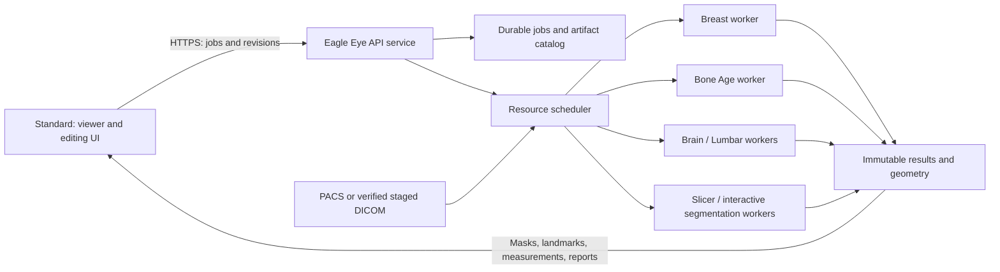

# Eagle Eye Server and Standard Client migration plan

Date: 2026-09-21. Status: phase-1 source implementation is now available; see the
[implementation and verification ledger](../../modules/EAGLE_EYE_SERVER_PHASE1_2026-09-21.md).
No server deployment or final installer qualification has been performed. Sections
below describe the broader target; the ledger identifies the implemented subset.

## Current execution priority and server administration design (2026-09-22)

This amendment records the owner's latest priority and supersedes the older
Breast-first phase ordering in section 8. It is an inspected implementation plan,
not a claim that administration, automatic retrieval or parallel execution exists.
Complete Brain first, qualify the shared server path and other integrated engines,
then resolve the Breast classifier artifact mismatch last. Keep legacy service
configuration until replacement workflows pass acceptance; do not silently route
failed common-server requests to a different backend.

### Source audit

| Boundary | Present implementation | Remaining work |
|---|---|---|
| Common transport | `eagle_eye_remote/client.py`, `server.py`, `contracts.py`: authenticated reference-only jobs, polling, cancellation and derived artifacts | Settings integration, separate-machine acceptance, reconnectable client job history and operational diagnostics |
| Desktop hosting | `launch.py`: owned loopback listener tied to workstation lifetime | Production service supervision and an administration client; desktop-hosted mode currently rejects a LAN listener |
| Standalone hosting | `bootstrap.py` and `server.py`: explicit service command, TLS required outside loopback | Windows service install/start/stop/recovery, least-privilege storage access, reboot without login and drain-before-upgrade |
| Source acquisition | `source.py`: `pacs-storage` resolves reception metadata to accessible mapped storage; `workstation-cache` reads an already complete server cache | Automatic cache-miss PACS download into server-owned storage, authoritative completion, resume and shared acquisition ownership |
| Dispatch | Seven explicit module IDs select adapters in `adapters.py` | Per-module installed/ready/blocked capability inventory; generic segmentation is not yet a separate registered remote module |
| Concurrency | Bounded admission and FIFO CPU/RAM reservations; serial default, explicit parallel budgets and per-client quotas; actual two-client model execution passed | Production module budgets, GPU scheduling, retention and multi-user soak qualification |
| Recovery | Durable JSON states and owner/request idempotency; unfinished jobs become `interrupted` after restart | Bounded durable job index, queue recovery policy, explicit retry lineage, retention and maintenance |
| Settings | Lazy role-aware Eagle Eye tab and Server Settings link; unified connection, owner job inventory, next-start source/resource settings | Fresh native GUI acceptance; full service lifecycle and credentials/provisioning administration |
| Readiness | `/v1/capabilities` currently returns all protocol module names | Actual model/runtime readiness and blocked reason; a listed name must not imply runnable weights |

No new remote inference was run for this architecture audit. Existing protocol and
role guards were rerun directly: 28 passed, retries disabled, process exit code 0.
Actual model evidence and unresolved Brain behavior remain in the
[execution report](../../reports/EAGLE_EYE_EXECUTION_FIXES_2026-09-22.md).

### Settings and ownership

Add a lazily constructed **Eagle Eye** settings tab using the current settings
factory. Keep storage, connection and scheduling services outside UI controllers.
The role is displayed from the installation/deployment configuration; switching it
must not accidentally load weights or start a second host inside Standard.

Standard's **Server Settings** gains an **Eagle Eye Server** connection entry:
HTTPS URL, client identity, protected credential reference, trusted CA, asynchronous
Test Connection and discovered module readiness. The Eagle Eye tab displays the
same saved connection, capabilities and this client's jobs; it does not maintain
another competing URL. Reconcile the existing `server_profiles.py` and remote
`settings.py` configuration through one versioned resolver and migration, including
explicit command-line overrides and site/profile selection. Saving an endpoint
must not move in-flight jobs: each job retains its original server identity.
Keep legacy fields visible until migration acceptance, then retire them through a
separate compatibility migration. Never silently fall back to local weights.

Server's **Eagle Eye** tab contains:

- Service: configured address/port, TLS, running/draining/stopped state and local
  connection test. Local administration talks to the same service as remote clients.
- PACS and storage: select an existing supported PACS profile, configure accessible
  storage mapping if used, server cache/job/result roots, free-space thresholds and
  retention. Test identity resolution, source reachability and write access separately.
- Models: module/version, weight/runtime readiness, CPU/GPU capability and measured
  resource profile. Report unavailable dependencies or incompatible artifacts clearly.
- Clients: separate credentials and permissions; each client can see/cancel only its
  jobs. Administrator operations require a separate authorization scope.
- Jobs/resources: queued, retrieving, waiting-for-resource, running, publishing,
  completed, failed, cancelled and interrupted states; per-client limits, CPU/RAM/GPU
  budgets, cancellation, retry, safe drain and bounded diagnostics.

Background workers perform connection probes, readiness checks and disk/network
operations. Secrets are not placed in server-profile JSON, logs or reports. Schema
versioning, installation profile writers, mirrors and both builders must follow the
existing runtime/catalog checklist when implementation reaches those boundaries.

### End-to-end data contract

1. Standard sends its selected operation, authoritative study/series/SOP references,
   parameters and request ID. An admission code alone is insufficient identity.
   The server validates module, modality, source roles, permissions and readiness;
   it dispatches the requested operation rather than guessing from a patient code.
2. The server resolves the configured PACS and looks for a verified local source.
   On a miss, a worker obtains the selected DICOM series directly from PACS into
   server-owned cache. Reuse the supported socket/download coordination contract;
   do not add a competing downloader or reconnect retired gRPC. Shared changes
   require the existing Unify ownership handoff before implementation.
3. Publish download completion only after atomic file publication and authoritative
   identity/count checks. Deduplicate concurrent acquisitions for the same source;
   cancellation by one waiter must not cancel another job's required acquisition.
   Lease/pin inputs against retention while jobs use them, then stage immutable inputs.
4. Acquire measured execution resources and run the isolated module adapter. Release
   resources and owned subprocesses on success, failure, timeout and cancellation.
5. Publish only completed, identity-bound derived results: measurements, landmarks,
   masks, reports and necessary derived previews with geometry/version/checksums.
   Standard downloads and displays them in the originating study. The Eagle Eye job
   path does not upload DICOM from Standard or return original DICOM to Standard;
   ordinary workstation viewing can still fetch images from PACS independently.

### Scheduling contract

Accept multiple clients concurrently while bounding all queues. Separate acquisition
capacity from inference capacity so a long brain job does not unnecessarily prevent
other studies from being fetched. Use measured per-engine RAM/VRAM and CPU-thread
budgets plus per-device leases, not just a configurable thread count. Keep one heavy
GPU job per device as the conservative default until co-residency is measured; allow
independent CPU/light jobs only when the total resource budget permits them.

Use per-client quotas and fairness with aging to prevent starvation. Oversized jobs
remain visibly blocked or fail with an actionable capacity reason. Add bounded
request handling, rate limits and structured queue-full responses with retry advice.
Do not transparently rerun a crashed computation or switch model/device versions.
Reconnect must locate the original request; explicit retry creates recorded lineage.
Persistent completion survives service restart, and unfinished work is visibly
interrupted until the qualified recovery policy permits safe resubmission.

### Delivery order and acceptance

1. **Brain closure:** diagnose the intermittent native abort and repeated-mask
   difference using fixed inputs/runtime/model settings; qualify Standard, Robust,
   lesion and downstream MS/SVD results, geometry, cancellation and native review.
   Do not call the repeated-mask difference resolved or clinically acceptable without
   measured comparison and an appropriate acceptance criterion.
2. **Connection and administration slice:** one versioned configuration resolver,
   Standard connection entry, lazy role-aware Eagle Eye tab, asynchronous probes and
   truthful readiness. Test save/reload/profile changes without altering active jobs.
3. **Uncached source slice:** a request from Standard for a study absent from server
   cache must trigger direct PACS retrieval, complete verified staging, inference and
   result display without client DICOM upload or a manual server download.
4. **Multi-client slice:** use two authorized client identities with different modules;
   prove fairness, resource admission, source deduplication, owner isolation, cancel,
   reconnect, queue-full handling and restart recovery. Serial success alone is not
   evidence of parallel inference. Bone Age can serve as the lighter real-model case
   while Breast remains blocked; add synthetic scheduler stress independently.
5. **Remaining engines, then Breast:** finish Alignment/Total Spine/Lumbar native
   workflow gates and inventory any other segmentation operation explicitly. Resolve
   Breast's training/inference feature contract last; preserve its blocked status until
   compatible artifacts and end-to-end output are verified.
6. **Deployment qualification:** separate Standard and Server PCs, LAN TLS, service
   restart without workstation login, CPU/GPU qualification on the actual target,
   clean installer/no-client-weights checks, storage retention and upgrade rollback.

These are extensions of OPT-51/OPT-56 and this migration plan, not a separate
optimization queue. Interactive editing/revision synchronization remains the next
phase after the initial analysis-and-return path is qualified. This amendment makes
no runtime change, starts no listener and performs no deployment.

## 1. Product decision and boundaries

- AI-PACS Eagle Eye becomes the server edition: model weights, isolated inference
  runtimes, heavy segmentation/measurement jobs, scheduling, and durable results.
- AI-PACS Standard becomes the interactive Eagle Eye client: study selection,
  review, point/box/contour/mask editing, progress, cancellation, and result display.
- Standard retains ordinary DICOM workstation functions. "UI client" applies to
  Eagle Eye computation; it does not remove local viewing, decoding, or existing MPR.
- No Eagle Eye model weights or inference environments are installed or downloaded
  to Standard. Model unavailability never triggers automatic local inference.
- Server installation includes an independently supervised processing service.
  No workstation login or visible desktop window is required to accept jobs.
- One product/repository and installer family; each model retains its own runtime.
  Copying a desktop executable to a server is not sufficient to implement this design.
- Initial deployment is Windows server on the clinic LAN. A Linux GPU worker is a
  later compatible execution target, not a prerequisite or a promised Windows capability.

## 2. Inspected baseline

| Component | Observed evidence | Migration implication |
|---|---|---|
| Breast | Razi `pacs`, `D:\FCOS_AR\API.py`; `AI_PACS_Mammo.exe` listens on 8002 | Import a verified source/model bundle; retain service during migration |
| Breast pipeline | DICOM preparation, FCOS ResNet50-FPN/HybridFCOS, ROI/single-view/bilateral features, stacked XGBoost | Preserve preprocessing, thresholds, geometry and feature ordering |
| Breast environment | Project requirements pin torch 2.5.1 / torchvision 0.20.1; inspected venv is Python 3.10 | Separate environment, not installation into the main workstation interpreter |
| Bone Age | Windows A100 `wina100`, `D:\Bone\BoneInference\BoneAgeAPI.py`; `BoneAge_Launcher.exe` listens on 8003 | Second adapter in the same server product |
| Bone Age pipeline | `bone_age_inference.py`, `dicom_utils.py`, EVA02-based BoneAgeViT, `final_model.pth` (350,806,623 bytes) | Preserve preprocessing and demographic inputs; compare outputs before cutover |
| Bone environment | `D:\Bone\venv\pyvenv.cfg` reports Python 3.12.3 | Separate from Breast and main Python 3.13.5 |
| Current client | `modules/viewer/interactor_styles/ai_chat_interactorstyle.py`: `MamoWorker` and `BoneAgeWorker` | Extract transport/orchestration into services, retain result presentation |
| Current endpoint file | `config/servers_address.json` points both features at Razi | Select authoritative source/deployed revision; source on A100 does not prove the Razi service matches |
| Existing local AI | Brain, brain lesions, offline lumbar, Alignment and Total Spine under `modules/ai_imaging/` | Migrate adapter by adapter, preserve each feature's interaction semantics |
| Edition packaging | `builder/distribution_profiles.py`, `BUILD.md`, `eagle_eye/assets.py` | Current Standard already excludes several AI bundles but still includes shared Slicer |
| Slicer integration | `docs/modules/ADVANCED_ANALYSIS_RESIDENT_RUNTIME.md` | Existing local viewer and analysis processes are distinct; reuse the analysis boundary, not a viewer's live scene |

These are source/file/listener observations. The running frozen binaries have not
been proved identical to the inspected Python source. No model outputs or timing
were measured. The Windows A100 VM exposes a basic display adapter; do not select
CUDA merely because its host alias contains A100. Actual GPU support is a worker
qualification result. The documented physical A100 belongs to the Linux VM.

## 3. Target topology and ownership

| Function | Standard client | Eagle Eye server |
|---|---|---|
| Navigation, zoom, window/level, overlay visibility | Immediate local interaction | No round trip |
| Move/add/delete point or box; brush/contour gesture | Local preview, undo and pending draft | Accept versioned edit; validate geometry |
| Lightweight measurement preview | Optional, explicitly provisional | Authoritative recomputation for saved result |
| Model inference, automatic segmentation, expensive mask operations | Submit request and display state | Execute owned worker and publish new revision |
| Final mask/landmark/report | Render and review | Durable version, provenance and acceptance state |
| Model/runtime management | Capabilities and readiness display | Install, verify, warm/evict and schedule |

Ordinary GUI interaction must not wait for server inference. No image is sent for
every mouse move. Commit a point/box on gesture completion; coalesce continuous
gestures, and run expensive operations on an explicit Apply/Analyze action.

## 4. Data access and the common contract

The owner's updated phase-1 boundary requires PACS references only. Source images
must be obtained on the server; client DICOM upload is not part of this migration:

1. PACS-backed study: send authoritative study/series/instance references and a
   source manifest. A configured server-side PACS adapter retrieves the selected
   inputs using the existing supported infrastructure. Verify identity and complete
   instance/frame inventory before inference, rather than scanning every study image.
2. Local imports or server-inaccessible sources are unsupported in phase 1. Report
   the missing server access explicitly; do not fall back to client inference or
   automatically upload images. Any future import route requires a separate decision.

Use an analysis-specific artifact ingress on the server. Do not add another client
PACS downloader or reconnect the retired gRPC path. Shared source/identity work must
follow the Unify handoff in the existing boundary document, section 0.2.

Every request records protocol version, institution scope, authenticated actor,
request/idempotency ID, module and operation, source revision/hash, Study/Series/SOP
UIDs and frame numbers, parameters, model selection, and optional parent result and
annotation revision. Server-created opaque IDs address files; arbitrary filesystem
paths, scripts, or caller-supplied executable commands are never accepted.

Every result includes job ID, input revision, model/runtime/preprocessing versions
and hashes, device/precision, parameters, warnings, completion state, and artifact
manifest (type, size, checksum, coordinate frame and reference identity). Status
success is published only after every required output is complete and verified.
"No finding", "unsupported input", "partial result", and "failed" remain distinct.

Proposed HTTPS API surface:

| Endpoint | Contract |
|---|---|
| `GET /v1/capabilities` | Installed/ready modules, operations, compatible schemas and supported hardware |
| Server-side PACS resolution | Resolve references into a verified manifest; no client image upload |
| `POST /v1/jobs` | Accept immutable request; return 202/job ID, never hold HTTP until inference completes |
| `GET /v1/jobs/{id}` | Durable status/progress; bounded polling first, optional events later |
| `POST /v1/jobs/{id}/cancel` | Idempotent cancel with terminal outcome after worker acknowledgement |
| `GET /v1/results/{id}` and authorized artifact download | Versioned result manifest and resumable artifacts |
| `POST /v1/results/{id}/revisions` | Compare-and-swap edit submission against a base revision |
| `POST /v1/results/{id}/accept` | Explicit review acceptance of one exact revision |

Capability negotiation uses intersection of server availability, user entitlement,
and client-supported schema. An incompatible version is explained before submission;
unknown fields must not silently change inference semantics.

## 5. Interaction, geometry and segmentation

### Geometry contract

For a 2D edit, carry SOP/frame identity, original rows/columns, coordinate convention
(zero-based pixel-center x/y), and the reversible mapping from displayed/cropped/
flipped/resized image to source image. A screenshot or screen-space rectangle alone
is insufficient. Planar mammography is not assigned invented 3D volume geometry.

For a volume, carry FrameOfReferenceUID where present, exact voxel grid shape/order,
spacing, origin, direction/affine, units, source frame inventory and transform chain.
The wire contract uses explicitly declared LPS millimetres plus voxel indices when
needed; Slicer adapters explicitly convert LPS/RAS. If geometry is unavailable or
irregular, reject operations requiring a regular physical grid or use a documented,
versioned resampling map. Never silently realign or resize a mask to fit.

### Edit transaction

1. Client opens immutable result revision R and renders a private draft.
2. User moves/adds/deletes a landmark, draws a box, or edits a segment.
3. Client submits operation ID, base revision R, affected object/segment IDs,
   source geometry hash, and edit payload. Unsynchronized state is visible.
4. Server validates access and reference geometry, accepts a new revision or
   returns a conflict with the latest revision. No last-writer-wins mask overwrite.
5. Requested recomputation creates a new job pinned to this edit revision.
6. Client attaches completion only to the matching study/session/input/revision.
   A delayed result remains in history and never overwrites a newer draft.

Undo creates a new revision restoring prior content; it does not erase history.
Two clients editing the same base must resolve a conflict explicitly. Initial
implementation can use a renewable editing lease plus revision checks; a lease
alone is not sufficient. Acceptance of R does not accept a later recomputation.

### Segmentation transport and engine

- Points, positive/negative seeds, boxes, contours and brush edits are first-class
  operations. Store stroke plane, geometry, radius/units and algorithm version.
- Start with compressed full-mask snapshots plus hashes for correctness. Introduce
  chunk/region deltas only after verified reassembly against an exact base revision.
- Exchange masks as versioned segmentation artifacts with segment IDs, labels,
  overlap/layer semantics and reference geometry; `.seg.nrrd` is a candidate for
  rich interchange, not a reason to expose a mutable MRML scene over the network.
- Slicer, SAM or another qualified engine is an implementation behind a named
  operation. Client tools are enabled only when that operation is advertised.
- Server segmentation returns masks, measurements and optional mesh/preview data;
  the client renders its own objects. No Qt/VTK object or live viewer scene crosses
  process, network or Fast/Advanced/module boundaries.
- Keep existing client Slicer functionality for non-AI MPR/manual tools initially.
  Removing that runtime requires a separate dependency/UI coverage audit. Heavy
  Eagle Eye computation still runs on the server, including when the client uses
  a local Slicer editor to create a manual mask revision.
- Test each server Slicer operation without interactive login in the actual Windows
  service context. `--no-main-window` alone does not prove headless/service readiness.
  Any failing extension remains unavailable until qualified; do not require an
  operator to keep a hidden workstation logged in as the production solution.

## 6. Service, scheduling and failure behavior

Use a small authenticated API/control service, durable job store, bounded artifact
store and supervised per-engine workers. Start with one server and a transactional
local job database behind a repository interface; do not depend on the workstation's
live `dicom.db`. Multiple API/worker hosts require a separate storage/lease qualification.

Job states: awaiting_input -> queued -> running -> publishing -> succeeded;
also cancel_requested, cancelled, failed, interrupted and expired. Input validation
failure never enters the compute queue. On reboot reconcile worker leases and files;
do not silently restart an unknown side-effecting job or mark it completed.

The scheduler admits jobs against measured RAM/VRAM/CPU-thread budgets per module,
with conservative initial concurrency of one heavy job per device. Bound queue size,
provide fair access between clients, and protect interactive corrections from batch
starvation. Never load all models simply because they are installed. Warm caches
are version-keyed and evictable; module globals and GPU contexts are process-owned.

CPU fallback is explicitly qualified per model, with timeout and quality/precision
policy; lack of CUDA does not authorize silent numerical or backend changes. Capture
queue, input-transfer, model-load, compute and result-transfer timings separately.

Cancellation stops the owned process tree and cleans uncommitted artifacts. Retry
uses the same idempotency key; an intentional rerun uses a new request ID. Disconnect
does not cancel a server job automatically. Reconnect resumes status/artifact retrieval.
Client drafts survive a disconnect locally and remain marked pending; source changes
or expired server artifacts require reconciliation before replay.

TLS and authenticated user/device identity are required for LAN clients, with
institution/job/artifact authorization, quotas and bounded inputs. Use a dedicated
least-privilege service account, protected credentials and scoped PACS access.
No patient identifiers/images or raw request bodies in shared diagnostic logs.
Define retention separately for inputs, drafts, accepted results and temporary files;
backup accepted results and audit revisions. Test restore before rollout.

Prediction does not implicitly enroll a case in training. Bone Age's inspected
automatic fine-tuning collector becomes a separate explicit dataset workflow.
Keep current EchoMind/LLM transport authority: moving image models does not silently
change external-provider routing or authorize new image disclosure.

## 7. Implementation seams and packaging

Proposed components:

- `modules/ai_imaging/eagle_eye_contracts/`: transport-neutral job, geometry, edit
  and artifact schemas; no model-framework or widget imports.
- `modules/ai_imaging/eagle_eye_client/`: authenticated transport, staging, polling,
  artifact cache and revision coordinator; thin feature-specific UI adapters.
- `server/eagle_eye/`: separate service entry point, persistence, scheduler and
  engine adapters. It must not import `main.py`, construct a QApplication, or use
  workstation UI controllers as backend business logic.
- Server-owned versioned payload manifests for Breast, Bone Age, Brain, brain
  lesions, Lumbar, Alignment, Total Spine and qualified segmentation engines.

These paths are proposals to reconcile with runtime/package catalogs before coding.
Do not append server orchestration to `ai_chat_interactorstyle.py`.

| Package | Required contents | Exclusions |
|---|---|---|
| Eagle Eye Server | Service + administration UI, common contracts, installed engine bundles, selected CPU/CUDA runtimes | Private jobs, datasets, caches, credentials, training logs |
| Standard Client | Existing workstation, Eagle Eye interaction UI, network adapter and schemas, required viewing/MPR runtime | Eagle Eye weights, training code, inference environments and model downloads |
| ARM64-emulated | Existing supported profile, client capability policy qualified separately | No implicit native ARM server or CUDA support claim |

Decouple feature visibility from local asset presence: Standard displays authorized
remote capabilities even though it has no model directory. Replace overloaded
`include_offline_lumbar` packaging logic with explicit role/feature manifests through
a versioned migration. Preserve existing edition IDs and installer upgrade identity
until their migration is tested; the marketing name can become Eagle Eye Server.

Use the canonical BUILD/RELEASE route with separate build targets: Client produces
Standard plus ARM in each backend (four installers), while Server produces Eagle Eye
in each backend (two installers). A Server local-QA candidate is not a qualified
service installer while the Breast/Bone portable bundles and service lifecycle are
unfinished. Update runtime
catalog, package definitions, profile writers, config-family versions, dependency
notices, mirrors and both backend guards together when implementation reaches packaging.
Standard content checks must cover `.pth`, `.pt`, `.onnx`, `.h5`, `.joblib`, other
manifest-declared weights, and nested archives/runtimes rather than extensions alone.
No full build is required for this planning change.

## 8. Staged execution and acceptance gates

| Phase | Concrete deliverable | Exit gate |
|---|---|---|
| P0: source and baseline | Read-only source/model acquisition with SHA-256 manifests; reconcile Razi Bone endpoint versus Windows A100 source and frozen binaries; dependency/license inventory | Exact source/weight/runtime baseline selected; private outputs excluded; agreed synthetic and approved private comparison set |
| P1: server skeleton | Service entry, authentication, capabilities, durable jobs, artifact ingress/download, fake worker and resource leases | Two clients; retry/reconnect/cancel/reboot; unauthorized access and malformed input guards; service works without login |
| P2: Breast + Bone integration | Package both engines as isolated server adapters; map legacy inputs/results into common contract | Same-input parity within preregistered tolerances; real model load and missing/corrupt weight rejection; no training collection side effect |
| P3: Standard remote workflow | Existing MG/DX UI uses common client; downloads results into study-owned store | Model-free Standard completes real source-GUI workflow; display/identity/cancel/reconnect verified; server is proven compute owner |
| P4: interactive pilot | Alignment point/box edits plus Total Spine segmentation correction on server | Two-client revision conflict, late result, add/delete/undo, geometry round trip, segmentation edit/recompute; clinical UI review |
| P5: remaining Eagle Eye engines | Brain, lesions, Lumbar and other heavy operations via module adapters | Per-module output parity, source completeness, correction flow, memory/device budget and Slicer service-context qualification |
| P6: packaging and pilot deployment | Eagle Eye Server/Standard role manifests; service install/upgrade/rollback; administrator configuration | Both build backends, clean machines, no client weights, reboot without login, backup/restore and multi-user soak pass |

Implement phases sequentially, accepting each vertical workflow before widening
scope. P2 includes integration inside the Eagle Eye product, not merely permanent
HTTP forwarding to the two old standalone applications. A temporary compatibility
adapter may preserve old routes during pilot migration; log which backend/version
ran and never silently switch backends within a job.

Minimum per-module acceptance matrix:

- Detection/measurement/mask parity versus the frozen baseline, with numerical
  tolerances fixed before comparison and CPU/GPU paths assessed independently.
- Original pixel coordinates, oblique volumes, anisotropic spacing, LPS/RAS,
  flip/resize, frame selection, mask overlaps and mismatched geometry rejection.
- Wrong study, incomplete source, expired artifact, stale edit, out-of-order
  completion, two users, cancellation during publish and server restart.
- Empty result is valid only after verified inference; missing weights cannot
  produce a normal result. Breast random-weight fallback is removed explicitly.
- Bone demographic inputs are verified, and selected series actually constrain
  the input inventory; do not preserve an unverified default as a migration rule.
- No network/decode/inference work on the GUI thread; actual mouse point/box/brush
  interaction verified, not just command acceptance or an offscreen unit test.
- Source GUI gates use the existing aipacs-control testing route and human bootstrap;
  blocked GUI or clinical review is reported separately from passing code tests.
- Test databases are isolated. Fixes add fail-before guards and catalog entries.

Proposed UI target: local editing/preview remains responsive independent of job
duration; select quantitative p95 interaction and per-module turnaround budgets
from P0/P4 measurements before acceptance. No unmeasured performance promise.

## 9. Rollout, rollback and unresolved decisions

Keep existing Breast/Bone services untouched until the new service passes parity
and a bounded pilot. Switch endpoints per site/module explicitly; preserve results
and drafts. Rollback redirects new jobs to the recorded compatible prior service;
completed artifacts stay readable. Never auto-downgrade schemas or overwrite older
model bundles. Drain jobs before upgrade and retain the previous qualified bundle.

P0 resolves exact frozen/source parity, source/model distribution rights, target
server OS/device/driver, storage/network budgets and retention. P4 resolves whether
existing local Slicer editing is sufficient for each interaction or a native client
tool is needed. None of these are reasons to re-decide the owner's server/client split.

Performance/lifecycle work continues under the existing master-plan owners
(OPT-51/OPT-56/OPT-58 as applicable), not a second independent optimization backlog.
Shared-trunk and viewer findings follow their established handoff ownership.
Existing credential/readiness and clean-release gates still apply before publishing.

## 10. References and document validation

- [Edition build contract](../../../BUILD.md)
- [Current Eagle Eye development contract](../../modules/EAGLE_EYE_DEVELOPMENT_CONTRACT.md)
- [Resident viewer versus analysis runtime](../../modules/ADVANCED_ANALYSIS_RESIDENT_RUNTIME.md)
- [Shared pipeline ownership](UNIFIED_PIPELINE_BOUNDARY_2026-06-27.md)
- [Optimization/lifecycle tracking](../../OPTIMIZATION_STABILITY_RELIABILITY_MASTER_PLAN.md)
- [Readiness and release limitations](../../reports/CODEX_REPOSITORY_READINESS_2026-08-27.md)
- [Slicer coordinate conventions](https://slicer.readthedocs.io/en/v5.12.0/user_guide/coordinate_systems.html): RAS internally; explicit conversion at the LPS contract boundary.
- [Slicer segmentation representation](https://slicer.readthedocs.io/en/5.8/developer_guide/modules/segmentations.html): NRRD plus segment metadata; qualify the installed version rather than assuming latest behavior.
- [Slicer command-line scripting](https://slicer.readthedocs.io/en/latest/developer_guide/script_repository/gui.html): no-main-window scripting is available; Windows service-context acceptance remains a separate gate.

Documentation-only validation: relative links, English-only new content, phase
coverage and whitespace. No runtime tests, live GUI pass or deployment are claimed.

## 11. Implementation ledger: settings and bounded scheduling (2026-09-22)

This ledger supersedes the earlier source-gap inventory only for the delivered
items below. It does not mark P1-P6 accepted.

- Settings now lazily exposes an Eagle Eye tab. Standard clients can save the
  unified endpoint and credential/CA file references, test the authenticated
  protocol, and retrieve their own latest 50 jobs. Server Settings links to this
  tab while retaining legacy service settings. Capabilities mean supported
  operations, not verified model readiness.
- The server tab shows hosted-service information and edits source/cache paths,
  job storage and resource reservations for the next controlled start. It preserves
  client credentials, PACS credentials and path mappings. It neither restarts the
  service nor moves existing results. Configuration I/O and probes run on an owned
  background executor; stale in-process edits are rejected using file revisions.
- Scheduling defaults to one computation. Explicit parallel configuration requires
  positive CPU-thread and RAM reservations for all seven operations, within server
  capacity. FIFO leases, a global 16-job admission bound, per-client quotas,
  cancellation and shutdown release reservations. Source staging remains serialized;
  it can proceed while another job computes. These are admission reservations,
  not enforced OS memory limits or a GPU scheduler.
- The durable job directory has exclusive OS-handle ownership. A second listener
  cannot open the same directory and incorrectly mark another service's jobs
  interrupted. Authenticated job inventory is filtered by client identity.
- `eagle_eye_client.json` is a versioned configuration family with an empty shipped
  endpoint. No new module ID or test-only runtime flag was introduced.

Actual independent loopback clients completed Alignment and Bone Age model jobs
with overlapping running states in 277.5 seconds, each receiving its own derived
result without uploading or returning DICOM. An earlier test used an obsolete Bone
study reference and failed before inference; it is not counted as a model pass.
The successful repeat used the owner's verified study selection.

Verification: 119 focused settings, scheduling, transport, role, Brain, regression,
startup and migration tests; 40 adjacent builder/payload tests; direct exit code 0,
retries disabled. All 470 existing mirror pairs match. Offscreen widget checks and
loopback model execution do not replace native settings/source-GUI acceptance.
The latest documented control-client ping could not reach a Test Control Server;
the requested human source bootstrap/sign-in remains pending. No workstation was
restarted, duplicated or hot-reloaded by the agent.

After the Brain CPU allocation correction, the combined runtime/configuration
selection passed 165 tests with direct exit 0 and retries disabled. Integrated
Standard and Robust actual-model runs returned complete PDFs and exact baseline
masks; their quantified probabilistic-volume differences and separate native gates
are recorded in the execution report. Counts are separate selections, not additive.

Cache-miss PACS acquisition is still open. The headless shared downloader exists
but needs an explicit non-GUI consumer contract for PACS profile/authentication,
selected series, deduplication, cancellation ownership and completion manifest.
The producer handoff is recorded in
[the shared-pipeline report](../../reports/UI_STALL_EVIDENCE_AND_FIX_2026-09-02.md#eagle-eye-server-cache-miss-acquisition-handoff-2026-09-22).
Do not restore retired gRPC or introduce a competing downloader. Current server
sources are completed workstation cache or explicitly mapped PACS storage.

Still open: native UI acceptance of the Brain allocation correction and broader
lesion reproducibility/clinical qualification, deferred Breast classifier compatibility,
native result/settings review, measured production module
budgets, GPU scheduling, model readiness certification, separate-machine TLS and
service/reboot/installer qualification. Interactive revisions remain phase two.
Rollback only the settings/admin, scheduling/ownership, launch metadata and config
family additions together with their guards; preserve pre-existing work and results.

Transport follow-up: a production-listener loopback TLS guard passes with an
ephemeral synthetic certificate and authenticated synthetic job/artifact retrieval.
Untrusted and wrong-host certificates produce verified SSL certificate errors.
The transport selection passes 24 tests; the tightened TLS case also passes on its
own. No deployed certificate, trust store, firewall or clinical service changed.
Separate-machine TLS/network qualification remains open.

The extended TLS guard then reproduced listener starvation: a raw peer connected
without sending a TLS handshake, and a second authenticated client timed out.
TLS handshaking is now deferred to the individual connection handler under its
existing 30-second timeout, keeping the accept loop available. The stalled-peer,
trusted certificate, wrong-host/untrusted certificate and synthetic job retrieval
checks pass; the affected transport/scheduling/roles/settings selection passes
45 tests, direct exit 0, retries disabled. Connection-count/rate limits and deployed
network qualification remain separate. Rollback removes handshake deferral and
reintroduces the reproduced listener stall.

Final lesion comparison: both complete same-input runs passed (3484.8 / 3897.8
seconds), with equal input/manifest hashes, zero differing mask voxels, equal
published measurements and complete eight-page derived reports. The newer report
also verifies portable HTML previews. This closes the selected-case two-run
engineering check only; native and broader clinical/hardware gates remain open.

Latest native preflight supersedes the earlier unreachable-control note: `ping`
and `list_actions` now succeed. The source workstation is in active clinical use
with voice recording visible, so no GUI input was sent. Native settings and result
acceptance remain pending outside that active session, in accordance with AGENTS.md.

## 12. Windows service architecture review (2026-09-22)

Status: source-backed design review, not an implemented service or a release
qualification. This section refines the remaining P1-P6 work under OPT-51. Earlier
actual-model receipts remain valid within their stated limits; they do not prove
operation under a Windows service account. Breast optimization remains deferred.

### 12.1 Decision: shared source, separate process lifetimes

Keep one repository and shared versioned contracts/adapters. Do not fork two
long-lived copies of workstation business logic. Separate the application role,
entry point, process ownership and installed assets instead:

| Boundary | Proposed responsibility | Lifetime |
|---|---|---|
| Standard workstation | Existing viewing/MPR, local interaction, AI request submission, reconnect and derived-result review | Interactive user session |
| Eagle Eye service host | Windows Service Control Manager (SCM) integration, configuration, listener and shutdown supervision | Machine service, independent of desktop login |
| Server orchestration | Authentication, durable jobs, PACS acquisition coordination, scheduling and result publication | Owned by the service host |
| Analysis workers | Existing module adapters in qualified isolated runtimes; Qt/Slicer only where needed | Owned per job initially; descendants belong to the same process tree |
| Optional Server administration/workstation UI | Existing ordinary workstation functions plus service settings, queue and diagnostics | Separate user process; closing it does not stop the service |

Standard retains local image decoding, rendering and legitimate Slicer review
components. Removing AI weights does not mean removing normal workstation
functionality. Server installation may retain the familiar workstation interface,
but no interface, login dialog, microphone, viewer scene or desktop single-instance
lock may be required for service startup or analysis.

Microsoft documents the Session 0/noninteractive service boundary and recommends
a separate user interface with controlled communication rather than an interactive
service: [Interactive Services](https://learn.microsoft.com/en-us/windows/win32/services/interactive-services).
Local administration should use authenticated, narrowly scoped IPC or loopback
administration APIs. Client job credentials must not grant service configuration,
model installation or process-launch privileges.

### 12.2 As-built gaps and code ownership

Paths below are current source locations, not claims that the proposed abstractions
already exist. Follow-up implementation should extract small services from these
boundaries rather than expand UI controllers.

| Current source/evidence | Present behavior | Required server change |
|---|---|---|
| `main.py`, `eagle_eye_remote/bootstrap.py` | Early headless server/worker dispatch already precedes desktop startup | Retain independent entry boundary; add a real SCM host and explicit role validation |
| `eagle_eye_remote/launch.py::HostedService` | Desktop-owned loopback listener; app shutdown closes it | Keep as development/transition mode; production UI connects to an independently running service |
| `eagle_eye_remote/server.py` | Console `serve_forever`; no SCM dispatcher/status/control handler in inspected path | Implement service startup, stop, readiness and bounded shutdown integration |
| `server.py::Jobs` | Atomically replaced JSON files; history loaded into memory; unfinished work becomes interrupted after restart | Transactional job catalog, bounded queries, recovery policy and isolated corrupt-record handling |
| `eagle_eye_remote/client.py` | Request ID created per analysis; unfinished request canceled in `finally`, including transport failure | Persist job handles; detach/reconnect on network loss; explicit cancellation remains separate |
| `eagle_eye_remote/source.py` | Completed workstation cache or mapped PACS storage | Consume the Unify headless acquisition contract for uncached selected series |
| `eagle_eye_remote/scheduling.py` | Bounded admission and CPU/RAM reservations, default one computation | Measured module budgets, GPU/device policy and long-running fairness; distinguish reservations from enforced limits |
| `eagle_eye_remote/adapters.py` | Seven operations; worker creates offscreen QApplication; Brain uses Slicer subprocesses | Qualify each dependency in Session 0 without logged-in user resources |
| `aipacs_runtime.py` | Paths depend on frozen/dev mode, per-user roots, and writable install-root `User Data` fallback | Dedicated explicit service storage/configuration resolver, independent of desktop profile and install-directory writability |
| `builder/distribution_profiles.py` | Role derives from `include_offline_lumbar`; packaged model feature list omits Breast/Bone Age | Explicit role manifest and complete module/runtime/model inventory |
| `tools/build/build_local_candidate.py` | Server release blocked pending portable models, service installation and clean-host qualification | Preserve the gate until actual installed-service evidence exists for both backends |

The `eagle_eye_remote/` paths above are relative to `modules/ai_imaging/`.
Existing TLS, ownership isolation, checksums, process-tree cancellation, admission
bounds and actual model runs are useful foundations. They do not establish an
unattended service contract, durable queue replay or bounded network concurrency.

### 12.3 Service lifecycle and Session 0 qualification

Use one SCM integration contract for PyInstaller and Nuitka. Select the concrete
host implementation through a small frozen-host qualification slice; do not assume
that registering the current console command with `sc.exe` makes it a service.
The executable must implement the SCM dispatcher, service entry and status/control
protocol: [Service Entry Point](https://learn.microsoft.com/en-us/windows/win32/services/service-entry-point).

Startup validates configuration, storage ownership, job-store migration and basic
listener prerequisites. Report bounded startup progress; do not load every heavy
model before servicing SCM control messages. Publish three distinct states:

- **Liveness:** control loop and scheduler heartbeat are progressing.
- **Readiness:** required storage/catalog/authentication are usable and admission
  is allowed; dependency failure has an explicit degraded/not-ready reason.
- **Module readiness:** installed model/runtime hashes and qualified execution
  profile; unavailable Breast classification must not appear ready merely because
  the operation name is registered.

SCM stop must promptly enter a stopping state, reject new jobs, signal cancellation
and wait only within a configured deadline. Move long shutdown work off the control
handler, report progress, then terminate remaining owned workers and record their
recoverable state. Current `executor.shutdown(wait=True)` is not a bounded service
stop policy. Staging, network operations and artifact preparation need cooperative
cancellation or their own bounded timeouts too. Microsoft requires responsive
control handlers, with long work moved to another thread:
[Service Control Handler Function](https://learn.microsoft.com/en-us/windows/win32/services/service-control-handler-function).

Provide a separate maintenance **drain** operation: stop accepting work and allow
existing analyses to finish before an upgrade. A complete LST run has taken about
65 minutes in current evidence; that duration is not a suitable SCM stop-handler
wait. Configure bounded service crash recovery/backoff, expose repeated failure,
and supervise scheduler health rather than equating an existing process with a
healthy service. A worker failure should fail its job without killing other jobs.

For each adapter, test service-account access to fonts, PDF generation, DLLs, temp
directories, subprocess environments, Slicer and actual CPU/GPU execution. Offscreen
QApplication and `--no-main-window` under a logged-in user are insufficient evidence.
If a component cannot run reliably in Session 0, extract/replace that computation
with a qualified headless worker; do not require a permanently logged-in desktop.

### 12.4 Durable jobs and reconnectable clients

Use a service-local transactional job database, separate from the clinical
`dicom.db`, with paginated history. Retain immutable per-job input/result manifests.
An atomic JSON rename alone is not a transaction spanning queue admission, worker
ownership and result publication, nor a demonstrated power-loss guarantee.

Persist owner, request ID and fingerprint, accepted input binding, operation and
model/runtime versions, stage, attempt number, lease/generation, timestamps,
cancellation intent, error category and artifact publication state. Enforce a unique
owner/request-ID constraint and reject reuse with a different fingerprint. Fence
late output from an obsolete worker attempt so it cannot overwrite a newer result.

On restart, queued jobs can be re-admitted after validation; running jobs must be
reconciled and marked interrupted or retried under an explicit bounded policy.
Do not claim checkpoint resume for models without checkpoint support. Publish
results only after identity, geometry and checksums pass and the durable manifest
is committed. Exercise crash points before/after publication. Quarantine a corrupt
job/artifact with an actionable error instead of preventing the whole server from
starting. Define schema migration and backup/restore behavior before replacing
the existing job directory format.

Persist a client handle containing server identity, job ID, request ID, protocol and
input binding. A lost connection or closed progress panel detaches observation;
it must not implicitly cancel server computation. After an uncertain submission,
reconcile using the same request ID before retrying. A deliberate new analysis gets
a new ID. Explicit Cancel remains authenticated and owner-scoped. This is durable
idempotent submission/result publication, not a promise of exactly-once inference.

Separate queue waiting, source retrieval, computation and artifact-transfer timeouts.
Current fixed client polling lifetime must not cancel a legitimate long analysis
that first waited in a queue. Support reattachment after application restart and
verified retry/resume of large result downloads without repeating inference.

### 12.5 PACS, accounts and storage

The service receives authoritative study/series references, obtains selected source
DICOM itself, and returns derived artifacts. Uncached retrieval remains a blocking
functional gap. Extend the existing Unify producer handoff with service-account PACS
profile/authentication, identity verification, deduplication, cancellation per waiter,
complete-instance manifests and cache pin/lease ownership. An active analysis must
not lose its staged inputs to eviction. Do not add another downloader.

Choose a least-privilege service identity for the actual PACS access method. A local
service identity may suffice for local data; domain network resources may require a
managed domain identity. Do not default to LocalSystem or reuse an interactive user's
saved credentials. Service security context and permissions are account-dependent:
[Service User Accounts](https://learn.microsoft.com/en-us/windows/win32/services/service-user-accounts).
Use verified UNC paths for remote storage, not desktop mapped drive letters:
[Services and Redirected Drives](https://learn.microsoft.com/en-us/windows/win32/services/services-and-redirected-drives).

Proposed server layout: protected configuration/catalog/log roots under
`%ProgramData%\AIPacs\EagleEyeServer`, and explicitly configured large-volume roots
for staged inputs, scratch and results. Program/model binaries are administrator-
managed and immutable to job requests. Service writable paths have explicit ACLs
and must not silently fall back to Program Files, the developer checkout or an
interactive profile. Store credentials for the selected service identity; never
place secrets in launch arguments or copy a desktop secret store indiscriminately.

Set retention by age and bytes, minimum free-space admission thresholds and cleanup
rules protecting active jobs and in-progress downloads. Record auditable cleanup
failures. Back up the catalog with compatible manifests/results and test restoration.
Service upgrade/uninstall must preserve result/configuration data by default.

### 12.6 Resource control, network capacity and operations

Keep the conservative one-heavy-job default until measured capacity supports more.
Record per-module peak process/system commit, physical RAM, CPU threads, scratch
space, elapsed stages and GPU/VRAM use on qualified hardware. Existing reservations
are estimates; Windows process-tree ownership currently supplies cleanup, not the
advertised CPU/RAM hard limits. Define device assignment and OOM behavior explicitly;
do not infer CUDA availability from a machine name or silently change computation
precision/backend when capacity runs out.

Preserve global and per-client job quotas; add fair scheduling and observable queue
reasons before scaling. Distinguish admission capacity from network capacity: a
16-job bound does not bound `ThreadingHTTPServer` connection threads. The current
deferred TLS handshake fix prevents accept-loop starvation but is not a complete
production listener. Python explicitly does not recommend `http.server` for production:
[Python 3.13 HTTP server documentation](https://docs.python.org/3.13/library/http.server.html).
Qualify a maintained Windows-compatible production HTTP stack/gateway with bounded
connections, header/body limits, timeouts, request rates and graceful shutdown while
preserving the existing authenticated contract. Select the concrete dependency in
implementation, with both frozen backends tested.

Expose queue depth/age, running module/device, reserved versus observed memory,
worker heartbeat, disk pressure, PACS availability, result-transfer failures and
restart/interruption counts. Windows service/startup failures need accessible Event
Log or equivalent operator diagnostics. Rotate structured logs; keep patient data,
credentials and source images out of generic operational diagnostics. Restrict any
necessary clinical audit record to its authorized storage. Support certificate
renewal and credential rotation without silently disabling TLS verification.

### 12.7 Build and installation contract

Preserve the canonical `BUILD.md` workflow and output locations. The existing four
Client candidates and two explicitly selected Server candidates remain the edition
matrix. Service packaging belongs inside that workflow, not in a new release script.

- Introduce explicit `application_role` and versioned protocol/module/runtime/model
  inventory instead of deriving server role from the offline-lumbar inclusion flag.
- Client packages include communication and result-review components, with an
  inventory proving absence of AI model weights and inference environments. Existing
  `.pt/.pth` size checks alone do not cover formats such as ONNX or HDF5; use an
  explicit asset inventory and role-specific absence guards.
- Server packages include the SCM entry, isolated worker runtimes and complete model
  manifests, including portable Breast/Bone Age assets. Separate server engine assets
  from client review assets even where both use Slicer. Resolve all installed paths
  without developer drives, user venvs or first-run Internet downloads.
- Installer operations cover service account/ACL setup, endpoint/certificate
  configuration, narrowly scoped firewall rules, start mode, recovery policy and
  repair/uninstall. Test both PyInstaller and Nuitka installed products.
- Update through drain, validated side-by-side assets and controlled activation.
  Pin accepted jobs to their model/runtime version. Define database migration backup
  and downgrade rules; switching binaries alone cannot undo an incompatible schema.

Do not remove the current Server promotion gate because console inference succeeds
or this plan is written. Existing clean-source synchronization, credential readiness,
mirror parity and immutable build receipts still apply. Breast classifier readiness
must remain truthful while its optimization is deferred; a supported-module release
scope must be explicit rather than labeling every module ready.

### 12.8 Ordered implementation and acceptance gates

These slices refine the existing phases and OPT-51; they are not a separate
optimization backlog. Each runtime slice requires fail-before regression guards,
affected-workflow acceptance and existing mirror/build parity checks where relevant.

| Order | Concrete deliverable | Required evidence before advancing |
|---|---|---|
| 1 | Explicit roles, dedicated service paths and minimal SCM host in both frozen backends | Clean-host start/stop, reboot without login, logoff/RDP disconnect and UI close leave service available; one real analysis under service identity |
| 2 | Transactional job catalog, recovery and bounded stop/drain | Kill worker/service at each job stage; restart recovers queue without duplicate publication; corrupt job does not stop other jobs; no orphan descendants |
| 3 | Persistent client handles and reconnect semantics | Drop network during submit, queue, computation and download; reconnect retrieves same authorized job; explicit cancellation remains distinct |
| 4 | Unify headless PACS consumer integration | Cache miss downloads selected complete series on server, verifies identity and pins inputs; PACS outage/recovery, shared retrieval and cancellation ownership tested |
| 5 | Qualified worker budgets, readiness and production listener/operations | Every advertised module on supported service hardware; GPU/OOM and disk-pressure behavior; mixed clients, slow peers, quotas and no cross-owner access |
| 6 | Portable role-selected installers and maintenance | Both backends on clean declared Windows targets; no development-path dependency; service repair, update/rollback, certificate renewal and uninstall preserve data |
| 7 | Sustained installed-system acceptance | Initial 24-hour mixed workload followed by proposed 72-hour soak, reboot/recovery and backup restore; no unbounded growth, orphan processes or lost accepted jobs |

The proposed soak durations are acceptance targets, not completed tests. Establish
latency/throughput and memory-growth thresholds on the declared hardware/workload
before the soak; average inference time alone cannot establish capacity. Exercise
more simultaneous requests than the configured admission bound and confirm bounded,
clear rejection while admitted work and health checks remain responsive.

Separate gates remain: numerical/geometry correctness, actual service execution,
client native result review, security/network qualification and installer parity.
Passing one does not substitute for the others. Interactive annotation/revision
synchronization remains phase two; it must not delay the phase-one service boundary.

Review validation: documentation and source inspection only. No code, installer,
service configuration, running workstation or production server changed in this
review. Runtime, Session 0, reboot and soak acceptance remain pending.

## 13. Service entry and reconnect implementation ledger (2026-09-22)

The owner authorized implementation and direct coordination with the existing
`Evaluate Git Push and Build` task. Runtime ownership stays in this Eagle Eye task;
that task owns manifests, role-selected packaging and canonical build documentation.
Section-12 requirements and the exact entry contract were delivered to task
`01a0455d-9ccd-7183-a1d1-3a6b97202651`. Delivery does not prove packaging completion.

### Runtime and build handoff contract

- `main.py` dispatches headless commands before desktop launch configuration, Qt,
  workstation login and single-instance initialization.
- `bootstrap.py` accepts `--eagle-eye-windows-service <absolute-config>` and private
  `--eagle-eye-service-child <absolute-config>`. Frozen Standard editions reject
  hosting through the existing edition guard.
- `service_host.py` uses the pywin32 SCM dispatcher. Service name: `AIPacsEagleEye`;
  display name: `AI-PACS Eagle Eye Server`. Installer command contract:
  `"<installed AIPacs.exe>" --eagle-eye-windows-service "<absolute server.json>"`.
  This is not evidence that an installed binary has been qualified.
- The SCM process owns a listener child in a Windows Job Object. A private start
  gate prevents execution before ownership succeeds. Listener acknowledgement
  precedes RUNNING; this does not certify model readiness.
- Stop/Shutdown requests cooperative shutdown, with a 20-second budget before
  terminating owned unfinished processes. Startup supervision has a 60-second
  budget; final process reap/pipe cleanup has additional bounded waits. Control
  callbacks do not wait for inference. Status interrogation preserves pending
  states; failure propagates to pywin32's nonzero stopped-status handling.
- Service storage, credential, certificate and local PACS mapping paths must be
  absolute. No user-profile fallback or new feature flag was added. Installer ACLs,
  machine-level configuration, account selection and recovery policy remain pending.
- Both backends must qualify lazy imports `servicemanager`, `win32service`,
  `win32serviceutil` and their native dependencies. The frozen child invokes the
  same executable, without developer Python paths. Existing desktop loopback mode
  remains available; the running workstation was not replaced or restarted.

### Reconnect correction

The fail-before guard reproduced unintended `/cancel` after a polling transport
error. `client.py` now cancels only on explicit intent; observation timeout also
detaches without canceling computation. Before POST it atomically writes and flushes
a versioned handle under the analysis destination's `.eagle-eye-jobs` directory.
The handle contains request/input binding, endpoint, credential digest and later
job ID, never the raw credential. Treat it as local clinical data, not a shareable log.

`Client.resume(handle_path, destination)` verifies the server/credential/job binding
and reconciles the same request ID, including after a lost POST acknowledgement.
New explicit `analyze` calls still create new requests. `DetachedAnalysis.handle_path`
exposes the handle to callers. Existing lightweight client staging includes this
code without a new file/dependency.

This is an API foundation: automatic UI reattachment, handle inventory/retention,
credential-rotation migration and queue-aware observation policy remain open.
Resume retries verified result retrieval to a fresh destination; it is not partial-
download resume or model checkpoint continuation.

### Evidence and limits

Two service-dispatch guards failed before wiring the new commands. Two transport
guards failed before correction: unintended cancellation and missing lost-ack recovery.
After changes, 59 lifecycle/transport/role/scheduling/settings tests passed with
retries disabled and direct exit 0. A subsequent 41-test service-host/build-payload
selection passed, including an additional actual `main.py` headless-child case;
selections overlap and are not additive.

Actual isolated source subprocess tests cover authenticated listener startup,
cooperative and forced stop, owned descendant cleanup, rejected ownership gating,
startup failure and both source entries. Synthetic HTTP recovery retrieves the
original result with one server job. No clinical fixtures or live database are used.
All 470 mirror pairs match; mirror dry-run found no drift. Existing client staging
copies `client.py` directly; no unrelated payload was synchronized.

Native control `ping` and `list_actions` succeeded. No clinical GUI input, restart,
service installation or production configuration change was performed. The current
Windows token is not Administrator: real SCM registration/Session 0, service-account
inference, reboot/logoff and clean-host frozen acceptance remain unverified. Native
recovery UI is not implemented or accepted by these tests.

Remaining section-12 work includes transactional queue/recovery, Unify cache-miss
retrieval, production listener capacity, module readiness/resource qualification,
installer lifecycle, backup/retention and soak. Keep the Server promotion gate closed.
Breast classifier optimization remains deferred by the owner.

Rollback only the new bootstrap branches/service host together, retaining prior
console/worker entries and unrelated main.py changes. Reverting the client correction
restores cancellation on transport loss and removes resume support; preserve saved
handles/results. No installed service from this work needs uninstalling.

## 14. Razi source-development pilot preflight (2026-09-22)

The owner requested a source-development deployment on the Razi PACS machine and
replacement of the legacy Breast listener on port 8002 after preparation. This is
explicit authorization for that target and intended cutover; the older generic
control-node preference to experiment only on the demo node does not override it.
Operational readiness must still be established before stopping the live listener.

Fresh read-only SSH evidence identifies `WIN-CTBQPS2GSM3`, Windows Server 2022
Standard, 32 GB total RAM and approximately 7.6 GB free. D: has about 3686 GB free;
C: about 199.5 GB. These are point-in-time values, not reserved capacity. Brain's
previous roughly 26.5 GB observed allocation cannot be budgeted into this remaining
headroom alongside clinical PACS. Do not run heavy-model load tests or silently
increase the VM allocation; begin with qualified limited workloads only.

| Local route | Verified role | Pilot behavior |
|---|---|---|
| `127.0.0.1:105` | Listening PACS DICOM process | Preserve; use only for DICOM association operations |
| `127.0.0.1:50052` | Listening PACS socket process | Preserve existing metadata/thumbnail/download protocol configuration |
| `http://127.0.0.1:8000` | OpenAPI exposes `/api/ai-patient/by-study/{study_uid}` | Candidate for existing `pacs-storage` adapter; storage roots/authentication still require verification |
| `:8002` | `D:/FCOS_AR/dist/AI_PACS_Mammo.exe`, parent and child processes | Leave running until replacement and rollback qualify |
| `127.0.0.1:8042` | No listener observed | Proposed isolated development test port; recheck immediately before bind |
| `:8770` | ReceptionCrmServer running | Preserve |

Legacy Breast exposes `/api/v1/run_by_study` and `/api/v1/run_full_analysis`.
The unified server exposes `/v1/jobs` and derived-artifact retrieval instead. Port
reuse is not API compatibility. Test the updated Standard client against the new
endpoint, inventory legacy consumers and route them explicitly before cutover.
No existing client endpoints were modified during this preflight.

### Development deployment shape

Proposed dedicated root: `D:/AI-PACS-EagleEye-Dev`, separate from PACS and FCOS.
Use versioned `revisions/<receipt>/source`, an independently provisioned main Python
environment, isolated model runtimes, shared protected configuration/secrets, and
separate jobs/scratch/log directories. Keep each tested source revision and its asset
hash manifest; activate a new revision with a controlled stop/start. Do not overwrite
files underneath running analyses or use automatic web-server hot reload.

The system Python observed on Razi is 3.13.3, while this checkout is qualified on
3.13.5. `requests`, `pydicom`, `numpy`, `PySide6` and `torch` are discoverable there;
`SimpleITK` and `win32service` are not. Import discovery is not a runtime test. Do
not modify that shared interpreter or copy a development venv blindly. Provision
the intended interpreter and pinned dependencies in the new root, then verify
actual imports, dependency consistency and every selected model runtime.

Stage a reviewed source/runtime closure with checksums, including authorized
uncommitted Eagle Eye work where required. A Git HEAD-only clone would omit current
changes. Exclude patient caches, workstation databases, logs, developer credentials,
unrelated EchoMind secret-bearing sources and build scratch; do not copy the entire
dirty checkout. Any dependency requiring those excluded files must be resolved
before deployment, not papered over by copying secrets. Model weights are separate
versioned assets. Provision server credentials privately and do not print them.

Start the headless source listener under the dedicated environment, not the full
workstation login window. Initially bind only `127.0.0.1:8042`, one analysis at a
time. A control-node SSH tunnel can carry the first remote-client test without
opening another LAN listener. Direct LAN access requires verified TLS and client
credentials. All three Windows firewall profiles were observed disabled; existing
firewall rule scoping must not be represented as active protection. Do not change
global firewall policy as part of this pilot.

### Cutover and rollback gate

1. Verify read-only source resolution against selected authorized studies and
   complete identity/geometry checks; source DICOM remains on the server.
2. Measure actual Breast/Bone runtime capacity under a conservative workload;
   preserve the explicitly deferred Breast classifier limitation. Test new Standard
   client submission, result retrieval, disconnect and explicit cancellation.
3. Capture the legacy process launch context, working directory, account, executable
   hash and any supervising startup mechanism in a protected operational record.
   No matching Breast/FCOS/Eagle scheduled task appeared in the bounded name search;
   this does not rule out differently named tasks or other supervisors.
4. Prepare and verify exact restart instructions and new-listener shutdown, without
   terminating PACS, CRM or unrelated Python processes. No established 8002 TCP
   session was observed at sampling time; that is not proof of no queued inference.
5. During the authorized test window, recheck active jobs and port ownership, stop
   only the verified legacy parent/child, then start the tested revision on 8002.
   Verify new-client health/results and PACS/CRM continuity. On failure stop only
   the new listener and restore the exact legacy launch, verifying `/health` and
   the original API before declaring rollback complete.

Current result: preflight and concrete deployment design complete; remote source
staging, environment provisioning, inference, stop/start and cutover NOT performed.
The deployment record lists the unconfirmed runtime, capacity, client compatibility
and rollback gates. This pilot must not be labeled production service qualification.

## 15. Razi development mode and new Slicer baseline (2026-09-23)

The owner confirms Razi Reception is authorized for source development, including
VS Code and local code inspection. Source confidentiality is not a reason to force
an installer-only workflow. Operational isolation from the live PACS remains useful.

Recommendation for this phase: run Eagle Eye Python source in a dedicated pinned
environment, together with the already compiled custom Slicer runtime and separately
versioned model environments/weights. Source deployment does not require rebuilding
Slicer on Razi. Keep native compilation on the preparation machine and transfer the
complete qualified runtime, including launcher, inner executable, DLLs, embedded
Python, modules, resources, launch settings and native provenance.

| Mode | Benefit | Limitation | Decision |
|---|---|---|---|
| Dedicated source deployment | Inspect/debug code and logs; test a small source revision without making an installer | Dependencies and asset versions must be explicitly pinned; live files must not change during a job | Preferred for this integration pilot |
| Frozen Server installer | Repeatable installation, service/account/ACL lifecycle and clean-host acceptance | Every code change needs a new candidate; logs remain available, but source debugging is less direct | Required subsequent packaging acceptance, not the current development loop |

### Verified Slicer input, not a new Server installer

The authoritative [2026-09-23 native baseline](../../release-and-build/SLICER_NATIVE_BASELINE_2026-09-23.md)
applies to both product roles and both frozen backends. The default shared cache is
`generated-files/distribution-assets-native-3.6.7-vc143-20260923/`; the assembled runtime is
`modules/mpr/advanced_3d_slicer/slicer_custom_app/NewMPR2Slicer/build/`.
The compiled inner executable digest is
`275b7fc209de41a1610ff0105762f2090b428621640fd43f406fc16ecf62874e`.

Fresh checks in this review passed `verify_native_build_provenance` against both
assembled runtime and shared cache, matching current native source and executable.
The source launcher's actual resolver selected the canonical assembled launcher;
no Slicer process was started. Earlier full-cache/full-runtime parity evidence is
recorded in the linked baseline. It is not relabeled as a new full-file verification
in this review. The build task confirms no new Server installer was produced; its
old Server candidate was placed under `_superseded` and must not be sent to Razi.

### Exact revision deployment rule

1. Capture a reviewed source revision including required uncommitted changes, plus
   dependency locks and model manifests. Keep machine credentials and patient data
   outside source and logs shared with developers.
2. Include current Python startup/presentation code and Qss companions as well as
   the complete native runtime. Copying only the EXE or Git repository is insufficient;
   ignored compiled assets are not transported by Git.
3. Stage into a new revision under `D:/AI-PACS-EagleEye-Dev`, verify file inventory
   and hashes after transfer, and retain the prior revision for rollback. Never edit
   an immutable build-input cache or a currently executing analysis revision.
4. Before analysis, verify the executable actually resolved under the intended
   service/development account. Environment overrides, `config/slicer_config.json`
   and installed runtime locations can precede the source default. A matching local
   build cache does not prove that a remote account launches that cache.
5. Record source/model/runtime revisions and the resolved launcher/inner binary
   in the deployment receipt. Reject an unexpected older runtime. This is a required
   pilot acceptance check, not a newly implemented automatic remote-start gate.
6. Start the headless source server with dedicated logs and one active analysis;
   use VS Code/SSH for controlled edits and debugging. Stop accepting jobs, finish
   or explicitly interrupt current work, activate the next verified revision and
   restart. Do not attach a stopping debugger to clinical PACS processes.
7. Validate the new Slicer analysis path on selected authorized inputs, then test
   a fresh frozen Server candidate built from the same accepted inputs. Developer
   success does not establish service-account/Session 0 or installer acceptance.

Current review changes documentation only. No source/runtime transfer, Razi service
change or new inference run occurred. The prior Razi capacity sample is dated
2026-09-22 and must be refreshed before execution; it is not a current reservation.

## 16. Authorized Razi development staging and live API receipt (2026-09-23)

The owner explicitly chose `D:/Eagle Eye Server` and authorized dependency
installation and execution there. Fresh preflight found the directory absent,
3673.2 GB free on D: and about 8.3 GB available RAM. A dedicated root and isolated
venv were created using the existing Python 3.13.3; shared Python was not modified.

8,096 source/runtime/wheel files were transferred in a 574,305,733-byte archive,
then independently SHA-256 checked on target. Selected Eagle Eye source and launch
support were included; no clinical cache/database or EchoMind credential-bearing
sources were copied. This is a listener-development source subset, not yet a complete
qualified model deployment. An initial extraction exceeded Windows path length;
the active source revision is `revisions/20260923-dev/source` and the complete native
runtime is separately at `slicer/20260923`. The incomplete initial revision remains
inactive. A target README identifies it and the open gates.

Offline installation succeeded for requests2.34.0, pydicom2.4.5, numpy2.4.4,
PySide6 6.10.2, SimpleITK2.5.3 and their staged dependencies; `pip check` passed.
This does not qualify model compatibility or match the workstation Python patch
version. Per-model weights/environments remain to be provisioned and validated.

An SSH-owned detached process exited when the SSH session ended. The subsequent
manual-only task `AI-PACS Eagle Eye Development` runs `Run-EagleEye.ps1` under the
existing administrative user's S4U token with limited run level and no boot trigger.
The source listener remains running independently on loopback8042. This is not the
SCM production service or final least-privilege account design.

Live checks: authenticated capabilities protocol1/pacs_references succeeded;
unauthenticated requests returned401; the actual workstation Client reached the
remote API through a temporary SSH tunnel and obtained its empty owner-scoped job
inventory. The tunnel was closed after testing. Clinical listener owners remained
unchanged for Breast8002, PACS105/8000 and CRM8770. No clinical analysis was submitted.
PACS storage allowed_roots is intentionally empty until an authoritative mapping
is verified; advertised module names do not mean installed/readied models.

### Blocking native-runtime finding handed to the build owner

The remote inner binary matches the approved Slicer SHA-256, but the headless
synthetic startup and `--version` failed. Direct native startup with all bundled
DLL directories on PATH returned `-1073741502` (`0xC0000142`, DLL initialization
failure). No synthetic completion receipt was produced. Existing system VC DLLs
are14.31.31103; the probed MSVCP/VCRUNTIME imports from bin/Release and deps/qt
have no missing symbols. A global VC upgrade is therefore not an established fix.

Evidence and target log paths were delivered to `Evaluate Git Push and Build`
task `01a0455d-9ccd-7183-a1d1-3a6b97202651`, which owns native packaging. No native
fallback, system DLL replacement or clinical restart was attempted. Target logs
are `logs/slicer-probe.*` and `logs/native-version.*`; they contain synthetic startup
diagnostics only. Until this gate and model/source qualification pass, do not cut
over8002 or label the pilot ready for analysis. Source edits/build correction can
continue independently; the deployment record records this narrower pilot state.

### App-local CRT correction activated for the pilot (2026-09-23)

The build owner isolated the failure to the native runtime compatibility boundary:
the unchanged VTK DLL failed with1114 in both Razi Session0 and1, then loaded with
the official VC14314.44 DLLs explicitly supplied in diagnostic scratch. The separate
candidate `D:/Eagle Eye Server/slicer/20260923-vc143-candidate` preserves all7,836
baseline files byte-identically and adds10 official CRT DLLs beside the inner EXE.
The target receipt is `logs/slicer-vc143-candidate-receipt.json`. Ordinary launcher
`--version` and synthetic no-main-window script both exited0 without diagnostic
preloading. A nonfatal EGL warning remains; clinical rendering was not tested.

After independently checking the native EXE hash and empty authenticated job queue,
the pilot runner was backed up to `Run-EagleEye.before-vc143.ps1`, updated to this
candidate and restarted. `deployment.json` records the selected runtime. API health
and the actual Client over a temporary SSH tunnel passed after restart; the empty
owner queue was confirmed and the tunnel closed. Original runtime is retained.
Breast/PACS/CRM process identities remained unchanged. No global CRT was installed.

An observed lifecycle gap: stopping the development scheduled task did not terminate
its Python listener. The empty listener was stopped only after exact port/process
command-line/config ownership revalidation. Do not treat Stop-ScheduledTask alone
as verified shutdown; owned graceful shutdown remains required before model jobs.
This follow-up supersedes the native-startup blocker only. Model environments,
weights, PACS mapping and full inference/service acceptance remain pending.

## 17. Remote development documentation (2026-09-23)

Installed nine English documents and a SHA-256 manifest in `D:/Eagle Eye Server`
on Razi Reception. Start at the root `README.md`; `AGENTS.md` records development
boundaries and `docs/` contains current state, architecture, development, operations,
testing, backlog and history. The canonical source copy is
[the development documentation directory](../../modules/eagle-eye-server-development/README.md).

The existing remote README was preserved under
`incoming/docs-backup-20260923-143928` before replacement. Archive membership,
safe paths, all nine destination hashes and internal links were checked. The
scheduled task remained running and the loopback API listener remained present.
No source, configuration or runtime was changed or restarted for this operation.
This documentation-only validation does not claim model, GUI or clinical acceptance.
The backlog remains part of OPT-51 and preserves deferred Breast optimization.

## 18. Unattended service and PACS session follow-up (2026-09-23)

See [the remote workspace acceptance record](../../modules/eagle-eye-server-development/docs/SERVICE_AUTH.md).
The Razi LocalService candidate on 8043 passed empty stop/start and automatic
recovery after its verified listener was terminated. Delayed automatic boot startup
is configured, not reboot-tested. The old task on 8042 remains unchanged: automatic
approval review rejected its proposed replacement with no more detail than
`blocked by policy`; that command did not execute.

PACS credentials now have endpoint-bound machine DPAPI storage with a service-readable
ACL. The source adapter logs in after restart/on first access and renews once after
401, with redacted failures and cooldown. Settings exposes the local PACS preset,
separate protocol ports, encrypted account save/test and service status/install.
Service-managed desktop mode and the standalone settings console do not bind a
second listener. The server's Job Object helper no longer imports viewer packages.

Verification: 66 focused tests passed with retries disabled; 470 mirror pairs match.
Pre-fix proofs: five auth failures, missing UI preset, duplicate desktop listener
and viewer import guard. Actual PACS health is HTTP 200. Real account setup/renewal,
source GUI, reboot, loaded recovery and model qualification remain open. This is
an OPT-51 development slice, not production release or clinical acceptance.

### Build-owner parity finding (2026-09-23)

The build task, `Evaluate Git Push and Build`, reports that `.venv_build` and the
immutable default `distribution-assets-native-3.6.7-vc143-20260923` dependency lock/
wheel cache do not contain real `pywin32==311`; `pywin32-ctypes==0.2.3` is not a
replacement. Developer `.venv` has pywin32, so source success can conceal this gap.
Required frozen modules include servicemanager, win32service, win32serviceutil,
pywintypes, win32crypt and win32security, with their matching native dependencies.

The build owner also reports absent installer provisioning for service_managed,
credential_file, slicer_executable and LocalService storage permissions. Module
discovery alone does not establish frozen service readiness. Both backends need
dependency/provisioning guards and actual clean-host, Session 0 lifecycle acceptance.
The common native Slicer baseline remains valid; preserve its immutable cache and
version any required dependency-cache update separately. Build ownership remains
with that task. No build or release was started or authorized by this handoff;
Server release remains blocked. This record attributes the assessment to the build
owner and does not claim a new local audit or a change on Razi.

The build owner subsequently implemented the Server-only dependency preflight,
before snapshot/compilation for new and resumed candidates. It checks genuine
pywin32 311, required imports, inventoried x64 wheel and exact/hashed locks; Client
preparation bypasses this Server gate. Reported verification: three failing guards
before correction, four targeted passes afterward and 59 combined packaging/
runbook/Client passes. These results are build-owner evidence, not reruns here.
The [build-side parity record](../../../builder/docs/EAGLE_EYE_SERVER_SERVICE_BUILD_PARITY.md)
defines the separately versioned cache and both-backend installed acceptance plan.
No dependency was installed, immutable cache changed or installer built. Installed
configuration, ACL and service transaction remain unimplemented; release stays blocked.

## 19. Full workstation deployment and failed GUI acceptance (2026-09-23)

The complete runtime source/UI snapshot (5,525 hash-verified files) is now installed
at `D:/Eagle Eye Server/revisions/20260923-workstation/source`, with a dedicated
venv, pinned offline dependencies and real pywin32 311. Post-install pip check
passed. Root `Open-EagleEye-Workstation.cmd` launches source Server mode with the
corrected VC143 Slicer candidate and existing managed service on 8043. PACS is
configured for loopback DICOM 105 and separate metadata/download socket 50052.
The existing headless service/task revisions and clinical listeners were preserved.

The owner signed in, then reported a freeze opening the patient list. The same
session records a native Advanced access violation at viewer_2d.py:342 SetInputData
and a separate sampled 6050.9 ms Home Reception-breaker gap. GUI acceptance FAILED;
no download/display or end-to-end AI pass is claimed. Evidence was routed to the
existing Viewer and shared UI reports under the documented ownership boundary.
No viewer/runtime repair, feature-flag change or process restart was attempted.
The build owner was notified to preserve this as an independent release blocker.

Breast/Bone Age runtime relocations and Bone Age app-local CRT correction passed
Python/import probes. All seven model bundles (126,380 payload files) were installed and verified;
runtime imports passed. Target inference is still unqualified. Full worker-source alignment of the independent service is still open.
See [full deployment receipt](../../modules/eagle-eye-server-development/docs/FULL_WORKSTATION.md).
This is OPT-51 development deployment, not a release or clinical acceptance.

### Role-specific settings follow-through — 2026-09-23

Server role hides outbound legacy AI endpoint controls and client-connection
editors; PACS/Reception and local Eagle Eye service/source/resource settings remain.
Standard retains connection controls. Hidden endpoint values survive profile edits.
33 focused tests passed and the four-file update is present in Razi development
source with backup/hash receipt. Fresh-launch live Settings acceptance is pending;
see the development FULL_WORKSTATION runbook.

## Unified Standard client settings and Razi development launch (2026-09-24)

The owner now requests one Eagle Eye connection on Standard too. This supersedes
earlier statements that Standard retains visible Breast/Bone Age/Segmentation
editors: both roles hide legacy global/profile AI endpoints, while preserving
their saved values and Reception/PACS controls. Standard links to the Eagle Eye
connection page; server links to local management. The client still uses the
authenticated shared protocol and sends study/series references.

The control-PC desktop AIPacs Standard Client.cmd now invokes the private,
development-only generated-files/eagle-eye/run_razi_client.py helper. It opens an
owned SSH tunnel on loopback 18043 to the real Razi SCM listener 8043, verifies
authenticated capabilities, then runs run_app.ps1 -Standard with deployment/
razi-client.json. Normal AIPACS_TEST_SERVER=0 is preserved. SSH host identity
is checked against the existing control-node known_hosts; no other configured
forwards are started. The existing development desktop credential is obtained
over SSH and held only in the launcher/child environment, never stored in this
repository. This identity is shared with the server development desktop, so
per-client isolation acceptance still needs a separate production credential.
The tunnel ends when this client invocation ends. An occupied local port fails
the launch rather than killing another process. This helper is not a shipped
SSH dependency or the final public 8002 endpoint.

The --check-only launch path authenticated against the actual server successfully
and closed its tunnel. It did not launch a second workstation. Fresh human
source launch/Settings GUI and real analysis remain pending. Desktop backup:
generated-files/eagle-eye/deployment/Standard-client-before-razi.cmd. Server
backend was not changed by this client-only slice and was not restarted.

## Remote manual review and server recalculation (2026-09-25, OPT-51)

Status: code inspection and implementation design only. No revision endpoint,
editable transfer bundle or remote correction workflow has been implemented by
this assessment. The existing paired HTTPS listener remains on port 8002; no new
public port is needed. Older pilot endpoint notes above are historical.

### Verified current boundaries

- `eagle_eye_alignment/widget.py::_point_changed/_recalculate` already permits
  landmark movement and computes measurements locally. Report generation also
  uses a local worker. These edits are not submitted to the server.
- `eagle_eye_total_spine/widget.py` and `review_workflow.py` already own editable
  endplates, curve evidence and review invalidation. Its report path is local;
  remote inference does not provide a server revision protocol.
- `eagle_eye_brain/manual_review.py` prepares isolated Slicer corrections and
  recalculates locally. It needs the reference `resampled.nii.gz` (volumetry) or
  `flair.nii.gz` (lesions), original mask, and volumetry `label_names.json`.
- `eagle_eye_remote/artifacts.py` exports selected masks/tables/reports, but the
  reference volumes and label dictionary above are not in its export allowlist.
  Receiving a mask alone therefore does not provide a usable remote edit session.
- `eagle_eye_remote/server.py::handler` provides jobs, status, cancel and artifact
  retrieval. `contracts.py` admits inference parameters, not correction data.
  No upload/revision/conflict API currently exists.
- Jobs have paired-client ownership and immutable staged inputs. Use these as the
  foundation; do not implement a second source resolver or viewer data pipeline.

### Responsibilities and visible behavior

Standard remains a full workstation and the human review surface. It renders
images/overlays, edits landmarks or labels, maintains undo/redo and a local draft.
Cheap geometric recalculation may remain as an immediate provisional preview.
Server-accepted measurements and reports are authoritative only after the server
validates and recalculates that submitted revision. Do not block the GUI on network
or recomputation, and do not send a request on every mouse-move event. Initial UX:
explicit `Apply changes on server`, `Revert draft`, and revision/status display.
While a request runs, retain its exact submitted snapshot; further edits are a new
draft and must not be overwritten by an older response. Distinguish `Local draft`,
`Submitting`, `Calculating`, `Server result`, `Conflict` and `Failed`.

Server retains original inference, source geometry, model/version provenance,
correction history and outputs. Editing points/endplates normally requires
measurement/report recalculation, not rerunning the neural model. Segmentation
editing similarly requires mask measurements and affected reports. A new AI run
is a separate explicit operation and must not silently replace manual work.

### Revision contract and concurrency

Add a review service/repository alongside the existing job service, with immutable
revision directories and one serialized commit boundary per analysis. Original
inference is revision zero. Each correction records analysis ID, parent revision,
module, source-binding digest, schema version, unique idempotency key, edits hash,
authenticated device identity, user identity when verified, timestamps, changed
objects and algorithm/measurement versions. A client-supplied display name is not
an authenticated operator identity. Preserve existing owner restrictions; shared
multi-user editing needs explicit access grants, not access by patient ID alone.

Proposed operations, all on the existing authenticated HTTPS listener:

1. GET review manifest/history: exact baseline revision, source bindings,
   coordinate/label schema, editable artifact descriptors and capabilities.
2. POST corrections with expected parent revision and idempotency key. Repeating
   the same key/content returns the same operation; changed content is rejected.
3. Poll the correction operation and download the committed revision artifacts.
4. For masks, create a bounded upload session linked to analysis/base revision,
   upload the corrected mask with hash/length, then explicitly finalize it.

A stale expected revision returns HTTP 409; do not auto-merge masks or competing
landmarks. An accepted calculation reserves its base or checks it atomically at
commit. A failed or interrupted operation leaves the previous successful revision
intact. Persist operation handles before sending, reconcile after disconnect, and
never mark a local draft saved merely because HTTP accepted it. Use unique staging
paths, atomic publication, per-client limits and existing worker/resource ownership.
Recalculation uses the parent's retained source snapshot, not a fresh PACS download;
if that snapshot has expired, fail explicitly. Define retention/pinning for active
review sessions and cleanup for abandoned uploads.

### Module payloads and geometry

| Module | Client sends | Server recalculates |
|---|---|---|
| Lower Limb Alignment | Full bounded landmark set, side/key identifiers, explicit calibration override and acquisition metadata | Angles, lengths, mechanical axes and report using existing geometry/report services |
| Total Spine | Named vertebral/endplate points, projection, selected curves and explicit calibration/orientation changes | Affected angles/measurements and annotated report; invalidate affected review signatures |
| Brain volumetry | Corrected integer label mask linked to baseline geometry and label schema | Voxel-count volume addendum and affected evidence/report; preserve original posterior estimates |
| Brain lesions | Corrected lesion mask and existing clinical context | Counts/volumes and affected spatial/MS/SVD fields using server-retained reference data; invalidate dependent comparisons |

Radiograph coordinates must be in original source pixel coordinates, never screen
coordinates. Validate identity, semantic binding, dimensions, finite values,
landmark set, side and bounds. Calibration changes are explicit, auditable overrides,
not mutations of the original source fingerprint. Total Spine projection and curve
level references must match the parent's loaded image. Reuse existing validation
and calculation functions rather than duplicating formulas in the transport layer.

Brain manifest specifies reference space, dimensions, spacing, origin/direction,
NIfTI affine/units (including qform/sform handling), dtype, permitted label IDs and
hashes. Reject geometry mismatch, nonintegral/unsupported labels, NaNs and excess
uncompressed size before measurement. Do not silently resample an uploaded edit.
Reuse `validate_edit` and extend with the explicit exported label vocabulary.
Manual hard-label volume is distinct from SynthSeg posterior volume; never relabel
one as the other or reuse dependent scores without recomputing/invalidating them.
Longitudinal comparisons dependent on a changed mask become stale.

### Editable result delivery and packaging

Keep the normal report response small. Provide an on-demand, hash-verified review
bundle with the mask, label dictionary, transform/geometry manifest and exact
reference raster/volume. Prefer a verified local matching reference if present;
otherwise transfer the derived reference volume needed for editing. This is a
necessary expansion beyond report-only transport, not a license to upload original
DICOMs on every request. No model weights or inference environments go to Standard.

Do not broadly export arbitrary NIfTI or server folders. Define explicit artifact
roles; permit only generated review assets within the parent's owned directory.
Initial mask upload can use the entire compressed corrected label volume; sparse
voxel patches can follow only if measured transfer cost warrants their complexity.
Validate compressed and expanded limits, hash, geometry and source ownership.
Never accept a client path, Python/pickle payload or arbitrary executable Slicer scene.

For Standard, choose the existing viewer/editor where it supports the workflow.
If Slicer is required for Brain correction, package an editing runtime separately
from server AI weights and ensure normal role flags do not invoke local inference.
A small client is not automatically a client without any visualization dependency.
Server-only installations must recalculate headlessly without a logged-in desktop.
Publish server revision capabilities so older servers leave edits visibly local and
never falsely present them as synchronized. Apply normal source/mirror/build parity
guards separately for Standard and Server; no release build is required for design.

### Ordered implementation and acceptance

1. Shared revision repository/API and Alignment vertical slice: drag a landmark,
   submit from Standard, recalculate on Razi, retrieve changed measurements/report,
   reopen the revision, and prove revision zero remains unchanged. Include stale
   revision, duplicate submission, wrong owner/source, timeout and restart guards.
2. Total Spine: reuse the same revision service; change an endplate and confirm
   matching source geometry, changed angle/report and review invalidation. Do not
   modify viewer rendering/Unify boundaries as part of transport work.
3. Brain editable bundle and upload: open the exact reference/mask on Standard,
   save a correction, compute server-side volume addendum and receive/reopen it.
   Test affine mismatch, unsupported labels, oversized upload, cancellation,
   interrupted upload, stale base and retained original. Test both volumetry and
   lesions; report regeneration alone is not acceptance.
4. Cross-role verification: two authenticated clients, independent jobs, explicit
   conflict handling, no leaked artifacts, reconnect/restart recovery and normal
   operation without test-only feature flags. Do not claim shared editing until
   access-grant/user identity policy is implemented and tested.

Each slice needs a red-before guard for the missing behavior, focused direct pytest,
applicable payload parity and a fresh-source live GUI pass reported separately.
Do not certify anatomical correctness merely because the transport succeeds.
The external Brain example still needs its original DICOM study imported into the
server workstation database before it can exercise the ordinary analysis path.

### Alignment remote revision implementation (2026-09-25)

Status: Alignment vertical slice implemented and automated/paired-bridge verified;
fresh-source GUI acceptance pending. Total Spine and Brain corrections remain design
work, not delivered features. No broad editable-mask upload endpoint exists yet.

`reviews.py` validates bounded Alignment corrections and checks owner, completed
parent, exact study/series references and active/successful child conflicts under
the existing job lock. A correction is a new job using immutable copied parent
sources, without PACS retrieval or AI inference. Its measurements/PDF are produced
headlessly by the existing Alignment functions. Original artifacts remain unchanged.
Parent links persist across service restart; a stale parent returns HTTP 409.
Existing durable client handles provide retry identity. The source UI sends report
requests to the server, updates the accepted parent ID, and offers Resume server
result after a detached connection while locking its editing draft. The client
requires server capability `correction_modules` to include `alignment`.

API shape: existing POST /v1/jobs, module alignment, parameters.correction with
parent_job_id, complete landmarks, spacing/calibrated, flipped, acquisition_reviewed,
landmarks_reviewed and bounded notes. No new port or endpoint family. Jobs retain
owner/device authentication; clinical operator identity/signature is not asserted.
Initial automatic draft generation also becomes a child report job. Local preview
remains provisional; full cross-user sharing and revision browser are not delivered.
A closed/restarted client retains disk handles, but automatic UI reattachment across
application restart remains pending; in-session Resume is implemented.

Evidence: revision requirement failed before implementation. Fifty focused tests
passed, including HTTP correction/conflict, synthetic calculation with an edited
point, ownership, immutable parent, restart/idempotency, and Qt pending-draft lock.
Existing Alignment payload guards passed; 471 mirrors match. This verifies build
inputs, not a new Standard/Server installer. No release build was run.

Razi development deployment: eight files, verified pre-update hashes and backups
under backups/alignment-reviews-20260925; only AIPacsEagleEye restarted after zero
active jobs. The real paired client bridge submitted an unreviewed technical draft
with a one-pixel landmark change. Returned landmark matched exactly, measurement
changed, PDF arrived, parent remained successful: 8.01 seconds. This does not certify
clinical accuracy or a live GUI interaction. Human fresh source launch requested.
Rollback: restore the seven replaced files and remove the new reviews.py using the
backup manifest, then restart only the inference service. Do not overwrite unrelated
subsequent changes. GUI verification is the next gate before expanding to Total Spine.

#### Fresh-source GUI check (2026-09-25)

The human launched the normal source application. Native GUI input selected the
authorized cached stitched Alignment image and started remote inference. Landmarks
and measurements rendered successfully. The inference and automatic draft revision
both reached succeeded; the draft PDF was downloaded to the client. A real mouse
drag changed the local measurement preview; the point was visually restored without
submitting the test change. The reviewed-landmarks checkbox remains unchecked.

Manual correction submission through the final UI button is still pending human
review of landmarks, orientation and calibration. This partial GUI check is not a
complete correction acceptance pass or clinical validation. No runtime code changed
during this check; the earlier 50-test automated result remains separate evidence.

### Native correction mouse affordances (2026-09-25)

Alignment and inherited Total Spine endpoint handles now expose open-hand hover,
four-direction move cursor during drag, a hover ring and a 16-pixel pick target around the 10-pixel mark.
The move cursor replaces the initial closed-hand implementation at the user's request.
Four red-before Qt mouse-event guards verify press/hold/move/release on both shared
handle types in pan and placement modes, including the viewport cursor and movement.
The focused suite passes 52 tests; this follow-up still needs a fresh-source live GUI
check and remote UI deployment. The currently running process retains its loaded code.
Manual placement uses a crosshair and disables background panning until the user
returns to pan mode. Canvas and landmark tooltips explain the mouse actions.
Coordinates, release signals and review invalidation remain unchanged. Brain/Slicer
interaction is outside this native radiograph change; no claim of uniform Brain
editing support is made.

Three new synthetic checks failed before the change and passed after it. The
focused Alignment/review suite passed 13 tests; adjacent Total Spine editing,
endplate and two edition payload guards passed 35 tests. All 471 mirror pairs
match; sync dry-run found no drift. Source GUI verification needs the human to
restart the source app: the already running process predates these changes. No
installer was built and no remote UI payload was deployed in this slice. Shared
source applies to Standard Client and Eagle Eye Server on their next update.

Fresh source follow-up: native UI opened the authorized cached image, placed an
unsaved technical point, dragged it in placement mode, then switched to pan mode
and picked it up seven screen pixels from its center. The point moved while the
image remained stationary; the open-hand cursor was visible. Reloading the source
image cleared the test point. No report or server correction was submitted.
Transient closed-hand/crosshair and hover-ring appearance were not separately
captured by this automation; their code checks passed earlier. Total Spine still
needs its own live interaction pass. This is bounded Alignment GUI evidence, not
complete acceptance of every correction surface.

### Direct Eagle Eye MCP workflow (2026-09-25, OPT-51)

The shared CommandBus now registers search_patients/read_patients and Eagle Eye
open, series, select_series, functions, run, inputs and status actions. The stdio
bridge exposes search_patients and eagle_eye; the authenticated Agent Gateway
advertises the same registered actions. No new listener, role flag, authentication
bypass or screen-input path was introduced. This is shared Standard/Server GUI
source; the headless inference service is still controlled through its job API.

Workflow: search_patients(source=local|server, patient_id=...) -> read_patients ->
open_patient(exact patient/study) -> eagle_eye(open, study_uid) -> eagle_eye(series)
-> eagle_eye(select_series, exact series_uid) -> poll eagle_eye(functions) until
that series is loaded -> eagle_eye(run, catalog function) -> poll status. Series
responses include descriptions/protocols; ambiguous UIDs are rejected, not guessed.
No claim of anatomical suitability follows from a series number or modality.

Inputs: Total Spine run requires projection=coronal|lateral. After loading, status
returns image dimensions and indexed images; inputs accepts image_index when a
series contains several images, or region=[x0,y0,x1,y1] in source pixels for coronal
analysis. Existing ROI geometry validation and worker execution are reused.
Brain requires t1_series_uid and inputs_verified=true; optional flair_series_uid
must be distinct and available in that examination. Lesions additionally require
FLAIR and an explicit clinical_context from the existing disease selector. These
are caller attestations, never automatically inferred clinical review. Structured
selection skips the modal picker and uses the existing demographics/inference
workers. Legion's separate source-viewer ROI route is not automated by this slice.

Ownership: exact study and loaded series must match before dispatch. Opening a
workspace is not analysis completion. Active jobs reject duplicate runs. Status
reads worker/UI state without filesystem work; Alignment/Spine/Brain return
running, needs_input, failed, cancelled or result_ready. Native Breast/Bone callback
completion is tracked; Lumbar idle does not certify completion, and its detailed
structured outcome remains a follow-up. Brain input changes cannot reuse a
completed result under different input selections. Read-only agents cannot run
analysis or apply a region. Read results use the current Home table, not the
accumulated server search cache, and do not launch a new empty search.

Evidence: three new guards failed before implementation. The focused combined
suite passed 163 tests (exit 0; existing SWIG warnings); 472 plugin mirror pairs
matched. A real stdio MCP initialize/tools-list handshake exposed 60 tools,
including the two new wrappers. Application ping still reports no local control
listener. Thus no new patient-level MCP acceptance, installed artifact acceptance,
Razi UI deployment or service restart is claimed. The human must select the
source TestServer test launch or paired normal Agent Gateway path; never silently
replace MCP with desktop clicks or enable a LAN gateway. Ordinary launch remains
AIPACS_TEST_SERVER=0. All new UI worker paths still require live acceptance.

#### Existing MCP route audit (2026-09-25)

User constraint: extend the existing MCP; do not create a parallel control route.
Verified routes:
- Existing stdio server tools -> existing _send/AipacsControlClient -> existing
  local Test Control Server -> CommandBus.execute -> AdapterRegistry permission
  gate -> EagleEyeCommandAdapter -> existing workspace/viewer methods.
- Existing authenticated Agent Gateway -> existing McpBridge/GUI dispatcher ->
  the same CommandBus.execute and registered Eagle Eye adapter.

The added adapter extends the current registry, following the existing Browser
and Education adapter pattern. Search delegates to HomeCommandAdapter; series
selection delegates to ViewerWriteCommandAdapter. Analysis remains in the existing
workspace-owned workers. No additional MCP server instance, endpoint, port,
authentication store, model runner or alternate transport was added to runtime.
The stdio process and Agent Gateway are pre-existing transport choices, not two
new Eagle Eye implementations.

Added behavioral tests exercise the existing stdio tool wrapper and McpBridge
against one real CommandBus, proving shared workspace reuse and permission denial
before the launcher executes. The focused MCP/test-server/gateway suite passed
57 tests (exit 0). Transport endpoints are substituted in this test; this is not
live app attachment. No runtime edits or deployments were needed for this audit.
Patient-level live acceptance remains pending as documented above.

### 2026-09-25: co-located PACS source sharing (OPT-51)

Owner request: avoid storing a second complete DICOM study when Eagle Eye and
PACS run on the same computer, with regression checks across both projects.

Implemented source contract: PACS `storage_info.source_write_policy` advertises
`atomic-replace-v1` only in the updated source. Its DICOM storage copy/save,
document save, alternate C-STORE UI writers and on-disk multi-value repair now
publish a sibling `.partial` file with `os.replace`, through the stdlib-only
`utils/dicom_file_io.py`. Failed writes preserve the previous complete file and
remove the temporary. Transfer-syntax choices and original-byte copy remain as
before. The unrelated EchoMind changes in the PACS worktree are preserved.

Eagle Eye `source.py::StorageFiles` carries that explicit capability after the
existing study/path validation. `SourceLease` materializes selected objects as
Windows hardlinks when supported; `Jobs.execute` holds read leases through queue,
worker, hash validation and publication. The worker independently acquires read
leases. FILE_SHARE_READ | FILE_SHARE_DELETE permits PACS replacement/deletion but
denies writes through any alias. New PACS versions get a different file object;
in-flight/retained job versions remain unchanged. No writable source ACL or file
attribute is changed. Identity is rechecked on the materialized header as well as
existing source/output hashes and role counts.

Each job still has a selected-series directory, preserving Brain/Lesions/Lumbar
folder consumers and radiograph exact-SOP inputs. Aliases use the same physical
data blocks; deleting a job alias does not delete the PACS filename. Alignment
revisions reuse protected retained versions without a fresh full copy. Derived
NIfTI, masks and reports remain separate outputs and are not deduplicated by this
change. Older jobs/copies are not removed.

Fallback is deliberately explicit: older/unattested PACS, workstation-cache
fallback, non-Windows, different volumes, unsupported hardlinks or inability to
acquire read protection retain isolated copies. Co-location alone is not enough:
PACS storage and Eagle Eye job sources must be on the same hardlink-capable volume.
`AIPACS_EAGLE_EYE_COPY_SOURCES=1` restores copy behavior for new jobs; no new
persistent configuration schema or UI switch was introduced. All external writers
to attested PACS storage must also use atomic replacement; arbitrary third-party
in-place edits are outside this contract and are blocked during active leases.

Verification:
- Initial six Eagle Eye capability/lifetime guards and three PACS helper guards
  failed before implementation (missing new APIs); they are not presented as
  an old-runtime behavioral reproduction by themselves.
- The separate synthetic probe executes the original Git HEAD PACS copy method
  with a retained hardlink and confirms that it changes the retained old bytes.
  The current actual-method regression preserves them. No source rollback,
  clinical database, patient input or application import was used for that probe.
- Final workstation selection: **125 passed**, exit 0 (shared storage, HTTP
  source/artifacts, identity, authentication, cache fallback, scheduling,
  corrections, execution fixes and distribution profile guards).
- PACS: **6 passed**, exit 0, including atomic replacement/failure cleanup,
  actual storage copy entrypoint, real synthetic DICOM pixel/UID/transfer-syntax
  roundtrip, exact-byte copy and all affected writer routing. Eight changed
  Python files syntax-parsed without importing the PACS application.
- Real Windows tests verify samefile identity, denied parent/child writes,
  replacement during a lease, revision retention, cleanup, failure and cancel
  release, selected-series isolation and legacy/cross-volume fallback.
- Synthetic three-job, 16 MiB input measurement: copy mode adds 48 MiB of payload;
  shared mode adds **zero duplicate payload bytes** (directory metadata remains).
  Materialization sampled 38.607 ms vs 12.349 ms on a warm local volume. This is
  not total analysis time, clinical throughput, or a universal speedup claim.
  Reproducer/results: `generated-files/pacs-link-review-20260925/shared_storage_probe.py`
  and `shared-storage-results.json`.
- Mirror dry-run: no drift; verification: **472 matching pairs**. These four
  Eagle Eye server source files are not plugin mirrors. No unrelated payload sync.

Build handoff: source changes in `eagle_eye_remote/{source,server,reviews,adapters}.py`;
guards in `test_eagle_eye_shared_sources.py`. Server PyInstaller/Nuitka consume the
existing ai_imaging tree; distribution profile guards passed. Standard and
ARM64-emulated Client transport/payload is unchanged (server-only optimization);
no server implementation was added to their minimal Slicer client payload.
The PACS source includes the new utility through its existing `utils` package.
Produced installers, frozen services and clean-host acceptance are pending for
both projects; no build, release or deployment was performed.

Live gate: the existing MCP was absent from callable inventory; documented
`tools/testing/aipacs_control_mcp/client.py ping` could not attach to the local
Test Control Server (Invalid name). No source app was restarted, login automated,
or production gateway enabled. Fresh human-launched source acceptance remains
BLOCKED/PENDING under AGENTS.md: updated PACS + Eagle Eye, same-volume selected
series, actual model result, repeated analysis/correction, PACS overwrite and
job cleanup, unchanged source bytes/identity, and Standard Client viewing.
Automated verification does not certify these live or clinical gates.

### 2026-09-25: actual Razi installed-runtime inspection, 12:41-12:47 local time

The owner clarified that the Standard Client runs on the control PC and retrieves
from the installed PACS on Razi Reception. Authorized read-only SSH, TCP/health,
one existing source-metadata lookup and bounded existing-file inspection verified
this environment separately from the local development source. No deployment,
restart, settings change, new analysis, clinical write or downloaded image export.
Remote commands used the existing control-node SSH identity. Subsequent commands
explicitly disabled SSH forwarding to avoid inherited management tunnel settings.

- Remote identity: `WIN-CTBQPS2GSM3`, `192.168.2.222` (Razi production).
- Installed PACS: `D:/Program Files/AI_PACS_SERVER/PACS_Server.exe`, installation
  `version.txt` **3.0.84**. Windows executable version metadata was empty; this is
  an installation version, not a verified release hash or local Git match.
  PID 17464 owns TCP 8000 and 50052; its child PID 14732 owns DICOM 105.
  `AIPacsCoreService` is stopped, but that does NOT mean PACS is stopped: the
  installed processes/listeners above are active. MongoDB is running.
- From the control PC: TCP 50052 opened in 30.45 ms, TCP 8000 in 15.22 ms;
  `/health` returned HTTP 200 in 23.53 ms. Single connection/health samples,
  not DICOM throughput, authentication, or complete study-download acceptance.
- The current local Standard source process (PID 204620, started 12:36:05) was
  responding. Current source and installed-user socket configuration both name
  `192.168.2.222:50052`; current startup output also records that endpoint.
  No established direct imaging connection to Razi was observed in the sampled
  snapshots. Some process sockets pointed to loopback; their role was not
  established. Do not infer a wrong PACS setting, an active transfer, or a routing
  defect from that alone. The documented GUI test-control ping was unavailable.
- The active Razi `AIPacsEagleEye` service hosts HTTPS 8002 (worker PID 3296),
  using the workstation source revision under
  `D:/Eagle Eye Server/revisions/20260923-workstation/source` and
  `config/server-service.json`. A separate older process still listens on
  loopback 8042; it was not stopped or treated as the Standard client's target.
- Eagle Eye uses `pacs-storage`, local PACS `http://127.0.0.1:8000`, and
  `D:/Eagle Eye Server/jobs-service`. The configured PACS root is
  `D:/Program Files/AI_PACS_SERVER/data/dicom_data`. Both are on **D: NTFS**;
  volume has approximately 3.88 TB free (decimal) at observation. This confirms
  same-volume eligibility, not deployment or live hardlink acceptance.
- Deployed Eagle Eye source still contains `shutil.copyfile(path, out)` and no
  `SourceLease`. The installed PACS's actual source-metadata response has **no
  source_write_policy**. Therefore the new local optimization is NOT running on
  Razi. Updating only Eagle Eye would intentionally retain copying until the
  compatible PACS atomic-publication capability is deployed.

Existing-job evidence (no new job submitted): 15 recorded service jobs, with
11 succeeded, 3 failed and 1 cancelled; failure causes were not investigated in
this check. The three latest succeeded jobs each retain a separate **109,015,902
byte** input. Their manifest SHA256 values match each other; `fsutil hardlink list`
reports one link for each, confirming separate stored copies, approximately
312 MiB of job input payload across the three jobs. No clinical identifiers,
filenames, hashes or content are recorded here.

For one latest completed input, the live metadata API returned the matching
study identity and an existing source on D:. Hashing the source and staged copy
on Razi verified **source == staged == recorded manifest** (two files; 1,366 ms).
This confirms correct byte-preserving copying for that sampled case, not a full
patient inventory or model-quality claim. No DICOM bytes left the server.

Conclusion: real storage duplication is confirmed and the deployed sample is
byte-consistent. The new paired atomic-writer/hardlink implementation remains
local source work. Actual source GUI, full current Standard download timing,
model execution with shared input, and installed/frozen acceptance remain open.
Keep the live environment unchanged until a separately prepared, authorized
paired deployment with the established clinical release/rollback gates.

### Remote Brain, white-matter and Total Spine review implementation (2026-09-25, OPT-51)

Scope: extend the same authenticated `/v1/jobs` API on the configured Eagle Eye
connection (8002), not a new GraphQL service, port, MCP listener or parallel editor.
Source implementation is shared by Standard and the Eagle Eye workstation UI.
The headless server worker remains responsible for authoritative recalculation.

- Total Spine: the existing native point/endplate, curve and numbering controls
  produce bounded review snapshots. Apply-on-server creates an immutable revision
  and returns server measurements, PDF and coronal/lateral annotated PNGs. Manual
  measurements can start without an AI parent. A second projection can be added
  to the latest parent, fetching only that additional referenced image. Two SOPs
  may share a SeriesInstanceUID; the same SOP cannot fill both projections.
- Spine box segmentation: the existing SAM controls submit the selected SOP,
  projection, vertebral level and box to the same job API. The server returns a
  hash-checked binary mask and reviewable endplate proposal. Coronal and lateral
  SAM are supported; automatic landmark detection remains coronal-only.
- Brain and lesions: explicit `review_assets` carry the exact derived reference
  image, segmentation and (for volumetry) label names. No arbitrary NIfTI tree,
  original DICOM or model package is exported. Legacy report-only results remain
  readable and explicitly require fresh analysis for editing.
- Slicer remains the existing local editing runtime: named segments and visible
  Paint/Erase/Draw controls, mouse brush feedback and explicit save. The client
  validates edited NIfTI geometry against its downloaded parent, then sends only
  zlib-compressed little-endian uint16 labels, shape and parent mask SHA256.
  Bounds are 16 MiB compressed, 128 MiB expanded and 24 MiB JSON request/transport.
  The server restores only its parent's trusted affine and rejects wrong shapes,
  unsupported labels, trailing compressed data and expansion overflow.
- Brain revisions produce binary-volume addenda without relabeling the original
  posterior estimates. Lesion revisions recompute burden and spatial context;
  old distribution scores cannot be shown as current. Each revision retains the
  reference and edited mask needed for another revision. Parent output is intact.
- Existing owner checks, source identity, queue limits, resource leases and
  idempotent request IDs also govern these revisions. Stale parents conflict;
  another device owner cannot submit against a private parent. Device ownership
  is not a clinician signature. Clinical review checkboxes are never automated.
- Interrupted correction observation/download retains the existing durable job
  handle. Resume reconciles the same request; a confirmed terminal failure
  unlocks retry. The lesions UI no longer overwrites failure with old success.

Implementation owners: `eagle_eye_remote/segmentation_review.py`, `spine_review.py`,
existing contracts/client/server/adapters/artifact/routing modules; existing Brain
manual review/Slicer/widget and native Total Spine widget/assist service. No new
installer feature identity or test-only runtime flag was introduced. Source model
packages and reference weights remain server-owned; client editing needs Slicer.

Evidence: new behavioral guards first failed on missing editable artifacts, missing
spine correction/SAM contracts, same-series two-projection admission and stale lesion
success. The focused review guard currently has 29 cases, including two consecutive
real synthetic volume recalculations, changed spine angles, owner/conflict HTTP
round trips, oversized/invalid masks, large durable handles and interrupted download.
The first extended run passed 435 tests with one legacy report-only regression;
that regression was fixed and its focused tests pass. Final suite receipt follows.
472 existing mirror pairs match; no mirror copy was necessary.

Pending acceptance: fresh source UI via existing aipacs-control MCP, native Slicer
brush interaction, paired Razi inference/review and installed artifacts. Current
local MCP ping reports no test listener; the user has been asked to launch one
source Standard test session and sign in. No screen automation was substituted.
No service restart or Razi source copy was performed for this slice. The shared
server files also contain the separate, unshipped PACS source-sharing work above;
do not copy that workstream to Razi as an incidental part of this change. Coordinate
an owned patch/revision and rollback before the subsequent development deployment.

Final source receipt: **438 tests passed**, exit 0, across affected Brain/lesion,
spine, review, HTTP/auth/source-lifetime/MCP and builder suites; six existing SWIG
deprecation warnings. **472 mirror pairs match** and scoped whitespace checks pass.
An empty lesion mask now exposes its binary lesion segment so the reader can add
the first candidate; other labels remain rejected. These are synthetic/code and
build-input results, not live GUI, clinical, Razi deployment or installer acceptance.

### Client release handoff: capability guard (2026-09-26)

The old role guard still expected interactive_edits=false from the phase-one
server. This is stale: the current authenticated API intentionally advertises
Alignment, Total Spine, Brain and brain-lesions corrections (protocol 1), plus
spine box segmentation. Reproduced one failure/four passes before updating only
the role guard; the role, remote-review and Alignment-revision selection now has
43 passes (exit 0). No runtime behavior, listener, local pairing or remote server
was changed. The release owner owns sanitized snapshot/config-sanitizer changes;
local deployment values must remain local and release templates must be unpaired.
The previous fresh GUI/Slicer, Razi deployment and artifact acceptance limits still
apply; capability advertisement and source tests are not release acceptance.
