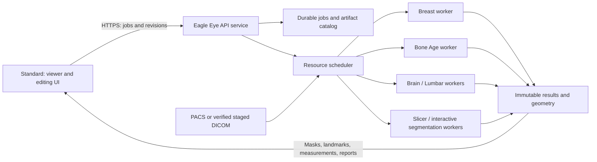

# Eagle Eye Server and Standard Client migration plan

Date: 2026-09-21. Status: implementation proposal grounded in source inspection;
no server deployment, runtime change, model transfer, or inference validation performed.
The product direction is the owner's decision. API names and implementation layout below
are proposed contracts, not existing capabilities.

## 1. Product decision and boundaries

- AI-PACS Eagle Eye becomes the server edition: model weights, isolated inference
  runtimes, heavy segmentation/measurement jobs, scheduling, and durable results.
- AI-PACS Standard becomes the interactive Eagle Eye client: study selection,
  review, point/box/contour/mask editing, progress, cancellation, and result display.
- Standard retains ordinary DICOM workstation functions. "UI client" applies to
  Eagle Eye computation; it does not remove local viewing, decoding, or existing MPR.
- No Eagle Eye model weights or inference environments are installed or downloaded
  to Standard. Model unavailability never triggers automatic local inference.
- Server installation includes an independently supervised processing service.
  No workstation login or visible desktop window is required to accept jobs.
- One product/repository and installer family; each model retains its own runtime.
  Copying a desktop executable to a server is not sufficient to implement this design.
- Initial deployment is Windows server on the clinic LAN. A Linux GPU worker is a
  later compatible execution target, not a prerequisite or a promised Windows capability.

## 2. Inspected baseline

| Component | Observed evidence | Migration implication |
|---|---|---|
| Breast | Razi `pacs`, `D:\FCOS_AR\API.py`; `AI_PACS_Mammo.exe` listens on 8002 | Import a verified source/model bundle; retain service during migration |
| Breast pipeline | DICOM preparation, FCOS ResNet50-FPN/HybridFCOS, ROI/single-view/bilateral features, stacked XGBoost | Preserve preprocessing, thresholds, geometry and feature ordering |
| Breast environment | Project requirements pin torch 2.5.1 / torchvision 0.20.1; inspected venv is Python 3.10 | Separate environment, not installation into the main workstation interpreter |
| Bone Age | Windows A100 `wina100`, `D:\Bone\BoneInference\BoneAgeAPI.py`; `BoneAge_Launcher.exe` listens on 8003 | Second adapter in the same server product |
| Bone Age pipeline | `bone_age_inference.py`, `dicom_utils.py`, EVA02-based BoneAgeViT, `final_model.pth` (350,806,623 bytes) | Preserve preprocessing and demographic inputs; compare outputs before cutover |
| Bone environment | `D:\Bone\venv\pyvenv.cfg` reports Python 3.12.3 | Separate from Breast and main Python 3.13.5 |
| Current client | `modules/viewer/interactor_styles/ai_chat_interactorstyle.py`: `MamoWorker` and `BoneAgeWorker` | Extract transport/orchestration into services, retain result presentation |
| Current endpoint file | `config/servers_address.json` points both features at Razi | Select authoritative source/deployed revision; source on A100 does not prove the Razi service matches |
| Existing local AI | Brain, brain lesions, offline lumbar, Alignment and Total Spine under `modules/ai_imaging/` | Migrate adapter by adapter, preserve each feature's interaction semantics |
| Edition packaging | `builder/distribution_profiles.py`, `BUILD.md`, `eagle_eye/assets.py` | Current Standard already excludes several AI bundles but still includes shared Slicer |
| Slicer integration | `docs/modules/ADVANCED_ANALYSIS_RESIDENT_RUNTIME.md` | Existing local viewer and analysis processes are distinct; reuse the analysis boundary, not a viewer's live scene |

These are source/file/listener observations. The running frozen binaries have not
been proved identical to the inspected Python source. No model outputs or timing
were measured. The Windows A100 VM exposes a basic display adapter; do not select
CUDA merely because its host alias contains A100. Actual GPU support is a worker
qualification result. The documented physical A100 belongs to the Linux VM.

## 3. Target topology and ownership

| Function | Standard client | Eagle Eye server |
|---|---|---|
| Navigation, zoom, window/level, overlay visibility | Immediate local interaction | No round trip |
| Move/add/delete point or box; brush/contour gesture | Local preview, undo and pending draft | Accept versioned edit; validate geometry |
| Lightweight measurement preview | Optional, explicitly provisional | Authoritative recomputation for saved result |
| Model inference, automatic segmentation, expensive mask operations | Submit request and display state | Execute owned worker and publish new revision |
| Final mask/landmark/report | Render and review | Durable version, provenance and acceptance state |
| Model/runtime management | Capabilities and readiness display | Install, verify, warm/evict and schedule |

Ordinary GUI interaction must not wait for server inference. No image is sent for
every mouse move. Commit a point/box on gesture completion; coalesce continuous
gestures, and run expensive operations on an explicit Apply/Analyze action.

## 4. Data access and the common contract

Two explicit ingestion routes are required; neither assumes another machine can
open a local drive path:

1. PACS-backed study: send authoritative study/series/instance references and a
   source manifest. A configured server-side PACS adapter retrieves the selected
   inputs using the existing supported infrastructure. Verify identity and complete
   instance/frame inventory before inference, rather than scanning every study image.
2. Local import or server-inaccessible source: upload a bounded immutable DICOM
   bundle in resumable chunks, verify hashes, then finalize it atomically. Reuse
   verified content within the same authorization scope; do not repeatedly upload
   an entire volume after a landmark edit.

Use an analysis-specific artifact ingress on the server. Do not add another client
PACS downloader or reconnect the retired gRPC path. Shared source/identity work must
follow the Unify handoff in the existing boundary document, section 0.2.

Every request records protocol version, institution scope, authenticated actor,
request/idempotency ID, module and operation, source revision/hash, Study/Series/SOP
UIDs and frame numbers, parameters, model selection, and optional parent result and
annotation revision. Server-created opaque IDs address files; arbitrary filesystem
paths, scripts, or caller-supplied executable commands are never accepted.

Every result includes job ID, input revision, model/runtime/preprocessing versions
and hashes, device/precision, parameters, warnings, completion state, and artifact
manifest (type, size, checksum, coordinate frame and reference identity). Status
success is published only after every required output is complete and verified.
"No finding", "unsupported input", "partial result", and "failed" remain distinct.

Proposed HTTPS API surface:

| Endpoint | Contract |
|---|---|
| `GET /v1/capabilities` | Installed/ready modules, operations, compatible schemas and supported hardware |
| `POST /v1/inputs` + chunk/finalize operations | Stage local inputs or resolve a PACS source into a verified manifest |
| `POST /v1/jobs` | Accept immutable request; return 202/job ID, never hold HTTP until inference completes |
| `GET /v1/jobs/{id}` | Durable status/progress; bounded polling first, optional events later |
| `POST /v1/jobs/{id}/cancel` | Idempotent cancel with terminal outcome after worker acknowledgement |
| `GET /v1/results/{id}` and authorized artifact download | Versioned result manifest and resumable artifacts |
| `POST /v1/results/{id}/revisions` | Compare-and-swap edit submission against a base revision |
| `POST /v1/results/{id}/accept` | Explicit review acceptance of one exact revision |

Capability negotiation uses intersection of server availability, user entitlement,
and client-supported schema. An incompatible version is explained before submission;
unknown fields must not silently change inference semantics.

## 5. Interaction, geometry and segmentation

### Geometry contract

For a 2D edit, carry SOP/frame identity, original rows/columns, coordinate convention
(zero-based pixel-center x/y), and the reversible mapping from displayed/cropped/
flipped/resized image to source image. A screenshot or screen-space rectangle alone
is insufficient. Planar mammography is not assigned invented 3D volume geometry.

For a volume, carry FrameOfReferenceUID where present, exact voxel grid shape/order,
spacing, origin, direction/affine, units, source frame inventory and transform chain.
The wire contract uses explicitly declared LPS millimetres plus voxel indices when
needed; Slicer adapters explicitly convert LPS/RAS. If geometry is unavailable or
irregular, reject operations requiring a regular physical grid or use a documented,
versioned resampling map. Never silently realign or resize a mask to fit.

### Edit transaction

1. Client opens immutable result revision R and renders a private draft.
2. User moves/adds/deletes a landmark, draws a box, or edits a segment.
3. Client submits operation ID, base revision R, affected object/segment IDs,
   source geometry hash, and edit payload. Unsynchronized state is visible.
4. Server validates access and reference geometry, accepts a new revision or
   returns a conflict with the latest revision. No last-writer-wins mask overwrite.
5. Requested recomputation creates a new job pinned to this edit revision.
6. Client attaches completion only to the matching study/session/input/revision.
   A delayed result remains in history and never overwrites a newer draft.

Undo creates a new revision restoring prior content; it does not erase history.
Two clients editing the same base must resolve a conflict explicitly. Initial
implementation can use a renewable editing lease plus revision checks; a lease
alone is not sufficient. Acceptance of R does not accept a later recomputation.

### Segmentation transport and engine

- Points, positive/negative seeds, boxes, contours and brush edits are first-class
  operations. Store stroke plane, geometry, radius/units and algorithm version.
- Start with compressed full-mask snapshots plus hashes for correctness. Introduce
  chunk/region deltas only after verified reassembly against an exact base revision.
- Exchange masks as versioned segmentation artifacts with segment IDs, labels,
  overlap/layer semantics and reference geometry; `.seg.nrrd` is a candidate for
  rich interchange, not a reason to expose a mutable MRML scene over the network.
- Slicer, SAM or another qualified engine is an implementation behind a named
  operation. Client tools are enabled only when that operation is advertised.
- Server segmentation returns masks, measurements and optional mesh/preview data;
  the client renders its own objects. No Qt/VTK object or live viewer scene crosses
  process, network or Fast/Advanced/module boundaries.
- Keep existing client Slicer functionality for non-AI MPR/manual tools initially.
  Removing that runtime requires a separate dependency/UI coverage audit. Heavy
  Eagle Eye computation still runs on the server, including when the client uses
  a local Slicer editor to create a manual mask revision.
- Test each server Slicer operation without interactive login in the actual Windows
  service context. `--no-main-window` alone does not prove headless/service readiness.
  Any failing extension remains unavailable until qualified; do not require an
  operator to keep a hidden workstation logged in as the production solution.

## 6. Service, scheduling and failure behavior

Use a small authenticated API/control service, durable job store, bounded artifact
store and supervised per-engine workers. Start with one server and a transactional
local job database behind a repository interface; do not depend on the workstation's
live `dicom.db`. Multiple API/worker hosts require a separate storage/lease qualification.

Job states: awaiting_input -> queued -> running -> publishing -> succeeded;
also cancel_requested, cancelled, failed, interrupted and expired. Input validation
failure never enters the compute queue. On reboot reconcile worker leases and files;
do not silently restart an unknown side-effecting job or mark it completed.

The scheduler admits jobs against measured RAM/VRAM/CPU-thread budgets per module,
with conservative initial concurrency of one heavy job per device. Bound queue size,
provide fair access between clients, and protect interactive corrections from batch
starvation. Never load all models simply because they are installed. Warm caches
are version-keyed and evictable; module globals and GPU contexts are process-owned.

CPU fallback is explicitly qualified per model, with timeout and quality/precision
policy; lack of CUDA does not authorize silent numerical or backend changes. Capture
queue, input-transfer, model-load, compute and result-transfer timings separately.

Cancellation stops the owned process tree and cleans uncommitted artifacts. Retry
uses the same idempotency key; an intentional rerun uses a new request ID. Disconnect
does not cancel a server job automatically. Reconnect resumes status/artifact retrieval.
Client drafts survive a disconnect locally and remain marked pending; source changes
or expired server artifacts require reconciliation before replay.

TLS and authenticated user/device identity are required for LAN clients, with
institution/job/artifact authorization, quotas and bounded inputs. Use a dedicated
least-privilege service account, protected credentials and scoped PACS access.
No patient identifiers/images or raw request bodies in shared diagnostic logs.
Define retention separately for inputs, drafts, accepted results and temporary files;
backup accepted results and audit revisions. Test restore before rollout.

Prediction does not implicitly enroll a case in training. Bone Age's inspected
automatic fine-tuning collector becomes a separate explicit dataset workflow.
Keep current EchoMind/LLM transport authority: moving image models does not silently
change external-provider routing or authorize new image disclosure.

## 7. Implementation seams and packaging

Proposed components:

- `modules/ai_imaging/eagle_eye_contracts/`: transport-neutral job, geometry, edit
  and artifact schemas; no model-framework or widget imports.
- `modules/ai_imaging/eagle_eye_client/`: authenticated transport, staging, polling,
  artifact cache and revision coordinator; thin feature-specific UI adapters.
- `server/eagle_eye/`: separate service entry point, persistence, scheduler and
  engine adapters. It must not import `main.py`, construct a QApplication, or use
  workstation UI controllers as backend business logic.
- Server-owned versioned payload manifests for Breast, Bone Age, Brain, brain
  lesions, Lumbar, Alignment, Total Spine and qualified segmentation engines.

These paths are proposals to reconcile with runtime/package catalogs before coding.
Do not append server orchestration to `ai_chat_interactorstyle.py`.

| Package | Required contents | Exclusions |
|---|---|---|
| Eagle Eye Server | Service + administration UI, common contracts, installed engine bundles, selected CPU/CUDA runtimes | Private jobs, datasets, caches, credentials, training logs |
| Standard Client | Existing workstation, Eagle Eye interaction UI, network adapter and schemas, required viewing/MPR runtime | Eagle Eye weights, training code, inference environments and model downloads |
| ARM64-emulated | Existing supported profile, client capability policy qualified separately | No implicit native ARM server or CUDA support claim |

Decouple feature visibility from local asset presence: Standard displays authorized
remote capabilities even though it has no model directory. Replace overloaded
`include_offline_lumbar` packaging logic with explicit role/feature manifests through
a versioned migration. Preserve existing edition IDs and installer upgrade identity
until their migration is tested; the marketing name can become Eagle Eye Server.

Use the canonical BUILD/RELEASE route and existing installer matrix. Update runtime
catalog, package definitions, profile writers, config-family versions, dependency
notices, mirrors and both backend guards together when implementation reaches packaging.
Standard content checks must cover `.pth`, `.pt`, `.onnx`, `.h5`, `.joblib`, other
manifest-declared weights, and nested archives/runtimes rather than extensions alone.
No full build is required for this planning change.

## 8. Staged execution and acceptance gates

| Phase | Concrete deliverable | Exit gate |
|---|---|---|
| P0: source and baseline | Read-only source/model acquisition with SHA-256 manifests; reconcile Razi Bone endpoint versus Windows A100 source and frozen binaries; dependency/license inventory | Exact source/weight/runtime baseline selected; private outputs excluded; agreed synthetic and approved private comparison set |
| P1: server skeleton | Service entry, authentication, capabilities, durable jobs, artifact ingress/download, fake worker and resource leases | Two clients; retry/reconnect/cancel/reboot; unauthorized access and malformed input guards; service works without login |
| P2: Breast + Bone integration | Package both engines as isolated server adapters; map legacy inputs/results into common contract | Same-input parity within preregistered tolerances; real model load and missing/corrupt weight rejection; no training collection side effect |
| P3: Standard remote workflow | Existing MG/DX UI uses common client; downloads results into study-owned store | Model-free Standard completes real source-GUI workflow; display/identity/cancel/reconnect verified; server is proven compute owner |
| P4: interactive pilot | Alignment point/box edits plus Total Spine segmentation correction on server | Two-client revision conflict, late result, add/delete/undo, geometry round trip, segmentation edit/recompute; clinical UI review |
| P5: remaining Eagle Eye engines | Brain, lesions, Lumbar and other heavy operations via module adapters | Per-module output parity, source completeness, correction flow, memory/device budget and Slicer service-context qualification |
| P6: packaging and pilot deployment | Eagle Eye Server/Standard role manifests; service install/upgrade/rollback; administrator configuration | Both build backends, clean machines, no client weights, reboot without login, backup/restore and multi-user soak pass |

Implement phases sequentially, accepting each vertical workflow before widening
scope. P2 includes integration inside the Eagle Eye product, not merely permanent
HTTP forwarding to the two old standalone applications. A temporary compatibility
adapter may preserve old routes during pilot migration; log which backend/version
ran and never silently switch backends within a job.

Minimum per-module acceptance matrix:

- Detection/measurement/mask parity versus the frozen baseline, with numerical
  tolerances fixed before comparison and CPU/GPU paths assessed independently.
- Original pixel coordinates, oblique volumes, anisotropic spacing, LPS/RAS,
  flip/resize, frame selection, mask overlaps and mismatched geometry rejection.
- Wrong study, incomplete source, expired artifact, stale edit, out-of-order
  completion, two users, cancellation during publish and server restart.
- Empty result is valid only after verified inference; missing weights cannot
  produce a normal result. Breast random-weight fallback is removed explicitly.
- Bone demographic inputs are verified, and selected series actually constrain
  the input inventory; do not preserve an unverified default as a migration rule.
- No network/decode/inference work on the GUI thread; actual mouse point/box/brush
  interaction verified, not just command acceptance or an offscreen unit test.
- Source GUI gates use the existing aipacs-control testing route and human bootstrap;
  blocked GUI or clinical review is reported separately from passing code tests.
- Test databases are isolated. Fixes add fail-before guards and catalog entries.

Proposed UI target: local editing/preview remains responsive independent of job
duration; select quantitative p95 interaction and per-module turnaround budgets
from P0/P4 measurements before acceptance. No unmeasured performance promise.

## 9. Rollout, rollback and unresolved decisions

Keep existing Breast/Bone services untouched until the new service passes parity
and a bounded pilot. Switch endpoints per site/module explicitly; preserve results
and drafts. Rollback redirects new jobs to the recorded compatible prior service;
completed artifacts stay readable. Never auto-downgrade schemas or overwrite older
model bundles. Drain jobs before upgrade and retain the previous qualified bundle.

P0 resolves exact frozen/source parity, source/model distribution rights, target
server OS/device/driver, storage/network budgets and retention. P4 resolves whether
existing local Slicer editing is sufficient for each interaction or a native client
tool is needed. None of these are reasons to re-decide the owner's server/client split.

Performance/lifecycle work continues under the existing master-plan owners
(OPT-51/OPT-56/OPT-58 as applicable), not a second independent optimization backlog.
Shared-trunk and viewer findings follow their established handoff ownership.
Existing credential/readiness and clean-release gates still apply before publishing.

## 10. References and document validation

- [Edition build contract](../../../BUILD.md)
- [Current Eagle Eye development contract](../../modules/EAGLE_EYE_DEVELOPMENT_CONTRACT.md)
- [Resident viewer versus analysis runtime](../../modules/ADVANCED_ANALYSIS_RESIDENT_RUNTIME.md)
- [Shared pipeline ownership](UNIFIED_PIPELINE_BOUNDARY_2026-06-27.md)
- [Optimization/lifecycle tracking](../../OPTIMIZATION_STABILITY_RELIABILITY_MASTER_PLAN.md)
- [Readiness and release limitations](../../reports/CODEX_REPOSITORY_READINESS_2026-08-27.md)
- [Slicer coordinate conventions](https://slicer.readthedocs.io/en/v5.12.0/user_guide/coordinate_systems.html): RAS internally; explicit conversion at the LPS contract boundary.
- [Slicer segmentation representation](https://slicer.readthedocs.io/en/5.8/developer_guide/modules/segmentations.html): NRRD plus segment metadata; qualify the installed version rather than assuming latest behavior.
- [Slicer command-line scripting](https://slicer.readthedocs.io/en/latest/developer_guide/script_repository/gui.html): no-main-window scripting is available; Windows service-context acceptance remains a separate gate.

Documentation-only validation: relative links, English-only new content, phase
coverage and whitespace. No runtime tests, live GUI pass or deployment are claimed.
