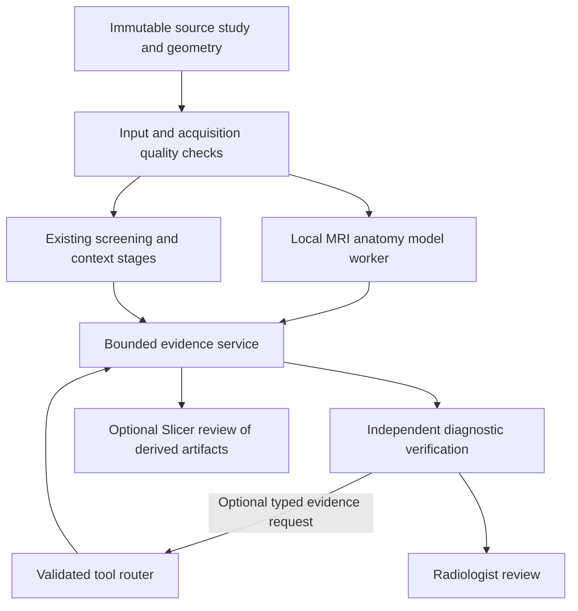

# Eagle Eye lumbar: Slicer and tool-assisted analysis feasibility

Date: 2026-08-31

Status: Research and architecture assessment. No runtime implementation, model call, patient-data processing, package installation, or live application test was performed. Existing worktree changes were preserved. Sources were inspected on the date above; upstream main branches are not pinned deployment specifications.

## Decision

Proceed with a controlled research prototype of anatomy localization, MRI segmentation, and geometry-linked evidence. Defer unrestricted LLM control of Slicer and any claim of improved clinical accuracy.

The strongest near-term hypothesis is that specialized image processing will help Eagle Eye select the correct anatomy and supply better evidence to its existing models. MCP is a possible command transport, not a diagnostic algorithm. A deterministic service can deliver much of the same benefit without an autonomous agent. Measure that benefit before adding adaptive tool selection.

No directly applicable validation of this exact Gemini/GPT/Slicer combination on lumbar MRI was established by this review. Published segmentation performance and successful remote control do not establish lesion-detection accuracy. Slicer itself is distributed for research and is not approved for clinical use; downstream clinical suitability remains the developer's responsibility. [Slicer intended use](https://slicer.readthedocs.io/en/latest/user_guide/about.html)

## Verified current implementation

These are source observations, not confirmation of the configuration or extensions loaded in a running installation.

| Source location | Observation | Implication |
|---|---|---|
| `modules/ai_imaging/eagle_eye_lumbar/analysis_prompt.py` | Screening and clinical-context defaults are `gemini-3.1-pro-preview`; verification defaults to `gpt-5.6-sol`. | Two model families serve three requests/stages; settings and environment overrides can change the actual models. |
| `eagle_eye_lumbar/llm_backend.py::run_analysis` | Screening/context run concurrently, then verification consumes their outputs and the evidence package. Transport remains with EchoMind. | Preserve the existing provider/entitlement boundary. There is no Slicer tool loop in this inspected path. |
| `eagle_eye_lumbar/evidence_bundle.py::resolve_mode` | Source default is `layout`; focused V2/V3 are selectable profiles. | Do not describe focused V3 as the universal deployed default. |
| `eagle_eye_lumbar/focus_evidence.py::_axial_roi` | V3 uses a physical crop with a posterior bias. | This is geometric cropping, not learned anatomy or lesion detection. |
| `focus_evidence.py::_focus_image` | Uses an axial source-image center in patient coordinates and projects it into sagittal acquisitions. | Cross-plane positioning exists, but the anchor is not a segmented lesion centroid. |
| `eagle_eye_lumbar/evidence_request.py::EvidenceFocus` | Carries axial frame anchors; the planner derives focus families from candidate wording. | Diagnosis-neutral localization needs a contract change, not only an extra plugin. |
| `modules/mpr/advanced_3d_slicer/slicer_launcher.py::send_remote_command` | Sends JSON commands to the separate custom Advanced Viewer runtime. | An integration seam already exists. Do not import Slicer's Python/VTK scene into the Fast viewer process. |
| `slicer_custom_app/startup_script.py::_remote_server_loop` | Loopback listener accepts `load_dicom` and `load_series`; success means scheduled. | No current segmentation, measurement, evidence-return, or completed-job contract. Acknowledgement is not proof of a finished analysis. |
| `slicer_custom_app/NewMPR2Slicer/CMakeLists.txt` | Pins a Slicer commit; Extension Manager and SimpleITK build options default OFF. Python support is ON. | Stock-Slicer extension instructions cannot be assumed to work on this custom build. Actual build-cache overrides and shipped dependencies still need inspection. |
| `tools/eagle_eye_bench/scoring.py::_morphology_outcome` | Treats morphology as an ordered list and adjacent mismatches as partial matches. | The existing score is insufficient as the primary endpoint for an extrusion/protrusion experiment. |

Shortened Eagle Eye paths above begin at `modules/ai_imaging/`; shortened Slicer paths begin at `modules/mpr/advanced_3d_slicer/`.

The existing [focused V3 research proposal](../plans/EAGLE_EYE_FOCUSED_V3_MORPHOLOGY_RESEARCH_PLAN_2026-08-31.md) already identifies localization, independent verification, and benchmark limitations. This assessment extends that investigation with specialized imaging tools; it does not replace its pending work or reopen the completed same-slab coverage correction.

## What tools could add

Separate three tasks: detection finds a candidate region, segmentation delineates its pixels, and diagnosis interprets morphology, signal, and consequences. A correct vertebral mask is not proof that an adjacent lesion was found or classified correctly.

| Candidate | Documented capability and integration | Recommended use and boundary |
|---|---|---|
| [TotalSpineSeg](https://github.com/neuropoly/totalspineseg) | MRI vertebra/disc labeling plus cord/canal segmentation; NIfTI outputs and optional localizer-assisted labeling. A standalone pipeline, not a verified installed AI-PACS extension. | First candidate for a coarse anatomy map and source-slice targeting. Its documentation explicitly disclaims validation of its cord segmentation for CSA measurements and several cord abnormalities. Do not extrapolate to root-compression diagnosis. |
| [SPINEPS](https://github.com/Hendrik-code/spineps) | Spine semantic/instance segmentation, with published sagittal T2 MRI evaluation; current documentation describes additional modality-specific models and optional VERIDAH labeling. | Compare against TotalSpineSeg on local acquisitions. Use the exact model appropriate to the sequence; do not transfer T2 validation to every newer model. |
| [SlicerTotalSegmentator](https://github.com/lassoan/SlicerTotalSegmentator) | Slicer integration of TotalSegmentator; upstream includes MRI tasks such as `vertebrae_mr`. | Convenient candidate for vertebral localization, especially when supporting both CT and MRI. The vertebra task is not a complete disc, foramen, and nerve-root disease model. [Task definitions and licensing](https://github.com/wasserth/TotalSegmentator) |
| [MedSAM-Lite Slicer plugin](https://github.com/bowang-lab/MedSAMSlicer) | ROI-prompted segmentation and manual refinement within Slicer. | Useful for annotation and clinician-assisted masks. An LLM-proposed ROI followed by a plausible mask does not independently establish that a lesion exists. |
| [MONAI Label](https://github.com/Project-MONAI/MONAILabel) | Framework connecting annotation clients, including Slicer, to inference and active-learning services. | Useful later for training/correcting a local disease-specific model. It is not one universal diagnostic model; each configured model requires modality and label checks. |
| [Segment Statistics and Markups](https://github.com/Slicer/Slicer/blob/main/Docs/user_guide/modules/segmentstatistics.md) | Geometric and intensity statistics, bounding boxes, and markup-based measurements. | Useful after mask/landmark QA. Disc-neck measurements and anatomy-specific stenosis metrics require their own definitions and validation. |

The SPINEPS paper reports vertebra/disc/canal Dice values of 0.920/0.967/0.958 in one described training/evaluation configuration. These are segmentation-overlap results on that study's data, not probabilities of correctly diagnosing lumbar disease and not expected AI-PACS performance. [SPINEPS study](https://arxiv.org/abs/2402.16368)

There is also a more direct pathology-model route: the RSNA lumbar challenge targets spinal canal stenosis, foraminal narrowing, and subarticular stenosis. Those targets are closer to neural-compromise assessment than generic whole-organ segmentation. A suitable model could be served as another bounded tool, but its availability, training overlap, licensing, and local external validation must be checked. The challenge does not establish a protrusion-versus-extrusion classifier. [RSNA task scope](https://www.rsna.org/artificial-intelligence/ai-image-challenge/lumbar-spine-degenerative-classification-ai-challenge)

## Expected benefit and failure modes

These priorities are engineering hypotheses, not measured effects:

- Highest near-term value: anatomical localization, candidate-level verification, retaining the relevant parasagittal slices, and showing the same focus across original acquisitions.
- Conditional value: quantitative disc height, alignment, lesion extent, and canal measurements when the correct anatomy and image plane are established.
- Greater uncertainty: protrusion/extrusion/sequestration classification, lateral-recess/foraminal severity, and nerve-root contact versus compression. These require local pathology evidence, not only whole-structure masks.
- Low direct benefit from generic spine segmentation: marrow differential diagnosis, infection versus tumor, or symptom attribution. Relevant sequences, clinical context, and task-specific validation remain necessary.

The lumbar nomenclature uses the dimensions of displaced material relative to its attachment base in the same plane, or loss of continuity, to distinguish extrusion. A whole-disc bounding box, global volume, or Feret diameter does not encode that relationship. A disconnected predicted mask can also result from segmentation failure. Require source-image confirmation and return indeterminate when attachment cannot be assessed. [Lumbar Disc Nomenclature 2.0](https://radiology.queensu.ca/source/Lumbar_Disc_Nomenclature.pdf)

Additional safeguards:

- A model's canal label must be anatomically defined; it must not silently become a dural-sac area or a nerve-root mask. At lumbar levels, a cord mask does not delineate the cauda equina roots.
- A high whole-disc Dice can conceal a missed small extruded fragment. Evaluate local lesion boundaries and clinically important regions separately.
- Preserve native axial slabs, spacing, gaps, and changing orientations. Resampling thick/gapped MRI does not recover absent information; surface smoothing can erase a narrow attachment.
- Check patient motion and registration before transferring a mask between sagittal T1, sagittal T2, and axial T2. A coordinate projection is not verified cross-acquisition anatomical correspondence.
- Test transitional vertebrae, incomplete fields of view, postoperative anatomy, metal, scoliosis, and poor image quality. Permit uncertain numbering and request human confirmation.
- Retain clean original images alongside optional overlays. Labels and colored masks can anchor both models to the same error.

## Proposed architecture

Keep coarse anatomy generation deterministic and reusable. Initially give the final verifier a fixed evidence package; introduce bounded requests only after the fixed pipeline is evaluated. Diagnostic independence requires separating localization from candidate diagnoses in the handoff. Even then, shared tools can cause correlated errors, so two agreeing LLMs do not constitute independent validation.

Slicer is valuable for visualization, manual correction, and selected processing. GPU inference can run in a separate pinned environment and return immutable masks and metadata. Avoid forcing PyTorch/nnU-Net into the workstation's Python 3.13 environment or tying every inference job to the user's interactive Slicer scene. Choose local workstation or approved on-premises service only after resource and privacy review; no server access was tested here.

Proposed tool surface, not existing endpoints:

| Tool | Bounded result |
|---|---|
| `get_study_quality` | Available sequences, coverage, spacing, slab and geometry warnings |
| `get_anatomy_map` | Source-linked vertebra/disc labels, masks, uncertainty and model version |
| `get_focus_evidence` | Native neighboring images, selected region, plane correspondence and coverage |
| `measure_reviewed_region` | Named measurement, units, source plane, method and mask/landmark provenance |
| `get_job_status` / `cancel_job` | Explicit queued/running/completed/failed/cancelled state |

Scope requests to an opaque study/session handle and allowlisted artifacts. Validate requested structures, coordinates, orientation convention, units, image count, and time budget. Store source identity locally, plus model/weight version, preprocessing, transform chain, render profile, warnings, and result hashes. Reject stale results after study changes. Distinguish unsupported, failed, and not-assessable from normal.

Use explicit DICOM LPS / Slicer RAS / image-index conversions with round-trip and laterality guards. Heavy filesystem, decode, inference, and measurement work stays off the PACS GUI thread. Slicer's MRML/UI application uses its own event loop with bounded updates; a separate worker owns heavy computation. No mutable Qt/VTK state crosses domains.

## MCP feasibility and security

Remote control is technically feasible: upstream Slicer exposes Python and WebServer interfaces. Existing community MCP bridges demonstrate node inspection, screenshots, and code execution. That establishes an engineering pattern, not clinical safety. [Slicer WebServer](https://slicer.readthedocs.io/en/latest/user_guide/modules/webserver.html), [MCP-Slicer](https://github.com/zhaoyouj/mcp-slicer)

Do not expose arbitrary Python execution, shell commands, filesystem paths, plugin installation, or unrestricted screenshots to the diagnostic models. One bridge explicitly describes itself as unsuitable for clinical data or production; Slicer's own WebServer documentation also warns of security risks. Use reviewed typed operations, authenticated local IPC, resource limits, redacted audits, and a per-session workspace. Treat all model/tool text as untrusted data. [Bridge warning](https://github.com/zhangreling02-ai/3dslicer-claude-bridge)

The current local Slicer listener does not visibly authenticate requests and returns scheduling acknowledgement rather than completion. It should not be expanded into a diagnostic service without lifecycle, identity, input-size, timeout, and authorization controls.

MCP is optional. An internal typed API or validated JSON evidence request can provide the same initial functionality. Native tool-call compatibility through the actual GapGPT route was not established in this review and must be tested with synthetic data before choosing that transport. Preserve existing EchoMind authentication and routing.

Raw DICOM, identifiers, and unreviewed screenshots must remain within the approved local boundary. Any external LLM evidence transfer must use the existing approved privacy policy, including burned-in identifiers and minimum necessary image content. Local segmentation does not make a subsequent cloud request local.

Code, pretrained weights, data, and plugins can have different licenses. Review the exact pinned artifacts separately; a permissive code license is not proof of unrestricted weight redistribution. Slicer compatibility, bundled Python/CUDA dependencies, offline weights, telemetry behavior, and installer parity are deployment gates. Existing repository credential and release blockers remain in force; this assessment does not resolve them.

## Experiment that can answer whether it helps

First repair and freeze the benchmark contract. Morphology is categorical, can coexist with generalized bulging, and must not be scored as a single severity ladder. Freeze clinically adjudicated negatives and count false positives, omissions, wrong levels/sides, and unassessable cases.

Use a development cohort for integration, then a separate locked local test cohort with normal studies and a representative pathology mix. A small initial feasibility pilot can find engineering failures; it cannot establish clinical safety. Determine the confirmatory sample size from disease prevalence and the desired confidence intervals. Use two radiologist readers with disagreement adjudication and evaluate at the patient as well as lesion/level level. Split by patient and account for within-patient correlation.

| Arm | Intervention | Question |
|---|---|---|
| A | Frozen current selected production workflow | What is the actual baseline? |
| B | Fixed improved evidence, using the existing focused profile where appropriate | Does source-slice selection/rendering alone help? |
| C | Same B contract plus deterministic anatomy masks and validated measurements | What do specialized tools add? |
| D | Same C tools plus bounded adaptive evidence requests | Does LLM-directed tool use add benefit beyond a fixed pipeline? |

If the selected production workflow already matches B, document that and collapse the duplicate. Otherwise keep prompt/model changes separate from evidence changes. For an evidence-only comparison, reuse frozen screening/context outputs; subsequently test complete end-to-end repeated runs. Hold model IDs, sampling, prompts, budgets, and test cases fixed where possible, and record provider drift.

Primary endpoints should be prespecified by clinical task: sensitivity with false positives per study, morphology confusion matrix, level/laterality errors, and clinically important neural-compromise misses. Include specificity/PPV, abstention/coverage, segmentation failures, tool failures, latency, cost, and radiologist correction time. Report uncertainty and repeated-run variability. More confident or longer reports are not evidence of improvement.

Public data can support engineering checks, but test independence must be verified: SPIDER contains 447 sagittal T1/T2 series from 218 patients and is used in the development of candidate segmentation systems. It cannot automatically serve as an independent external test of those pretrained models. [SPIDER dataset paper](https://arxiv.org/abs/2306.12217)

Tool-using medical reasoning has research precedent, for example MedRAX on chest X-ray questions. Its modality, benchmark, and tasks differ from lumbar MRI; its results cannot supply an expected accuracy gain here. [MedRAX paper](https://arxiv.org/abs/2502.02673)

## Recommended sequence and stopping rules

1. Establish benchmark semantics and inspect the actual custom Slicer payload/version without modifying a live patient session.
2. Compare pinned TotalSpineSeg and SPINEPS outputs on approved local research data; start with anatomy and evidence targeting, not autonomous disease labels.
3. Evaluate arm C against B. If it does not improve the prespecified endpoints, stop or change the imaging model before adding an agent loop.
4. Add a small, fixed maximum number of adaptive requests and compare D against C. Retain autonomy only if its incremental benefit justifies time, cost, and failure risk.
5. Keep radiologist review, explicit uncertainty, and a fallback to the unchanged viewer/workflow. Clinical deployment requires a separate validation and release decision.

The proposed first deliverable is therefore an anatomy-assisted evidence prototype with measurable endpoints, not a general-purpose agent allowed to operate every Slicer plugin.

## Verification scope

Reviewed current source, relevant existing research documentation, the custom-build configuration, and primary upstream documentation/papers. Added this report and its subsystem-index entry only. No tests were run because no executable behavior was changed. No diagnostic performance, installed-extension compatibility, or inference timing was measured. Self-review checked the distinction between segmentation and diagnosis, source defaults and runtime state, feasibility and clinical validation, and fixed versus adaptive tool benefit.
