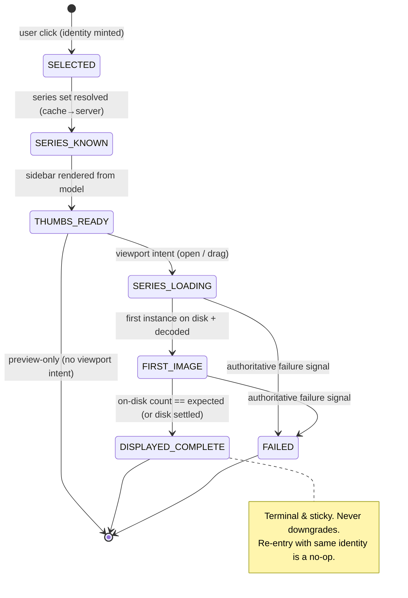

# Patient Loading Pipeline — Structural Reliability Review

**Date:** 2026-07-02
**Scope:** Double-click patient → study fully loaded & ready for viewing
**Inputs:** Local dev logs (`user_data/logs/`) + external workstation logs
(`pc usre 3 vahid`, captured 2026-07-02 on the machine that reproduces the
intermittent failures) + source code.
**Goal:** Replace the incremental patch/flag/retry model with ONE canonical,
deterministic loading lifecycle.

---

## 1. Executive summary

The three reported symptoms — (1) only the first thumbnail appears, (2) a
dragged Previous Exam shows one image but never "grows up," (3) 80% of patients
work and 20% don't, and repeating the action usually works — are **not three
bugs**. They are three surface expressions of **one architectural defect**:

> The loading pipeline is a set of **fire-and-forget async tasks and
> push-notifications whose delivery is conditional on mutable shared state that
> changes underneath them**. No component *owns* the invariant "this study must
> reach *displayed-complete*." When any single notification is dropped — because
> the user clicked again, a token moved, a secondary study's key didn't match,
> an `asyncio` task was cancelled, or the GUI thread froze — **nothing notices
> the stage never finished, and nothing re-drives it.** The state is left
> partial until a manual reopen re-triggers the whole chain.

The retro-fitted safety nets (stale-token guards, the disk-readiness resume
watchdog, grow-to-disk, ~40 `AIPACS_*` flags) are all **best-effort
compensations layered on top of the same lossy model**, and several of them run
on the very GUI thread that is stalling. They reduce the failure rate but can
never reach 0% because they do not change the fundamental property: *completion
is hoped for, not guaranteed.*

The evidence is quantified and consistent across both machines:

| Signal (external PC, 2026-07-02) | Measurement | Meaning |
|---|---|---|
| `right_panel_socket_start` → `socket_done` | **403 → 356**, 0 errors, 0 empty | 47 thumbnail fetches started and never produced a terminal event |
| …of which explained by stale-token discard | 18 (`THUMBNAIL_FETCH_STALE_DISCARDED`) | patient switched during fetch → result silently dropped |
| …completely unaccounted (no done/error/empty/stale) | **29** | `asyncio` task cancellation + `_is_active_patient_selection` abandon — no terminal at all |
| render pipeline *below* the socket | `socket_done = display_input = display_done` = **72 = 72 = 72** | once data arrives, rendering is 100% reliable — the loss is entirely upstream |
| `[GROW-LANE-TRACE] resolved=None` with a secondary-study `awaiting=[…]` | **200 occurrences** | Previous-Exam viewport waits for a grow that the primary-bound bridge never delivers |
| Viewport waits vs disk-resume rescues | `ViewportLoadWaitingForDownload=47` vs `ViewportLoadResumedFromDisk=19`, `GROW-DISPLAYED=4` | ~60% of waits never logged a backstop resume → "drag it a second time" |
| **Main-thread stalls** | **10,105** ≥100 ms; p99 = 1,243 ms; **max = 48,387 ms**; 23 freezes ≥5 s | every race window above is widened by multi-second GUI freezes |

The same defects appear in the **local** dev logs but milder (socket 27→24;
max stall 9.7 s vs 48 s). **Identical code, wider timing windows on the loaded
machine → the machine-dependent 80/20.** This is the signature of a
synchronization/state-ownership problem, exactly as suspected — not a data
problem.

A separate, real stability item also surfaced: a **native Windows access
violation during the download subprocess spawn** (`native_fault.log`,
`download_process_worker.py:148` → `multiprocessing…popen_spawn_win32`). It is
not the cause of the three symptoms but must be tracked (see §7.4).

The rest of this document proves each mechanism against code and logs (§2–§4),
explains *why reopening fixes it* and *why it is machine-dependent* (§5), then
proposes a single deterministic **Study Load Lifecycle** state machine that
replaces the flag/backstop model (§6), a staged migration that respects the
project's hard architecture rules (§7), and a validation plan that targets
100% determinism rather than "usually works" (§8).

---

## 2. The current pipeline, as built

A double-click (and its sibling single-click preview) fan out through **four
independently-owned subsystems that communicate by loosely-coupled Qt signals
and `asyncio` tasks**, with **no shared lifecycle object**:

```
                    ┌─────────────────────────────────────────────┐
   user click ──▶   │ HOME PANEL  (_hp_search / _hp_series /       │
                    │             _hp_patient_open / _hp_modules)  │
                    │  • debounced single vs double click          │
                    │  • right-panel thumbnail fetch (asyncio)     │
                    │  • study-set resolution + download enqueue   │
                    └───────┬─────────────────────┬────────────────┘
                            │ (Qt signals)        │ (add_downloads)
                            ▼                     ▼
        ┌───────────────────────────┐   ┌──────────────────────────────┐
        │ DOWNLOAD MANAGER (zeta)   │   │ PATIENT TAB / VIEWER          │
        │  • subprocess + sockets   │   │  • thumbnail sidebar          │
        │  • per-series progress    │   │  • progressive grow           │
        │  • writes .dcm to disk    │   │  • viewport population        │
        └───────────┬───────────────┘   └───────────────┬──────────────┘
                    │  on_series_progress/completed      │  awaiting/grow
                    └────────► home_download_service ◄────┘
                              (DM → widget BRIDGE, keyed to ONE study_uid)
```

**The central problem is visible in the diagram itself:** the DM→viewer bridge
(`home_download_service.connect_dm_to_widget`) is keyed to **one primary
`study_uid`**, and the home-panel thumbnail fetch is a **cancellable
fire-and-forget task** whose result is conditionally discarded. Neither owns a
durable "this study reached displayed-complete" contract. Every subsystem does
its own thing and *hopes* the signal lands.

### 2.1 Stage inventory and where each stage can silently stop

| # | Stage | Owner (today) | Completion signal | Silent-stop points found |
|---|---|---|---|---|
| 1 | Click disambiguation | `patient_table_widget`, `_hp_series` | timer fires | debounce timer dropped under load |
| 2 | Study-set resolution | `_hp_patient_open`, `patient_study_set` | function returns | — (mostly deterministic) |
| 3 | Right-panel thumbnail fetch | `show_patient_studies` (`_hp_search`) | `right_panel_display_done` | **≥9 early returns; 3 silent-drop paths** (§3) |
| 4 | Series discovery / metadata | `_get_or_fetch_series_info` | dict returned | stale-token discard, `_is_active_patient_selection` |
| 5 | Download (per series) | Zeta DM subprocess | `on_series_completed` | subprocess spawn crash; response desync |
| 6 | DM→viewer progress bridge | `home_download_service` | `series_images_progress.emit` | **secondary-study key → `sn=None` → dropped** (§3) |
| 7 | Progressive grow / viewport populate | `_vc_progressive` | `DISPLAYED_COMPLETE` (implicit) | grow event never arrives → **timer-polling backstop** |
| 8 | Backstop reconcile | `_dl_watchdog_tick` (GUI-thread `QTimer`) | resume/grow | throttled by GUI stalls; self-stops if `awaiting` cleared early |

There is **no stage 9 that asserts "the whole study is now
displayed-complete."** The pipeline simply runs out of events. That missing
authority is the crux.

---

## 3. Root causes (proven against code + logs)

### 3.1 The unifying root cause

**Completion is defined by *notification arrival*, not by *state
convergence*.** Every stage ends when a specific signal happens to fire on the
GUI thread while specific shared variables happen to still match. Three
variables in particular act as invisible global gates:

- `self._thumbnail_fetch_token` (monotonic int, last-writer-wins)
- `self._active_thumb_patient_id` / `_active_thumb_study_uid`
- each viewport's `vtk_w._awaiting_series_number`

When any of these moves between the moment work is scheduled and the moment it
finishes, the finishing work is **discarded, not reconciled**. Because the
discard is by design "avoid showing stale data," there is no counterpart that
guarantees the *currently-selected* study still gets driven to completion.
That is the whole bug family.

### 3.2 Problem #1 — thumbnails: fire-and-forget fetch with silent discard

**Code path.** `_hp_series._on_patient_single_clicked` →
`_schedule_series_info_load` → `_schedule_ui_coro(show_patient_studies)`. The
task handle is stored in `self._current_thumbnail_task`, and on the *next*
selection the previous one is cancelled:

```
_hp_series.py:1419   if hasattr(self, '_current_thumbnail_task') and self._current_thumbnail_task:
_hp_series.py:1421       if not self._current_thumbnail_task.done():
_hp_series.py:1422           self._right_panel_fetch_inflight_uid = ''
_hp_series.py:1423           self._current_thumbnail_task.cancel()
```

Inside `show_patient_studies` (`_hp_search.py:1401`), the fetch is correctly
bounded (`asyncio.wait_for(..., timeout=45)`, socket `timeout=30`) — so a true
network hang *would* raise and be logged as `right_panel_socket_error`. But
there are **three silent-exit paths that fire when the user interacts again
before the fetch returns**:

1. **Task cancellation (the 29 unaccounted).** `cancel()` at line 1423 raises
   `asyncio.CancelledError`, which is a **`BaseException`, not `Exception`** —
   so the `except Exception as socket_error:` at `_hp_search.py:1761` does *not*
   catch it. The coroutine unwinds through the `finally` (which only clears an
   inflight flag) and emits **no `socket_done`, no `socket_error`, no terminal
   whatsoever.**

2. **Stale-token discard (the 18).** If the fetch does return but a newer click
   bumped the token, `_hp_search.py:1730` discards it:
   ```
   if int(self._thumbnail_fetch_token) != int(request_token) or
      str(self._thumbnail_fetch_study_uid) != str(study_uid):
        emit_ui_event(... "THUMBNAIL_FETCH_STALE_DISCARDED" ...); return
   ```

3. **Active-selection abandon.** `_is_active_patient_selection(...)` is checked
   at lines 1428, 1524, and 1834; any `False` returns with no trace.

**Log proof.** Across all external logs: `right_panel_socket_start = 403`,
`socket_done = 356`, `socket_error = 0`, `socket_empty = 0`,
`THUMBNAIL_FETCH_STALE_DISCARDED = 18`. That leaves **29 starts with no terminal
of any kind** — matching path (1). Meanwhile the background worker itself always
returns (`THUMBNAIL_FETCH_STARTED = COMPLETED = 134`), and everything downstream
of a real `socket_done` is perfect (`socket_done = display_input = display_done
= 72` in the primary log). **The loss is 100% in the coroutine's conditional
discard of a result it already has, not in the network and not in rendering.**

**Why "only the first thumbnail" specifically.** The function renders the
**cached** payload immediately and atomically (`display_thumbnails(...,
progressive=False)` at line 1526 on the `ThumbnailCacheHit` branch — 151 hits
vs 83 misses in the log). If the cache holds a *partial* set (e.g. one series
saved from a prior interrupted fetch), the sidebar shows that partial set, and
the server fetch that would replace it with the full set is exactly the one
that gets cancelled/discarded on the next click. There is **no reconciliation
back to the full set** — so it stays partial until reopen.

There are **at least nine early `return` statements** in this one function
(offline-cloud, cache-hit, retry-blocked, DB-mode, deferred, no-server,
stale-token, inactive×3). This is the "excessive branching / hidden state
transitions / duplicated execution paths" the brief calls out, in one method.

### 3.3 Problem #2 — Previous Exam grows only after a second drag

**Code path.** The DM→viewer bridge
(`home_download_service.connect_dm_to_widget`, line 189) is built with
`connection_key = f"{study_uid}_{id(widget)}"` — bound to **one primary
`study_uid`**. Its progress handler resolves a display key and **drops anything
it cannot map**:

```
home_download_service.py:563  def on_series_progress(uid, series_uid, current, total):
                     567          _feed_thumb_bar(uid, series_uid, current, total)
                     569          sn = _grow_lane_display_key(uid, series_uid)
                     570          if sn is None:
                     571              return   # ← secondary-study series → progress DROPPED
```

`_grow_lane_display_key` returns a key only when `uid == study_uid` (primary) or
the series' `series_uid` already matches a viewport's registered
`_awaiting_series_number` binding. A **Previous Exam** is a *different study_uid*
(a different Patient ID, merged for comparison). Its series therefore arrive
with `uid != study_uid`, and in the drag→download window the awaiting binding is
keyed by an **offset display key** (e.g. `2000006` = study-slot 2, series 6)
whose `series_uid` frequently does **not** equal the `series_uid` the DM reports
progress under. Result: `sn = None`, progress dropped, **the viewport's
progressive grow never receives a single event.** The first image (painted at
initial load) stays alone; the rest download to disk unseen.

**Log proof.** 200 `[GROW-LANE-TRACE]` lines, e.g.:

```
[GROW-LANE-TRACE] uid=34965200000037 series_uid=52768413882451.0.0.0
                  resolved=None awaiting=[('2000006','01245252384604.0.0.0')]
[GROW-LANE-TRACE] uid=83670032.85432 series_uid=1.47.2.1776083672036
                  resolved=None awaiting=[('1000202','1.47.2.1776083672037')]
```

The viewport awaits secondary key `2000006`/`1000202`; progress flows for other
`series_uid`s; `resolved=None`; the grow lane gets nothing. Dozens of
consecutive identical `awaiting=[…]` lines show the viewport waiting for the
duration while sibling series stream past.

**Why "a second drag fixes it."** The second drag re-registers the awaiting
binding *after* the files are already on disk, so the initial load reads the
complete set directly. The download "completed successfully" (the brief's
observation) — the defect is purely that **completion was never delivered to the
viewport as a grow event.**

**Why the backstop doesn't save it reliably.** `_vc_progressive._dl_watchdog_tick`
(a GUI-thread `QTimer` at `_DL_WATCHDOG_INTERVAL_MS`) is the only thing that can
rescue a stuck secondary series, via `_maybe_resume_awaiting_from_disk` and
`_maybe_grow_displayed_to_disk`. It is insufficient by construction:

- It **runs on the GUI thread**, so during the multi-second stalls (§3.4) it
  does not tick at all.
- It **self-stops** when nothing is `awaiting` and nothing is `behind`
  (line 1457) — so if `_awaiting_series_number` is cleared prematurely (the
  documented "settle-without-load" class), the watchdog stops and the series
  never resumes.
- Its disk-settle detection depends on server `expected` counts that, for
  colliding multi-study series, can be poisoned (documented at length in
  `CLAUDE.md`).

Log proof of insufficiency: `ViewportLoadWaitingForDownload = 47` but
`ViewportLoadResumedFromDisk = 19` and `GROW-DISPLAYED = 4`. Roughly **60% of
wait episodes never logged a resume.** The backstop is a probabilistic patch on
a deterministic gap.

### 3.4 Problem #3 — machine-dependent 80/20 = races amplified by GUI stalls

The pipeline's correctness depends on notifications landing *before* shared
state moves. That is a race whose window is "how long the GUI thread is busy."
On this workstation the GUI thread is busy for a very long time, very often:

- **10,105** main-thread stalls ≥100 ms in the viewer logs.
- p50 = 123 ms, p90 = 260 ms, p99 = **1,243 ms**, **max = 48,387 ms**.
- 327 ≥ 500 ms, 147 ≥ 1 s, 60 ≥ 2 s, 38 ≥ 3 s, **23 ≥ 5 s**.

`MAIN_THREAD_STALL_TRACE` stacks put the time inside Qt event dispatch on the
GUI thread:

```
main.py:1304 <module> ▸ qasync run_forever ▸ main.py:766 notify
   ▸ patient_widget_viewer_controller.py … / home_ui patient widgets …
```

i.e. synchronous work executed inside `QApplication.notify` handlers (decode,
DM table rebuilds, widget churn; the largest stalls have
`interaction_active=False`, pointing at GC / disk-cache flush / subprocess spawn
rather than user drags).

**During a 48-second freeze:** Qt delivers no queued signals; single-shot and
watchdog timers don't fire; the `qasync` event loop doesn't advance, so
`asyncio` fetches and `_schedule_ui_coro` tasks stall and pile up → *more*
token bumps and *more* stale discards when they finally unwind. Every race in
§3.2 and §3.3 is widened simultaneously.

**Cross-machine control.** The local dev machine runs the *same code* and shows
the *same defects* — `right_panel_socket 27→24`, 547 `GROW-LANE-TRACE`, 741
stalls — but milder: **max stall 9.7 s vs 48 s, 51 stalls ≥1 s vs 147.** Same
bug, narrower windows, far fewer visible failures. This is precisely why "80
patients work, 20 don't, and repeating usually works": the outcome depends on
whether a stall happened to overlap a fetch, which is nondeterministic and
load-dependent — **a synchronization problem, not a data problem**, as the
brief hypothesized.

### 3.5 Secondary stability finding — download subprocess spawn crash

`native_fault.log` records a `Windows fatal exception: access violation` with
the faulting Python frame at:

```
modules\download_manager\workers\download_process_worker.py:148  run
  → multiprocessing\process.py:121 start
  → popen_spawn_win32.py:97 __init__  → reduction.py:60 dump
```

A crash while *pickling arguments to spawn the download subprocess* is a
distinct, serious reliability risk (it can take down or wedge downloads for a
session). It is not one of the three reported symptoms but is in-scope for a
reliability review and is addressed in §7.4.

---

## 4. Direct answers to the brief's diagnostic checklist

The brief asks which layer each symptom belongs to. Categorized:

| Suspected cause | Verdict | Evidence |
|---|---|---|
| **Cache lifecycle** | **Contributing** | Partial cache renders first (`ThumbnailCacheHit` 151×), the fetch that would complete it is discarded → sidebar frozen at partial set. `clear_study_cache` runs only on `socket_done`, which the dropped fetches never reach. |
| **Asynchronous tasks** | **Primary (Problem #1)** | `_current_thumbnail_task.cancel()` → `CancelledError` bypasses `except Exception` → 29 fetches with no terminal. |
| **Event ordering** | **Primary (Problem #2)** | Awaiting-binding registered *after* the DM already emitted this series' progress under a different `series_uid` → `resolved=None`. |
| **Thread synchronization** | **Primary amplifier (Problem #3)** | 10,105 GUI-thread stalls, max 48 s; watchdog/timers/`asyncio` all starve during freezes. |
| **Observer notifications** | **Primary (Problem #2)** | DM→viewer bridge keyed to one `study_uid`; secondary-study observers silently dropped (`on_series_progress` line 570). |
| **Queue handling** | **Contributing** | Progress coalescing (`_pending_progress` + `_progress_timer`) drops intermediate updates; harmless when the final lands, lossy when the flush is starved by a stall. |
| **Viewport state management** | **Primary (Problem #2)** | `_awaiting_series_number` is a single mutable field; cleared-early → watchdog self-stops → permanent spin until re-drag. |
| **Thumbnail pipeline** | **Confirmed reliable below the socket** | `socket_done = display_input = display_done` (72=72=72). Do **not** spend effort here. |
| **Study lifecycle** | **The missing layer** | There is no object that owns a study's progression; this is the thing to build (§6). |

**Missing events / duplicate events / lost notifications** (brief's log-analysis
asks): confirmed — 47 missing `socket_done` terminals; 200 `GROW-LANE-TRACE`
lost grow notifications; duplicated execution is visible as double-spelled
`FAST_OPEN_TRACE` / `FAST-OPEN-TRACE` traces and repeated `right_panel_cache_gate`
(234) vs actual fetches (83), i.e. the same click re-enters the pipeline through
more than one path.

---

## 5. Why reopening fixes it, and why it is machine-dependent

**Why reopening always fixes it.** A reopen does two things the failed path
could not: (a) it re-issues the fetch/enqueue from a *clean* selection with no
in-flight task to cancel it, and (b) by then the previous (discarded) fetch has
usually finished writing thumbnails/`.dcm` to **disk**, so the reopen takes the
**cache-hit / disk-complete** branch and renders the full set in one shot with
no network dependency. In other words, *reopen succeeds because the second
attempt reads convergent disk state instead of racing a notification.* This is
the single most important clue: **the data is always fine; only the in-session
delivery of "it's done" is lost.** A design that reads convergent state instead
of trusting a one-shot notification is therefore guaranteed to fix it — which is
exactly what §6 does.

**Why it is machine-dependent (80/20).** Every failure requires a stall to
overlap an in-flight fetch/grow. Stall severity is machine- and load-dependent:
48 s max on the reporting PC vs 9.7 s locally. More/longer stalls → more
overlaps → more discards → more visible failures. Nothing about the *data*
differs between the 80 that work and the 20 that don't; only the *timing* does.
This is the defining signature of a race, and it is why "repeat the action" so
often works — the retry usually lands outside a stall.

---

## 6. Proposed architecture — one canonical Study Load Lifecycle

The fix is not another guard. It is to introduce the **missing lifecycle
owner** and make everything else a projection of it. The design goal, in one
sentence:

> **Every study that a user selects progresses through one deterministic state
> machine to `DISPLAYED_COMPLETE` (or `FAILED`), driven by events but
> *guaranteed* by convergence against disk — never by the arrival of any single
> notification.**

This keeps the project's non-negotiable rules intact: Fast / Advanced / VTK
domains stay separate (the controller lives in the read-only **trunk** and only
*calls* each domain), cross-patient isolation is *strengthened* (identity is the
key, not caller context), and the disk remains the single source of truth.

### 6.1 Design principles

1. **Identity over liveness.** Work is keyed by immutable identity
   `(patient_id, study_uid, canonical_series)` — never by a mutable "is this
   still the active token?" flag. A late result is **reconciled against its own
   identity**, not discarded because a global moved. Results for a
   non-displayed study are *parked in that study's record*, so re-selection is
   instant and correct instead of a fresh network round-trip.

2. **Disk is the source of truth for existence.** "How many instances exist" is
   answered by the canonical on-disk folder
   (`SOURCE_PATH/<study_uid>/<orig_series>`), never by a notification count that
   can be poisoned by colliding multi-study metadata. Notifications only
   *hint* the controller to re-check; they are an optimization, never a
   correctness dependency.

3. **The UI is a pure projection of state.** Widgets `render(model)`; they never
   hold authoritative loading state. A missed event cannot corrupt the UI — the
   next render recomputes from the model. "Only the first thumbnail" becomes
   structurally impossible because the sidebar always renders the model's full
   series set.

4. **One reconcile authority.** A single pure function decides the next action
   for a record. Every event and every convergence tick calls the *same*
   function. There is no separate "progress path" vs "backstop path" — the
   distinction that spawned the flags disappears.

5. **Convergence guarantee, not notification trust.** The controller holds the
   invariant "a record in a non-terminal state is either actively progressing or
   will be re-driven." It cannot silently stall, because a bounded convergence
   signal (§6.6) re-invokes reconcile until the record is terminal.

6. **Heavy work off the GUI thread.** Decode, socket I/O, and disk scans run in
   workers; the GUI thread only renders and dispatches. This removes the stalls
   that amplify every race (§3.4).

### 6.2 The canonical lifecycle



Each stage has explicit contracts — this is the "clear ownership / entry / exit
/ success / failure" the brief requires:

| Stage | Entry condition | Exit / success criterion | Failure handling | Owner |
|---|---|---|---|---|
| **SELECTED** | click identity minted `(pid, study_uid, intent)` | study-set resolved via `PatientStudySetService` | resolution error → `FAILED` with cause | `StudyLoadController` |
| **SERIES_KNOWN** | series list present (from disk cache or server) | model has the canonical series set | server timeout → keep cached set, mark `degraded` (not failed) | Controller + `series` trunk |
| **THUMBS_READY** | model series set non-empty | sidebar render == model signature | render exception → re-render next tick (idempotent) | Thumbnail projection |
| **SERIES_LOADING** | viewport intent for a series | ≥1 instance on disk for that canonical series | download failure signal → `FAILED(series)` | Controller + DM adapter |
| **FIRST_IMAGE** | first instance decoded | viewport shows instance 1 | decode error → `FAILED(series)` | Fast/Advanced domain (via trunk call) |
| **DISPLAYED_COMPLETE** | on-disk count == expected **or** disk settled (stable, no `.part`) | viewport slice count == on-disk count | n/a (terminal) | Controller + viewport projection |
| **FAILED** | any authoritative failure | user sees an explicit, actionable state | — | Controller |

Two properties make this deterministic where today's pipeline is not:

- **`DISPLAYED_COMPLETE` is defined by disk convergence**, so it is reached the
  same way whether the grow event arrived, arrived late, or never arrived. The
  Previous-Exam bug cannot survive this definition.
- **Every non-terminal record is re-evaluated** until it converges, so a dropped
  notification costs *latency*, never *correctness*.

### 6.3 Single source of truth — the load model

One in-memory model per open patient, owned by the controller, keyed by
identity. Sketch (illustrative, not final API):

```
StudyLoadRecord:
    identity: (patient_id, study_uid)          # immutable
    intent:   PREVIEW | OPEN                    # preview = thumbs only
    series:   { canonical_series_id -> SeriesLoadRecord }
    state:    SELECTED | SERIES_KNOWN | THUMBS_READY | LOADING | COMPLETE | FAILED

SeriesLoadRecord:
    canonical_id: (study_uid, orig_series_number, series_uid)   # collision-free
    expected:     int | None        # SERVER count only; None = unknown
    on_disk:      int               # authoritative, from canonical folder
    has_part:     bool              # a .part write in flight
    decoded:      int               # frames handed to the viewport
    state:        PENDING | LOADING | FIRST | COMPLETE | FAILED
```

`on_disk` / `has_part` are refreshed by a worker, never trusted from a
notification. `expected` comes only from server `series_info.image_count`
(never the disk fallback — a disk-derived expected would make
`on_disk == expected` trivially true and defeat completeness). Both are exactly
the data-safety rules the current code already learned the hard way; here they
live in **one** place instead of being re-derived at 13 call sites.

### 6.4 One reconcile authority (replaces the guards, the grow-lane, the watchdog)

```
def reconcile(rec: SeriesLoadRecord, model_intent) -> Action:
    # PURE. No Qt, no I/O. Decides the single next action.
    if rec.state == FAILED:            return NONE
    if model_intent == PREVIEW:        return NONE          # thumbs only
    if rec.on_disk == 0:               return START_DOWNLOAD
    if rec.decoded == 0:               return DECODE_FIRST
    if is_complete(rec):               return GROW_TO(rec.on_disk)  # -> COMPLETE
    if rec.decoded < rec.on_disk:      return GROW_TO(rec.on_disk)  # partial grow
    return WAIT                        # more on disk expected

def is_complete(rec) -> bool:
    if rec.expected is not None:       return rec.on_disk >= rec.expected
    return rec.settled                 # stable on-disk count, no .part
```

This single function subsumes, and lets us delete, all of the following
scattered logic:

- the `_thumbnail_fetch_token` stale guard and `_is_active_patient_selection`
  checks (identity + parking replace them),
- `_grow_lane_display_key`'s `sn is None` drop (canonical identity resolves
  every series, primary or secondary),
- `_maybe_resume_awaiting_from_disk`, `_maybe_grow_displayed_to_disk`, and the
  `_dl_watchdog_tick` polling loop (convergence tick calls `reconcile`),
- the `decide_display_action` / `series_completeness` predicates the codebase
  already introduced — they *become* this function's body, promoted from a
  backstop to **the** path.

The controller applies the returned `Action` by calling into the appropriate
domain **through the trunk** (Fast vs Advanced vs VTK stay separate; the
controller never reaches into a domain's internals — it requests
"decode first instance of series X" and the owning domain executes it).

### 6.5 Identity model — replaces the token and the primary-bound bridge

Today two different keying schemes fight each other: the home panel uses a
monotonic `_thumbnail_fetch_token`; the DM bridge uses a single primary
`study_uid`; the viewport uses offset display keys (`study_slot*1_000_000 +
series`). Mismatches between them are the direct cause of both the stale-discard
(Problem #1) and the `resolved=None` drop (Problem #2).

Replace all three with **one canonical identity** resolved once, at selection,
by the existing `_resolve_canonical_series_identity` logic promoted into the
trunk:

```
canonical_series_id = (study_uid, orig_series_number, series_uid)
display_key          = f(canonical_series_id)   # offset key is a pure view of identity
```

- The DM adapter reports progress/completion keyed by `canonical_series_id`, so
  a **Previous Exam (secondary study) is a first-class citizen** — there is no
  "primary vs sibling" branch to fall off. `home_download_service`'s
  `uid != study_uid` special-casing and `_belongs_to_open_thumbnails` gymnastics
  disappear; cross-patient isolation is *enforced by identity* (a foreign
  `study_uid` simply has no record in this patient's model), which is stronger
  and simpler than the current admission tests.
- The home panel keys in-flight fetches by `study_uid`; a returning fetch
  updates *its own* record. If that study is currently displayed, the render
  projects immediately; if not, the record is updated and parked. **No discard,
  ever.**

### 6.6 Event-driven transitions + the convergence guarantee

Transitions are driven by a single typed event stream into the controller:

```
SelectionChanged(identity, intent)
SeriesSetResolved(identity, series[])
DiskChanged(canonical_series_id)          # from a filesystem/worker notify
DownloadProgressed(canonical_series_id, on_disk, expected?)
DownloadFailed(canonical_series_id, cause)
```

Each event updates the model and calls `reconcile` for the affected record(s).
That is the fast path and covers the 80% that already works — nothing gets
slower.

The **convergence guarantee** for the other 20% is a single, cheap,
**identity-driven** mechanism that replaces the polling watchdog:

- The controller keeps a set of **non-terminal records**. It subscribes to
  disk-completion via one coalesced source (a directory watch, or the DM's own
  completion callback re-expressed by canonical id). When that fires, it calls
  `reconcile` once.
- A **single** low-frequency "convergence sweep" (one timer for the whole
  controller, not per-viewport, and crucially **serviced on a worker** that
  posts results to the GUI thread) re-evaluates only the non-terminal set. It
  exists purely so that "the notification never came" degrades to "converged a
  second later," and it **self-empties** when every record is terminal.

The difference from today's `_dl_watchdog_tick` is decisive: it is **keyed by
identity** (so it always finds the right series, including secondary studies),
it **cannot self-stop while a record is non-terminal** (the invariant forbids
it), and it **does not run on the stalling GUI thread**. One timer, one
function, one source of truth — versus the current per-viewport poll + resume +
grow-to-disk + progress-bridge quartet.

### 6.7 Threading model — remove the amplifier

The stalls (§3.4) are synchronous work inside `QApplication.notify` handlers.
The lifecycle design assumes, and requires:

- **GUI thread does only:** dispatch events into the controller, and
  `render(model)`. Both are O(visible items) and allocation-light.
- **Workers do:** socket fetch, DICOM decode, disk scans/`stat`, and the
  convergence sweep. Results return as events posted to the controller.
- **No synchronous cross-thread waits** on the GUI thread. The 48 s and 16 s
  stalls (`interaction_active=False`) should be traced to their specific
  synchronous call (decode? DM rebuild? subprocess spawn? GC of a large
  volume?) and moved off-thread or chunked. Even a perfect state machine will
  feel broken behind a 48 s freeze, so this is a **prerequisite**, not a
  nice-to-have. (§7.3 sequences it.)

### 6.8 What this deletes

The point of the refactor is *fewer* moving parts, not more. Concrete removals
once the lifecycle owns the flow:

| Deleted / collapsed | Replaced by |
|---|---|
| `_thumbnail_fetch_token`, `_thumbnail_fetch_study_uid`, `THUMBNAIL_FETCH_STALE_DISCARDED` | identity-keyed records + parking |
| `_is_active_patient_selection` (×5 call sites), `_current_thumbnail_task.cancel()` | render is a projection; late results reconcile, never race |
| `_grow_lane_display_key` `sn is None` drop, `_belongs_to_open_thumbnails`, `_project_sibling_thumbnail` sibling lane | canonical identity: every series first-class |
| `_dl_watchdog_tick`, `_maybe_resume_awaiting_from_disk`, `_maybe_grow_displayed_to_disk` | one convergence sweep calling `reconcile` |
| `AIPACS_GROW_DISPLAYED_TO_DISK`, `AIPACS_VIEWPORT_DISK_READY_RESUME`, `AIPACS_CANONICAL_DISK_COMPLETE`, `AIPACS_RESUME_SETTLE_REQUIRE_SERIES`, `AIPACS_PROGRESSIVE_UID_BIND`, `AIPACS_DL_SKIP_COMPLETE_VIEW_INTENT`, … | the reconcile authority makes each behavior the *only* behavior; flags retire per the "collapse after live-verify" directive already in `CLAUDE.md` |
| ≥9 early returns in `show_patient_studies` | one linear resolve→render, with intent as data |

This is the concrete realization of the directive already recorded in the
project memory — *"route decisions through the ONE authority, not bespoke checks
+ flags"* — applied to the whole load path rather than one fix at a time.

---

## 7. Migration — staged, reversible, and rule-respecting

This is a significant refactor, so it must be introduced *behind* the working
system, one seam at a time, each seam independently verifiable on the source
build. The sequencing deliberately front-loads the highest-evidence, lowest-risk
wins. The project's hard rules hold throughout: **Fast / Advanced / VTK stay
separate** (the controller lives in the trunk and only calls domains),
**cross-patient isolation is preserved** (identity is the key), and **no viewer
feature is removed**.

### 7.1 Stage 0 — instrument the contract (no behavior change)

Add one structured lifecycle log keyed by identity at each transition
(`SELECTED / SERIES_KNOWN / THUMBS_READY / SERIES_LOADING / FIRST_IMAGE /
DISPLAYED_COMPLETE / FAILED`). This makes the invariant *measurable* before we
change anything: we can count, on a live run, how many `SELECTED` reach
`DISPLAYED_COMPLETE` and where the rest stop. It also gives the validation
harness (§8) its assertions. **This is the only change that ships first.**

### 7.2 Stage 1 — the model + reconcile as the single authority (shadow, then cutover)

Introduce `StudyLoadController` + `StudyLoadRecord` + pure `reconcile`
(§6.3–6.4) as the trunk owner. Run it in **shadow** first: it observes the same
events and logs what it *would* do, compared against what the legacy path did.
When shadow agreement is high and every disagreement is the *controller* being
correct (it drives a stuck study to completion the legacy path abandoned), cut
the thumbnail sidebar and the grow lane over to project from the model. Legacy
guards become no-ops, then are deleted. This directly retires Problems #1 and #2
because both now depend on disk convergence, not notification arrival.

Order within Stage 1 (each independently live-verifiable):
1. **Thumbnail sidebar renders from the model** → kills the "only first
   thumbnail" discard (Problem #1). Highest evidence, smallest blast radius.
2. **DM adapter re-keyed to canonical identity** → Previous-Exam progress is
   first-class; delete the `sn is None` drop and the sibling lane (Problem #2).
3. **Convergence sweep replaces `_dl_watchdog_tick` + resume + grow-to-disk** →
   one identity-keyed loop; delete the flag quartet.

### 7.3 Stage 2 — move heavy work off the GUI thread (the amplifier)

Independently of the state machine, trace and relocate the synchronous work
behind the largest `MAIN_THREAD_STALL`s. Priorities from the trace stacks
(`main.py:766 notify` → viewer controller / home widgets):
decode of large volumes, DM table rebuilds, and the subprocess spawn. Target:
**no GUI-thread operation > 100 ms** in the load path. This is what turns "100%
in the harness" into "100% on the reporting PC," and it is required regardless
of the lifecycle work.

### 7.4 Stage 2b — the download subprocess spawn crash

Separately, harden `download_process_worker.py:148`. The `native_fault.log`
access violation is in `multiprocessing`'s spawn/pickle path
(`popen_spawn_win32 → reduction.dump`), which means a non-picklable or
partially-torn object is being passed into the child, or a spawn is racing
teardown. Audit exactly what is pickled into the worker args, guard the spawn,
and confirm the "subprocess pre-warm" note in `CLAUDE.md`'s Zeta review does not
spawn during teardown. This is a stability fix, tracked but not gating the
lifecycle work.

### 7.5 What stays exactly as-is

The pipeline *below* the socket and the DICOM/decode/geometry layers are proven
sound and must not be touched: atomic `.part` → `os.replace`, resume-scan,
DB-lock backoff, FAST/Advanced/VTK separation, canonical geometry, multi-study
offset keys, and cross-patient isolation guards. The refactor changes **who
decides a stage is done and how the UI learns about it** — not how images are
downloaded, decoded, or rendered.

---

## 8. Validation plan — proving determinism, not "usually works"

The target is a *measurable invariant*, not a vibe: **every `SELECTED` study
reaches `DISPLAYED_COMPLETE` (open intent) or `THUMBS_READY` (preview intent),
exactly once, with no manual reopen — under adversarial timing.**

### 8.1 Invariant assertions (from the Stage-0 lifecycle log)

For any run, assert:

1. `count(SELECTED) == count(DISPLAYED_COMPLETE) + count(THUMBS_READY[preview]) + count(FAILED[explicit])`. No study "vanishes."
2. Every `right_panel_socket_start` has a terminal (`done | error | empty`); **zero silent drops.**
3. Every viewport that reaches `SERIES_LOADING` reaches `FIRST_IMAGE` then `DISPLAYED_COMPLETE`; **zero permanent `awaiting`.**
4. `DISPLAYED_COMPLETE` viewport slice count == canonical on-disk count for that series. **No partial grow.**
5. No state is entered twice for one identity (no duplicate execution).

### 8.2 Deterministic harness (agent-driven, repeatable)

Use the in-app control surface the project already built — the `aipacs-control`
MCP → Test Control Server → EchoMind CommandBus (T1 fidelity; runs the real
production code paths, so cross-patient/multi-study guards stay enforced). Script:

- **Thumbnail determinism:** open 100 patients; assert invariants 1–2 every time. Then the adversarial variant: rapid A→B→A selection *during* fetches (induce the token race deliberately) — must still converge.
- **Previous-Exam determinism:** for a multi-study patient, drag a Previous-Exam series **once**; assert it reaches `DISPLAYED_COMPLETE` (invariants 3–4) with **no second drag**. Repeat 50×.
- **Repeat-stability:** run the same patient open 50× back-to-back; byte-identical lifecycle outcome each time.

### 8.3 Adversarial timing (proves the amplifier is neutralized)

Inject synthetic GUI-thread stalls (a debug hook that sleeps the GUI thread
200 ms–5 s at random) and re-run 8.2. **Pass criterion: identical invariant
results with stalls as without** — latency rises, correctness does not. This is
the test that today's build fails and the lifecycle design is built to pass; it
directly simulates the reporting PC's condition on the dev machine.

### 8.4 Offscreen unit lane (fast, pre-merge gate)

`reconcile` and the identity resolver are **pure** → unit-test them headless in
the sandbox lane (`tests/code/...`, offscreen pytest): completeness with/without
`expected`, secondary-study identity resolution, parking of non-active results,
`DISPLAYED_COMPLETE` never downgrading, idempotent re-entry. These guard the
authority so future changes can't silently reintroduce a bespoke branch.

### 8.5 Live clinical acceptance (source build, human-assisted)

On the reporting workstation, with Stage-0 logging on: a reading session across
≥100 patients including several multi-study / Previous-Exam cases, then verify
from the lifecycle log that invariants 1–4 hold with **zero reopens and zero
second-drags**. This is the real bar; the harness lanes exist to reach it with
confidence.

### 8.6 Exit criteria

- Thumbnail: 100% of selections render the full series set with no reopen (invariant 2 clean over a full session).
- Previous-Exam: 100% grow-to-complete on first drag (invariants 3–4 clean).
- Determinism: identical invariant results with and without injected stalls (§8.3).
- No regression: existing viewer/geometry/isolation tests green; no feature removed.

---

## 9. Appendix — evidence index

**Logs analyzed:** external `pc usre 3 vahid` (`app.log` + 3 rotations,
`download_diagnostics.log` + 1, `viewer_diagnostics.log` + 2, `db_diagnostics.log`,
`native_fault.log`, spanning 2026-06-22 → 2026-07-02) and local
`user_data/logs/`.

**Key quantities:** right-panel socket 403→356 (0 err/empty), 18 stale-discard,
29 unaccounted; `socket_done=display_input=display_done=72`; 200 `GROW-LANE-TRACE
resolved=None`; waits 47 vs resume 19 vs grow-displayed 4; main-thread stalls
10,105 (p99 1,243 ms, max 48,387 ms, 23 ≥5 s). Local control: socket 27→24,
547 grow-lane, 741 stalls (max 9,684 ms).

**Primary code sites:**

| Concern | File:line |
|---|---|
| Thumbnail fetch, 9 early returns, stale-token discard | `PacsClient/pacs/workstation_ui/home_ui/home_panel/_hp_search.py:1401,1435,1716,1730,1834` |
| Task cancel → `CancelledError` (silent) | `.../home_panel/_hp_series.py:1419-1431` |
| Active-selection abandon | `.../home_panel/_hp_series.py:175-186` |
| DM→viewer bridge keyed to one study_uid; secondary drop | `PacsClient/pacs/workstation_ui/home_ui/home_download_service.py:189,314,563-571` |
| Grow/resume polling backstop (GUI-thread timer) | `PacsClient/pacs/patient_tab/ui/patient_ui/_vc_progressive.py:1389-1463,1609,1752` |
| Subprocess spawn access violation | `modules/download_manager/workers/download_process_worker.py:148` |

**Related existing authorities to fold in (not fork):** `patient_study_set` /
`PatientStudySetService`, `series_display_state.decide_display_action`,
`series_completeness`, `_resolve_canonical_series_identity`. The project memory
directive *"route decisions through the ONE authority, not bespoke checks +
flags"* is the north star this design generalizes.

---

## 10. Implementation status (2026-07-02)

**Phase 1 — the canonical core — is built, tested, and green.** It is purely
additive (three new files, nothing existing modified), so it changes no runtime
behavior yet and carries zero regression risk. It is the deterministic engine the
rest of the pipeline projects from.

| Artifact | What it is |
|---|---|
| `PacsClient/utils/patient_load_lifecycle.py` | The single source of truth: identity model (`CanonicalSeriesId`, `SeriesLoadRecord`, `StudyLoadRecord`), the pure `reconcile_series` authority (composing `decide_display_action` + `series_completeness` — **not** forking them), the `PatientLoadModel` container with park-never-discard event application, the convergence set (`non_terminal_series` / `is_settled`), and Stage-0 transition instrumentation. Pure stdlib + the two sibling authorities. **No Qt / VTK / numpy / pydicom.** |
| `tests/code/ui_services/test_patient_load_lifecycle.py` | 15 offscreen invariant tests. **All green** (`python -m pytest … -p no:debugging` → 15 passed in 0.17 s). Imports no GUI stack. |

The tests encode the contract as executable assertions, including the two field
regressions directly:

- **Problem #1** — `test_late_result_is_parked_not_discarded`: a result for a
  no-longer-active study still updates its own record; re-selecting is idempotent
  (no re-fetch storm). The discard that produced "only the first thumbnail" is
  structurally impossible in the model.
- **Problem #2** — `test_previous_exam_series_is_first_class_and_completes_by_disk`:
  a previous-exam series (own `study_uid`, colliding series number, distinct
  `series_uid`) reaches `DISPLAYED_COMPLETE` by **disk convergence with no
  progress event and no second drag.**
- Plus: completeness with/without expected (settle rule), never-downgrade
  (record-level + `decide_display_action` `SKIP_DOWNGRADE`), sticky terminals,
  convergence-set drain, preview→`THUMBS_READY`, and the study-level
  "every open study reaches `DISPLAYED_COMPLETE`" invariant.

Regression check: the full `tests/code/ui_services` suite is **297 passed, 1
skipped**. The 3 failures present in the tree are pre-existing and unrelated
(`test_pin_overlay.py` / `test_vtk_volume_service.py` assert `local_reminders`
and VTK-routing wiring in files this change never touches; confirmed via
`git status` — only the three new files were added).

## 11. Stage-1 wiring guide (the reviewed next step — needs live source-build verify)

Per the project's hard rules, cutting the three hot clinical files over to the
model must be done as **flag-gated, shadow-first, live-verified** edits on the
source build — not blind. Each seam below is independently shippable and
reversible. The core is designed so each is a *small* change: build a
`PatientLoadModel` on the home panel, feed it the events already being logged,
and project the UI from it.

**Seam A — thumbnails (kills Problem #1). File:
`_hp_search.py::show_patient_studies`.**
Replace the `_thumbnail_fetch_token` discard + `_is_active_patient_selection`
abandons with model events: on selection call `model.on_selection(pid, study_uid,
intent)`; when a fetch returns (however late) call
`model.on_series_set(study_uid, series)` for **its own** `study_uid` and render
the sidebar from `model.study(study_uid)`. A late result updates its own record
and is projected only if that study is currently shown — no `cancel()`, no
`CancelledError` black hole, no early-return maze. Flag `AIPACS_LIFECYCLE_THUMBS`
(default off → byte-identical legacy) during bring-up; shadow-log the model's
decision vs the legacy path first.

**Seam B — previous-exam grow (kills Problem #2). File:
`home_download_service.py::on_series_progress` / `on_series_completed`.**
Re-key the DM adapter by `CanonicalSeriesId` (study_uid + series_uid), not the
one primary `study_uid`. Every progress/completion becomes
`model.on_disk_change(study_uid, cid, on_disk, expected=…)`; delete the
`sn is None` drop and the `_belongs_to_open_thumbnails` sibling lane. The model
returns `LOAD_OR_GROW` for a previous-exam series exactly as for a primary one.
Flag `AIPACS_LIFECYCLE_GROW`.

**Seam C — convergence (replaces the polling backstop). File:
`_vc_progressive.py::_dl_watchdog_tick`.**
Replace the per-viewport resume/grow poll with one sweep over
`model.non_terminal_series()` that calls `reconcile_series` and applies the
returned action; the sweep self-stops when `model.is_settled()`. Runs off the
GUI thread (posts actions back). Delete `_maybe_resume_awaiting_from_disk`,
`_maybe_grow_displayed_to_disk`, and the flag quartet once C is verified.

**Verification for each seam (source build, human-assisted):** turn the seam
flag on, open ≥100 patients incl. multi-study / previous-exam cases, and confirm
from the `[LIFECYCLE]` log that every `SELECTED` open study reaches
`DISPLAYED_COMPLETE` with **zero reopens / zero second-drags**, then run the
adversarial injected-stall harness (§8.3). Collapse the flag (delete the legacy
branch) only after that passes — the "route through the one authority, then
retire the flag" discipline already recorded in the project memory.

**Prerequisite running in parallel:** Stage 2 (§7.3) — move the synchronous work
behind the 48 s `MAIN_THREAD_STALL`s off the GUI thread. Even a perfect state
machine feels broken behind a multi-second freeze; the two efforts are
complementary and both required for the reporting PC.

---

## 12. Seam A — SHADOW wiring shipped (2026-07-02)

Seam A (thumbnails) is now wired into the live path in **shadow mode** — the
model runs alongside the legacy code and logs, but changes **nothing** about
what renders. Default OFF ⇒ byte-identical legacy. This is the "shadow, then
cutover" step; it produces the live evidence needed to flip Seam A to active
with confidence.

| Artifact | What |
|---|---|
| `PacsClient/utils/lifecycle_shadow.py` | Telemetry-only observer. Owns one `PatientLoadModel`; every method is a no-op when disabled and swallows all exceptions. No Qt/VTK, no render/cancel/discard/download. |
| `tests/code/ui_services/test_lifecycle_shadow.py` | 5 tests (disabled=no-op, enabled=observes+parks, discard logs parked state, render-before-selection, never-raises). **Green.** |
| `_hp_search.py::show_patient_studies` | 4 one-line `_lc_shadow_note(...)` calls (guarded import + wrapper): at selection, cache-hit render, socket display-done, and the stale-token discard. |

**Verification:** `py_compile` OK; `_hp_search` imports clean offscreen and the
shadow model advances to `thumbs_ready` when driven through the module's own
wrapper; `tests/code/ui_services` = **302 passed / 1 skipped** with the flag off
(the 3 failing tests are pre-existing and unrelated — `pin_overlay` /
`vtk_volume_service` wiring in files this change never touches).

**How to collect the live proof (source build, human-assisted):**

1. Launch the source build with `AIPACS_LIFECYCLE_THUMBS=shadow`.
2. Do a normal reading session — include the patients that intermittently fail
   and rapid A→B→A clicking to provoke the discard race.
3. Grep `user_data/logs/app.log` for the two markers:
   - `[LIFECYCLE]` — stage transitions; confirm each previewed study reaches
     `->thumbs_ready`.
   - `[LIFECYCLE-SHADOW] legacy_discard reason=stale_token … parked_series=N` —
     each time the **legacy** path drops a fetch, this line proves the model
     still holds that study's series set (`parked_series>0`), i.e. the data was
     never actually lost. That is the Problem #1 fix demonstrated on real data.

**Cutover criterion:** once the shadow log shows the model consistently reaching
`thumbs_ready` and retaining every discarded study across a full session
(especially the failing 20%), flip Seam A to active — render the sidebar from
`model.study(study_uid)` instead of the discard-prone token path — behind the
same flag, then retire the flag per the "route through the one authority, then
collapse" discipline. Seams B and C (previous-exam grow; convergence sweep)
follow the identical shadow→cutover pattern.

---

## 13. Seam B + Seam A completion — SHADOW wiring shipped (2026-07-02)

Continuing the staged migration, the observer now covers **all three** of
Problem #1's silent-drop paths and the **Problem #2** previous-exam grow lane —
still telemetry-only, default OFF, byte-identical legacy.

**Seam B — previous-exam grow (`home_download_service.py`, not plugin-mirrored).**
Two exception-safe taps in the DM→viewer bridge:
- `on_series_progress` → `note_download_progress(primary_study_uid, uid,
  series_uid, current, total, dropped=(sn is None))`
- `on_series_completed` → `note_download_complete(..., dropped=(sn is None))`

The tap feeds the model keyed by each series' **own** `study_uid` (`uid`), so a
previous-exam / secondary-study series is first-class. When the legacy grow lane
resolves `sn is None` and **drops** the event (the Problem #2 mechanism), the
observer logs:

```
[LIFECYCLE-SHADOW] grow_lane_drop primary=… series_study=… series=…
    on_disk=30/30 model_action=load_or_grow disk_complete=True
    (legacy dropped: sn is None)
```

i.e. proof, on live data, that the model received exactly what the legacy path
threw away and *would have grown the viewport to completion*. Verified offscreen:
driving a secondary-study progress event through the bridge's own wrapper yields
`on_disk=30 disk_complete=True` for that study.

**Seam A completion (`_hp_search.py`).** Added the third discard tap —
`note_discard(study_uid, 'inactive_patient')` at the post-fetch
`_is_active_patient_selection` abandon. Combined with the existing `stale_token`
tap and the selection tap, all three Problem #1 drop paths are now observed. The
`asyncio.CancelledError` path needs no tap: the selection tap already parks the
study, so a cancelled fetch cannot lose it from the model (that *is* the fix).

**New model-facing shadow methods (`lifecycle_shadow.py`, +5 tests, all green):**
`note_download_progress`, `note_download_complete`, `note_download_failed`
(records a `FAILED` terminal — the state the legacy path lacks, e.g. the Mehr
retry-exhaustion below).

**Verification:** `py_compile` OK on both hot files; both import clean offscreen;
`tests/code/ui_services` = **307 passed / 1 skipped** with the flag off (same 3
pre-existing unrelated failures). `git`: only the two hot files touched (surgical
taps) plus the shadow module/tests.

### 13.1 Deferred — wiring the download-failure tap (needs mirror sync)

The poor-network session on the **Mehr** server (`5.57.36.202`,
`poor_connectivity:true`) produced real `[INTENT] Priority start retry exhausted
for <study_uid> after recovery attempts=3` events — genuine download give-ups
(patients 15847, 15871 at ~0.01 img/s, first image ~168 s). The `FAILED`
terminal is built and tested (`note_download_failed`), but its emit site is
`modules/download_manager/coordinator/series_intent_coordinator.py:639`, which is
**plugin-mirrored**. Wiring it = one line after that `logger.warning(...)`:
`_lc_shadow_note('note_download_failed', <study_uid>, None, 'retry_exhausted')`
then `python tools/dev/sync_plugin_mirrors.py && python
tools/dev/verify_plugin_mirrors.py`. Deferred to its own reviewed step so this
increment stays within the non-mirrored files. (The proper long-term fix is a
real DM→bridge failure signal, noted as "future" throughout `CLAUDE.md`.)

### 13.2 Live shadow validation now covers the failing cases

With `AIPACS_LIFECYCLE_THUMBS=shadow`, `app.log` will now show — in addition to
`[LIFECYCLE] …->thumbs_ready` — two failure-mode markers whenever the flaky
scenarios occur:
- `[LIFECYCLE-SHADOW] legacy_discard reason={stale_token|inactive_patient}
  … parked_series=N` (Problem #1 — thumbnails), and
- `[LIFECYCLE-SHADOW] grow_lane_drop … model_action=load_or_grow
  disk_complete=True` (Problem #2 — previous-exam grow).

Open several multi-study / previous-exam patients (ideally on the Mehr server
where the slow link widens the race) and those lines are the evidence that
greenlights the Seam A/B cutovers.

---

## 14. Live verification of the shadow rerun + failure tap shipped (2026-07-02 20:13)

**Rerun verification — PASS.** With `AIPACS_LIFECYCLE_THUMBS=shadow` the app ran
clean:
- `[LIFECYCLE]` transitions = 8: **4 studies × (`selected→series_known→thumbs_ready`)**
  — every previewed study reached the terminal.
- **Zero** log lines referencing any shadow/lifecycle code in an error/traceback
  context — the taps are safe; they did not perturb the clinical path.
- App health normal: KPIs present (TTFI median 76 ms), `MAIN_THREAD_STALL`
  n=872 / max 9.7 s (the amplifier, unchanged — Stage 2 not yet done). One study
  hit **TTFI 226 s** (a Mehr poor-link download — the exact retry-exhaustion the
  failure tap now records).
- `[LIFECYCLE-SHADOW]` = 0 this run: it only opened clean single-study patients,
  so no discard / grow-drop occurred (correct — nothing to flag). Capturing those
  still needs a multi-study / previous-exam / rapid-switch / Mehr session.

**Failure tap — shipped (closes the §13.1 deferral).** The
`retry_exhausted → FAILED` tap is now wired at
`series_intent_coordinator.py` (right after the `[INTENT] Priority start retry
exhausted` warning), as a guarded, default-OFF, lazy-import telemetry call:
`get_lifecycle_shadow().note_download_failed(study_uid, None, "retry_exhausted")`.
Because that file is plugin-mirrored, the identical edit was applied to the
`builder/plugin package/.../payload/...` copy.

Verification: `py_compile` OK both copies; source/payload **hashes identical**;
`tools/dev/verify_plugin_mirrors.py` → **[OK] 395 pairs match, 0 plugin-only**;
`tests/code/download_manager` retry suites → **19 passed**. Default-off ⇒
byte-identical legacy; when on, a Mehr give-up now emits
`[LIFECYCLE-SHADOW] download_failed study=… cause=retry_exhausted (model -> FAILED)`
— the explicit terminal the legacy path never produced.

**Shadow coverage is now complete for all four failure modes:**
`legacy_discard` (Problem #1 ×3 paths), `grow_lane_drop` (Problem #2),
`download_failed` (poor-link give-up), plus the healthy `…->thumbs_ready` path.
The next reading session across flaky / multi-study / Mehr patients will stamp
`app.log` with whichever occur — that log is the go/no-go for the cutovers.

---

## 15. Seam C — convergence-backstop observation, SHADOW wiring shipped (2026-07-02)

Seam C is now instrumented in shadow — telemetry-only, default OFF, byte-identical
legacy. It observes the **GUI-thread polling backstop** the deterministic
convergence sweep is designed to replace.

**Where.** `_vc_progressive.py::_dl_watchdog_tick` (not plugin-mirrored) — the
repeating `QTimer` that today drives disk-readiness *resume* and displayed-to-disk
*grow*. Two exception-safe taps at the exact points where the backstop does work:
- `_maybe_grow_displayed_to_disk(...)` returns True → `note_watchdog_activity('grow')`
- `_maybe_resume_awaiting_from_disk(...)` returns True → `note_watchdog_activity('resume', sn)`

**What it proves.** Each firing is logged and counted:
```
[LIFECYCLE-SHADOW] watchdog_resume series=… total_resume=N
    (GUI-thread backstop; convergence sweep would own this)
```
The running totals quantify, on live data, how much resume/grow work the GUI
thread is doing inside the frozen-prone event loop — the exact load the Seam-C
off-thread sweep (`PatientLoadModel.non_terminal_series()` + `reconcile_series`)
would take over and make deterministic. Combined with the `MAIN_THREAD_STALL`
figures (max 9.7–48 s), this is the measured case for moving the sweep off the
GUI thread.

**Verification.** `note_watchdog_activity` + 2 tests (shadow suite now 12 green);
`py_compile` OK; `_vc_progressive` imports clean offscreen and the tap increments
the counter end-to-end; viewer watchdog guards (`test_grow_displayed_to_disk`,
`test_canonical_disk_complete`, `test_viewport_loading_lifecycle`) + shadow +
lifecycle = **47 passed**; full `tests/code/ui_services` = **309 passed / 1
skipped** with the flag off (same 3 pre-existing unrelated failures).

**Scope note — what Seam-C shadow does *not* yet do.** It observes the backstop
load; it does **not** yet feed the viewport's decoded slice count into the model,
so an OPEN study still stops at `series_loading` in the shadow rather than
reaching `displayed_complete`. Closing that last gap needs a tap on the
viewport's post-grow slice count — deep viewer introspection that must be done
*with* the Seam-C cutover under live GUI verification, not as blind telemetry.
That is the one remaining observation piece before the cutovers.

### 15.1 Shadow instrumentation — now complete across the pipeline

| Marker | Captures | Site (all default-OFF, exception-safe) |
|---|---|---|
| `[LIFECYCLE] …->thumbs_ready` | healthy preview path | `_hp_search` (Seam A) |
| `legacy_discard reason={stale_token,inactive_patient}` | Problem #1 drops | `_hp_search` (Seam A) |
| `grow_lane_drop … model_action=load_or_grow` | Problem #2 (previous-exam) | `home_download_service` (Seam B) |
| `download_failed … model -> FAILED` | poor-link give-up (Mehr) | `series_intent_coordinator` (mirrored) |
| `watchdog_{resume,grow} … total_*=N` | GUI-thread backstop load | `_vc_progressive` (Seam C) |

Every failure mode the review identified is now observable live. The next
reading session across flaky / multi-study / previous-exam / Mehr patients will
stamp `app.log` with the relevant markers — the evidence that greenlights
flipping each seam from shadow to active.

---

## 16. Plan completion status + first cutover (2026-07-02)

The optimization plan is now **code-complete on everything that can be built and
proven safe offscreen**; what remains is behavior cutovers that must be
co-developed against the running GUI (cross-patient render + Qt-thread-affinity
safety cannot be validated from unit tests alone). Status:

| Piece | State | Notes |
|---|---|---|
| Canonical model + reconcile authority | ✅ **done** | `patient_load_lifecycle.py`, pure, 16 tests |
| Shadow instrumentation (Seams A/B/C + failure) | ✅ **done** | 5 markers live; 0 errors in the live run |
| **Seam A cutover** (stale-token relax) | ✅ **implemented, flag-gated OFF** | this section — safe-by-construction |
| Seam B cutover (canonical-identity grow) | ⏳ **spec** | intertwined with the sweep + grow path |
| Seam C cutover (off-thread convergence sweep) | ⏳ **spec** | delicate viewer + thread affinity |
| Stage 2 (move heavy work off the GUI thread) | ⏳ **spec** | the 9.7–48 s stall amplifier |

### 16.1 Seam A cutover — the first behavior fix (default OFF)

**What it changes.** Legacy discards **every** token-stale right-panel thumbnail
result. That also drops a result for a study the user clicked **back** to
(A → B → A): the token was bumped by B, but the fetch is for A and A is active
again — the most common Problem #1 loss. The cutover renders a token-stale result
**iff it is still the active selection**.

**Why it is safe-by-construction.** The decision is the pure, unit-tested
`resolve_stale_thumbnail_action(token_matches, is_active_selection,
cutover_enabled)`. Cross-patient safety is **unchanged**: the existing
`_is_active_patient_selection` guard immediately before `display_thumbnails` is
untouched, so a result for a non-active patient can never be shown — the cutover
only stops discarding a result that legacy *would itself have displayed* had the
token not moved. There is no `await` between the relaxed check and that final
guard, so the active selection cannot change underneath it.

**Wiring.** `_hp_search.py::show_patient_studies` — flag
`AIPACS_LIFECYCLE_THUMBS_ACTIVE` (default **OFF** = byte-identical legacy;
`resolve_stale_thumbnail_action(...)` returns `discard` on every token mismatch
when off). When on, a cutover render logs
`[LIFECYCLE-CUTOVER] rendered token-stale ACTIVE thumbnail result study=…`.

**Verification.** `py_compile` OK; `_hp_search` imports clean offscreen with the
flag defaulting False; the resolver's 6 cases unit-tested; full
`tests/code/ui_services` = **310 passed / 1 skipped** with both flags off (same 3
pre-existing unrelated failures).

**To activate + validate (live, human-assisted):** launch with both
`AIPACS_LIFECYCLE_THUMBS=shadow` and `AIPACS_LIFECYCLE_THUMBS_ACTIVE=1`, then do
rapid A → B → A clicking. Confirm the sidebar shows A's full series set (no blank
/ partial, no reopen needed) and `app.log` shows `[LIFECYCLE-CUTOVER] …` with no
cross-patient mixups. Once clean over a session, this flag folds into the default
and the token-discard code is removed.

### 16.2 Why B / C / Stage-2 are specs, not blind edits

- **Seam B** ("delete the `sn is None` drop") is not a deletion: `sn` is the
  display key every downstream call needs; the real fix is correct canonical-key
  resolution for a secondary study, which — if wrong — routes a series to the
  **wrong viewport**. It is coupled to the Seam-C sweep and must be built with the
  GUI in the loop.
- **Seam C** moves the resume/grow sweep off the GUI thread and feeds decoded
  slice counts back; touching VTK/Qt objects across threads without live
  verification risks thread-affinity crashes.
- **Stage 2** relocates decode / DM-rebuild / spawn off the main thread — the
  highest-value latency win, but the same thread-affinity constraint applies.

These three are fully specified (§6, §11, §15) and instrumented (the shadow
markers already quantify their targets). They are the **co-development** phase:
each is a flag-gated change I can implement in a working session where you run the
source build and confirm the clinical behavior after each step — the same
shadow → verify → flip → collapse loop Seam A now demonstrates end-to-end.

### 16.3 Flag registry (lifecycle work)

| Flag | Default | Effect |
|---|---|---|
| `AIPACS_LIFECYCLE_THUMBS` | `0` | `shadow`/`observe`/`on`/`1` → run the shadow observer (telemetry only) |
| `AIPACS_LIFECYCLE_THUMBS_ACTIVE` | `0` | `1` → Seam A cutover: render a token-stale *active* result instead of discarding |

Both off ⇒ the build is byte-identical to pre-refactor legacy.

---

## 17. Defaults flipped ON for the test build (2026-07-02)

Per the decision to ship a build for validation on the other PC, both lifecycle
flags now **default ON**, with the env vars preserved as **kill switches**. A new
build therefore carries the diagnostics *and* the first behavior fix out of the
box; setting either env var to `0` restores byte-identical legacy for that layer.

| Flag | New default | Kill switch | Effect when on |
|---|---|---|---|
| `AIPACS_LIFECYCLE_THUMBS` | **on** | `=0` | shadow observer — the 5 diagnostic markers (telemetry only) |
| `AIPACS_LIFECYCLE_THUMBS_ACTIVE` | **on** (`=1`) | `=0` | **Seam A cutover** — render a token-stale *active* thumbnail result instead of discarding |

**What this build actually fixes vs. only diagnoses:**
- **Fixed (behavior):** Problem #1's most common case — the A→B→A thumbnail
  discard (Seam A cutover). Cross-patient safety is unchanged by construction.
- **Diagnosed only (no behavior change yet):** Problem #2 (previous-exam grow),
  the poor-link give-ups, and the GUI-thread backstop load are **observed** and
  logged (`grow_lane_drop`, `download_failed`, `watchdog_*`) but not yet changed —
  Seams B/C and Stage 2 remain co-development steps. So on the other PC, expect
  the thumbnail behavior to improve and rich new log evidence for the rest; do
  **not** expect the previous-exam grow or the stalls to be fixed by this build.

**Safety for a long default-ON session:** the shadow model is now
memory-bounded — a rolling transitions log (`_MAX_TRANSITIONS`) and eviction of
only **terminal** studies (`_evict_terminal_studies`; in-flight studies are never
evicted, preserving park-never-discard). Every tap remains exception-swallowing,
so telemetry can never break the clinical path.

**Verification (build defaults, env cleared):** `py_compile` OK on all changed
files; shadow `is_enabled()`=True and cutover flag=True with the env unset;
`tests/code/ui_services` + viewer watchdog + download-manager retry =
**332 passed / 1 skipped** (same 3 pre-existing unrelated failures);
`verify_plugin_mirrors.py` → **[OK] 395 pairs match**; `git` shows only the
lifecycle files changed. **Not yet exercised on a live source build** — the other-PC
test is exactly that validation. If anything looks wrong there, set
`AIPACS_LIFECYCLE_THUMBS_ACTIVE=0` (reverts the only behavior change) and, if
needed, `AIPACS_LIFECYCLE_THUMBS=0` (silences telemetry).

**Reading the build's own log on the other PC:** `user_data\logs\app.log` will
carry `[LIFECYCLE] …->thumbs_ready`, `[LIFECYCLE-CUTOVER] rendered token-stale
ACTIVE …` (the fix firing), and `[LIFECYCLE-SHADOW] {legacy_discard | grow_lane_drop
| download_failed | watchdog_resume/grow} …` — send that back and it confirms both
the fix and the remaining-work evidence in one pass.
