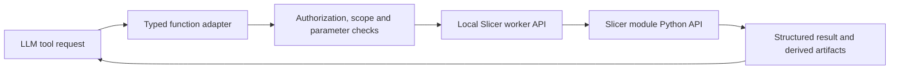

# Existing Slicer runtime: verified programmatic control

Date: 2026-08-31

Status: Core control cycle demonstrated on synthetic data in an isolated instance of the existing source-linked Advanced Viewer runtime. This is an executable capability audit, not a production LLM integration or clinical validation.

Follow-up references: the [control runbook](../modules/ADVANCED_ANALYSIS_SLICER_CONTROL_RUNBOOK.md) provides reusable API recipes.
The [extension guide](../modules/SLICER_EXTENSIONS_INSTALL_AND_CONTROL_GUIDE.md) records a subsequently executed third-party extension computation,
the separate failure of its GUI initialization, and source/download findings for selected AI extensions.

## Result

An external Python client successfully invoked the bundled Slicer WebServer through a restricted handler to discover modules, open images, import a DICOM series, change segmentation thresholds, read back parameters/results, save and reload segmentation outputs, and obtain a quantitative measurement. No mouse/keyboard automation was needed.

The evidence supports building an LLM-facing function adapter around the existing runtime. It does not establish that every installed effect works, that specialized AI plugins are installed, or that clinical segmentation is accurate.

Successful run: [result.json](../../generated-files/slicer-control-probe/d5a455c1d0fe44ea876edf96b854a14b/result.json). The launcher exited with code **0**, the tested cycle passed, and no Advanced Viewer process or temporary connection credential remained after verification.

## Which runtime was tested

Executable selected by the source checkout's default runtime path:

`modules/mpr/advanced_3d_slicer/slicer_custom_app/NewMPR2Slicer/build/AIPacsAdvancedViewer.exe`

This is the custom Slicer runtime used by Advanced Analysis, not the main installed AI-PACS workstation executable. The probe did not start the workstation, log in, or attach to a patient session. It used `--no-main-window`, `--disable-settings`, `--ignore-slicerrc`, and ignored additional user launcher settings. The source runtime and the separately installed payload under `C:/ProgramData/AIPacs/module_packages/advanced_mpr/payload` had matching SHA-256 hashes for four inspected files: root launcher, application executable, WebServer.py, and SegmentEditorThresholdEffect.py. This is targeted parity evidence, not a full-package parity audit.

| Identity | Observed value |
|---|---|
| Application name | `AIPacsAdvancedViewer` |
| Runtime-reported branded application version | `0.1.0-` |
| Runtime-reported repository revision | `ae061ac` |
| Packaging directory / launcher revision | `AIPacsAdvancedViewer-5.11` / `34362` |
| Embedded Python | `3.12.10` |
| VTK | `9.5.2` |

These identifiers describe different layers. Do not interpret the branding version as the upstream Slicer version. The workstation `.venv` and the embedded Slicer Python are also different environments.

The launcher's actual `--help` confirmed Python-script/code entry points, no-main-window operation, temporary settings, and ignoring `.slicerrc.py`. A tested console click was unnecessary; the same Slicer Python API was exercised through its running event loop.

## Verified operations

All numerical inputs and images below are synthetic. The known volume contains 12 x 24 x 32 voxels with intensities 0, 40, and 80 and spacing 0.8 x 0.9 x 2.5 mm. These values are not suggested clinical thresholds.

| Operation | Actual API boundary | Evidence |
|---|---|---|
| Discover loaded modules | `slicer.app.moduleManager().factoryManager().loadedModuleNames()` | Modules returned over external HTTP request |
| Discover segmentation effects | `qMRMLSegmentEditorWidget.availableEffectNames()` | 14 registered effects returned; registration is not execution proof |
| Save/open volume | `slicer.util.saveNode`, `slicer.util.loadVolume`, `arrayFromVolume` | NRRD pixels equal the original synthetic array |
| Import/open DICOM | `DICOMUtils.TemporaryDICOMDatabase`, `importDicom`, `loadSeriesByUID` | 12 generated MR instances loaded as one volume; pixels and spacing verified |
| Configure segmentation | `qMRMLSegmentEditorWidget`, source volume, segmentation node and segment ID | Explicit node references; no wildcard selection of an arbitrary scene node |
| Change threshold | `setActiveEffectByName('Threshold')`; `MinimumThreshold` and `MaximumThreshold` parameters | Parameter values read back and two resulting masks checked voxel-by-voxel |
| Execute threshold | `editor.activeEffect().self().onApply()` | Inclusive range [30, 100]: **1536** voxels; [60, 100]: **128** voxels |
| Save/reload segmentation | `saveNode`, `loadSegmentation`, `arrayFromSegmentBinaryLabelmap` | `.seg.nrrd` mask equals the pre-save mask |
| Export/read interoperable output | `ExportVisibleSegmentsToLabelmapNode`, `saveNode`, `loadLabelVolume` | `.nii.gz` mask preserved; IJK-to-RAS matrix preserved within numeric tolerance |
| Read measurement | `SegmentStatisticsLogic.computeStatistics()` | High-threshold region: **230.4 mm3**, matching the known voxel count and spacing |
| Refuse unauthorized requests | Temporary token check | Invalid token rejected |
| Refuse arbitrary execution | Fixed operation allowlist | `execute_python` rejected |
| Validate parameters | Numeric, finite, ordered bounds | Reversed threshold range rejected |
| Stop probe | HTTP shutdown request and `slicer.app.exit(0)` | Process exit 0; local listener and connection file removed |

Approximate timings in this one successful small-fixture run: startup 3.8 seconds; NRRD open cycle 2.0 seconds; DICOM import/load 0.9 seconds; threshold applications 0.5 and 0.1 seconds; save/reload/statistics 0.5 seconds. These are not estimates for full studies, cold starts, or AI inference.

A `.seg.nrrd` preserves segmentation structure; a NIfTI labelmap provides an array/geometry exchange format. Whole-scene `.mrb` saving, mesh export, screenshot rendering, DICOM SEG export, and arbitrary patient acquisition compatibility were **not** tested in this probe.

## Inventory versus functioning tools

Loaded modules include DICOM, SegmentEditor, Segmentations, SegmentStatistics, WebServer, Markups, CropVolume, Reformat, GeneralizedReformat, Transforms, ScreenCapture, VolumeRendering, and NewMPR2MPR.

Registered effects: Draw, Erase, Fill between slices, Grow from seeds, Hollow, Islands, Level tracing, Logical operators, Margin, Mask volume, Paint, Scissors, Smoothing, and Threshold.

Only Threshold execution was verified. In particular, **Mask volume raised an AttributeError during editor setup**: its `decimalsOption` assignment provided an integer where this runtime expects a `DecimalsOptions` value. Threshold and the reported I/O/measurement checks still passed. Do not advertise Mask volume as working without a separate guarded correction and retest. No packaged runtime file was edited during this audit.

Package discovery inside the actual runtime found NumPy and pydicom, but not SimpleITK, torch, monai, mcp, or totalsegmentator. No TotalSegmentator, MONAI, or MedSAM module appeared in the loaded-module inventory. This does not rule out a separately installed external service; none was connected or tested here.

Extension Manager being disabled does not disable all built-in tools. Conversely, a stock-Slicer installation guide does not prove that an extension and its dependencies are compatible with this custom payload.

## Control routes and MCP

| Route | Current status | Appropriate role |
|---|---|---|
| Python console | Python runtime/API confirmed; interactive console UI not separately exercised | Developer exploration and debugging |
| `--python-script` / `--python-code` | Launcher support verified; script entry used successfully | Bootstrap a controlled worker or run an isolated batch task |
| Existing AI-PACS JSON socket | Source accepts only `load_dicom` / `load_series` and acknowledges scheduling | Existing series-switch integration, not a complete analysis API |
| Bundled WebServer | Custom handler successfully called from an external process | Suitable transport for reviewed function wrappers |
| Generic Slicer `/exec` | Present in bundled source; deliberately not enabled | Avoid exposing arbitrary code to diagnostic models |
| Community MCP-Slicer | Upstream project exists; not installed or tested in this audit | Potential reference/adapter, not a prerequisite for core control |

Upstream [MCP-Slicer](https://github.com/zhaoyouj/mcp-slicer) exposes node inspection, screenshots, and arbitrary Python execution. It is separate from the installed Slicer application. An external MCP adapter can use its own compatible Python environment; Slicer's embedded Python does not need to host the MCP package. Compatibility and security still require verification.

Official references describe [Python scripting](https://slicer.readthedocs.io/en/latest/developer_guide/script_repository.html) and [WebServer control](https://slicer.readthedocs.io/en/latest/user_guide/modules/webserver.html). The installed module source and executable checks above, rather than latest documentation alone, establish the capabilities reported here.

## Proposed LLM-facing boundary



MCP can wrap the typed adapter, but is not needed between the adapter and Slicer. The prototype used an external Python client instead of an LLM, which isolates whether the underlying tool is actually controllable. Native function calling through the selected EchoMind/GapGPT route remains a separate integration test.

Suggested product functions, **not yet implemented product endpoints**:

- `list_capabilities`: installed and tested module/effect versions, supported input types and parameter schemas.
- `load_study`: an authorized study handle and explicit series selection, never an unrestricted path supplied by a model.
- `create_segmentation`: source-volume handle, reviewed algorithm/effect, validated parameters, new output artifact.
- `update_parameters`: explicit algorithm-specific fields and ranges, followed by parameter readback.
- `run_analysis`: bounded job with queued/running/completed/failed/cancelled states.
- `read_result`: measurements, masks, coverage and warnings associated with the same study and source geometry.
- `save_result`: allowlisted format and artifact identifier in a per-session output workspace.
- `cancel_job`: stop only the owned job without changing the radiologist's viewer or unrelated processes.

For example, the tested probe operation was `threshold` with parameters `lower=30, upper=100`, then `lower=60, upper=100`. Its reply included actual parameter readback, voxel count, volume, and expected-region verification. The probe intentionally accepts only its generated fixture and fixed output names; it is not a general patient-analysis bridge.

No universal `sensitivity` parameter exists across Slicer tools. Threshold changes voxel inclusion; Smoothing has a method and kernel size; an AI model may expose probability thresholds or postprocessing controls, or expose none. Each tool needs a schema derived from its real implementation. Lowering a voxel-intensity threshold does not by itself establish higher diagnostic sensitivity. MRI intensity thresholds are sequence/data dependent; the synthetic bounds in this test must never become clinical defaults.

## Safety and production gaps

The prototype binds directly through `SlicerHTTPServer(server_address=('127.0.0.1', 0), ...)`, with only its custom request handler. The bundled `WebServerLogic.start()` otherwise constructs a listener on an empty host string, which can bind all interfaces. CORS, generic execution, static file serving, and DICOMweb were not enabled. A temporary random token is sent by the local client and excluded from the result report.

The prototype is **not production-hardened**. Its small request-size check runs after the bundled HTTP parser has read the request. Production needs limits and deadlines at the transport boundary, authenticated local IPC, session ownership, bounded queues, cancellation, clinical data privacy, and redacted error handling. The temporary connection file also needs explicit access controls in a multi-user threat model.

The WebServer executes handlers on Slicer's event loop. Synchronous processing was acceptable for this tiny isolated fixture, but must not become a design for blocking a clinical GUI. Heavy decode/inference/processing belongs in a separate worker; MRML/Qt updates must run in their owning Slicer thread. Preserve Fast/Advanced/VTK execution boundaries and immutable identity-linked artifact exchange.

Additional validation is needed for interactive-session attachment, source selection, multiframe/gapped/oblique acquisition geometry, patient-switch cancellation, all desired effects, specialized AI plugins, and released-package parity. No claim of improved diagnostic accuracy follows from this control test.

## Reproduction and audit trail

The reusable probe files are:

- [External runner](../../tools/dev/run_slicer_control_probe.py)
- [Slicer-side synthetic handler](../../tools/dev/slicer_control_probe.py)

Run from the repository, only when no Advanced Viewer is running:

```powershell
.\.venv\Scripts\python.exe tools/dev/run_slicer_control_probe.py
```

The runner refuses to start alongside an existing Advanced Viewer, creates a unique directory under `generated-files/slicer-control-probe`, clears inherited NEWMPR2 input variables, starts the source-linked runtime with temporary settings, and records structured results plus stdout/stderr. It never uses the PACS database. DICOM import uses a newly generated synthetic series and its own temporary Slicer DICOM database. Artifacts are local and contain no patient data.

The first adapter attempt failed because this runtime's abstract `BaseRequestHandler` requires an explicit constructor. Its script failure left the isolated process alive; after waiting for the configured timeout, only the verified probe child was stopped. The constructor and owned-process cleanup were corrected in the probe. A subsequent attempt completed all listed checks and shut down normally. The failed result is retained under run `48c5dba84b9c4fe986ba67e1d5448f22`; it is not counted as a pass.

Verification performed: Python syntax checks, real external HTTP calls to the running custom runtime, known-mask assertions, save/load and geometry checks, invalid-request checks, exit-code inspection, and cleanup inspection. No repository-wide pytest/lint pass is claimed. Application code, packaged runtime files, credentials, and LLM prompts were not modified.
